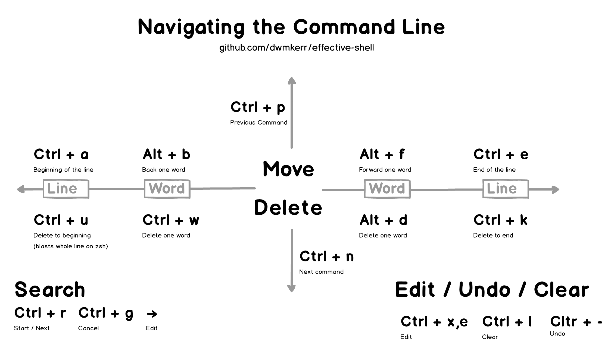

# effective-shell

Text, samples and references for my 'Effective Shell' series.


<!-- vim-markdown-toc GFM -->

* [Chapters](#chapters)
* [Quick References](#quick-references)
* [Coming Soon!](#coming-soon)
* [Improvements](#improvements)
* [Sharing](#sharing)
* [Research](#research)
* [The Pitch](#the-pitch)
* [Shell Programming Books](#shell-programming-books)
* [Research](#research-1)
* [Reading List](#reading-list)
    * [Beginners](#beginners)
    * [Advanced](#advanced)

<!-- vim-markdown-toc -->

## Chapters

- Part 1: Core Skills
    - [Navigating the Command Line](http://www.dwmkerr.com/effective-shell-part-1-navigating-the-command-line/)
    - [Become a Clipboard Gymnast](http://www.dwmkerr.com/effective-shell-part-2-become-a-clipboard-gymnast/)
    - [Getting Help](http://www.dwmkerr.com/effective-shell-part-3-getting-hepl)
    - [Moving Around](https://dwmkerr.com/effective-shell-4-moving-around/)
    - [Interlude: Understanding the Shell](https://dwmkerr.com/effective-shell-part-5-understanding-the-shell/)
- Part 2: Beyond the Basics
    - [Job Control](https://dwmkerr.com/effective-shell-6-job-control/)
    - [The Subtleties of Shell Commands](https://dwmkerr.com/effective-shell-7-shell-commands/)
    - WIP: Thinking in Pipelines
    - WIP: Shebangs
    - WIP: Interlude: The Shell Family Tree
- Part 3: Building Your Toolkit
    - WIP: Shell Customisation
    - WIP: Dotfile Management and Docfile Management
    - WIP: Aliases
    - WIP: Functions
    - WIP: Interlude: Future Shells

Note: Chapters can be read in any order. But all of the chapters in Part 3 assume you have read the first two chapters of Part 3, which teach you how to manage your own customisations.

## Quick References

[](1-navigating-the-command-line/navigating-the-command-line.md)

## Coming Soon!

If you have arrived on this link, it will be for a link to a section which has not been completed yet. Other chapters I am working on, or planning are:

- Shebangs: How to use, when to use `env`, how shebangs work with multiple shells (e.g. if I source a bash shebang in a zsh, what will happen?)
- Aliases. When to use (and more importantly, when not to use).
- Dotfile management (profile, private, etc)
- Sourcing (bashrc, profile, interactive, noninteractive, etc)
- Understanding Pipelines
- Understand logging (syslog, `logger` etc)
- Terminal Multiplexing: `screen` and `tmux`
- ANSI C Escaping (see https://www.dwmkerr.com/quick-tip-sending-newlines-with-curl/#comment-4375113010)
- Moving Files - `scp`, `aws s3`, `xcopy` etc
- Know Your Arrows! Pipe stdin <, >>, >, 2&>1 etc
- Understanding Commands (`command -v` to see functions, aliases, builtins etc)
- Customising the command prompt
- Basic Shell Scripting
- Internal Variables (https://www.tldp.org/LDP/abs/html/internalvariables.html#PROCCID)
- Heredocs
- `screen` and `tmux`
- ANSI C Escaping (see https://www.dwmkerr.com/quick-tip-sending-newlines-with-curl/#comment-4375113010)
- See if I can get an interview with shell creators?
- The history of shells, a shell family tree
- The rising popularity of commandline interfaces (Borland, VC++ vs Code, Vim etc)
- Globing (e.g. `cat file{1,2,3}`)
- Quick aliases (e.g. `D` for ISO8601 date)
- Watching (e.g. `watch k get pods`)
- Supercharging autocomplete

## Improvements

- [ ] Add `tree` to the Chapter 'Moving Around'.
- [ ] Getting Help: `help`
- [ ] `man test` is an excellent way to quickly check common tests (existence of a file etc)
- [ ] For the 'Getting Help' page, include `whatis` and `whereis`.

## Sharing

When sharing, the following hashtags have proven to be useful:

```
#shell #linux #bash #devops #hacking #coding #programming
```

## Research

(Note: once this research starts getting used, must create a proper citations/references section)

Great source of shell tricks and tips:

- https://twitter.com/krisnova/status/1109618657305333761?s=11
- Useful Linux commands: https://www.thegeekstuff.com/2010/11/50-linux-commands/

## The Pitch

This is _not_ a book about Shell Programming. There are many excellent Shell Programming books (see below). This is about general terminal and shell skills which will make you effective with many day to day tasks. Some shell programming is covered, but this is primary a book about how to work more effectively with command line interfaces and shells in general.

Possible titles:

**Darkscreen**: 30 ways to use shells and terminals to be more effective developer or operator.

## Shell Programming Books

This is list of useful books which are about Shell Programming, Terminal usage, Vim usage etc.

- [Practical Vim: Edit Text at the Speed of Thought, Drew Niel](https://www.amazon.com/Practical-Vim-Thought-Pragmatic-Programmers/dp/1934356980): Absolutely the best book I've read on Vim, perfect for users of all levels. Written by Drew Niel, who is the author of the amazing [Vimcasts](http://vimcasts.org/) series.
- [Modern Vim: Craft Your Development Environment with Vim 8 and Neovim, Drew Niel](https://pragprog.com/book/modvim/modern-vim) - I've not read it yet but will do so ASAP.

## Research

(Note: once this research starts getting used, must create a proper citations/references section)

Great source of shell tricks and tips:

- https://twitter.com/krisnova/status/1109618657305333761?s=11
- Useful Linux commands: https://www.thegeekstuff.com/2010/11/50-linux-commands/

## Reading List

### Beginners

[Shell Scripting by Jason Cannon](TODO) - For absolute beginners this book might be useful. However, it is _very_ short and really only covers a few topics. I suggest that for a beginners book, something with a bit more content may be better.

Great books!

Shell Scripting: How to Automate Command Line Tasks Using Bash Scripting and Shell Programming - Jason Cannon
How Linux Works, 2nd Edition: What Every Superuser Should Know - Brian Ward
Wicked Cool Shell Scripts, 2nd Edition: 101 Scripts for Linux, OS X, and UNIX Systems - Dave Taylor
The Linux Command Line: A Complete Introduction - William E. Shotts Jr.

### Advanced

- [The #! magic, details about the shebang/hash-bang mechanism on various Unix flavours
](https://www.in-ulm.de/~mascheck/various/shebang) - Excellent article on the internals of how different Unix platforms handle shebangs.
