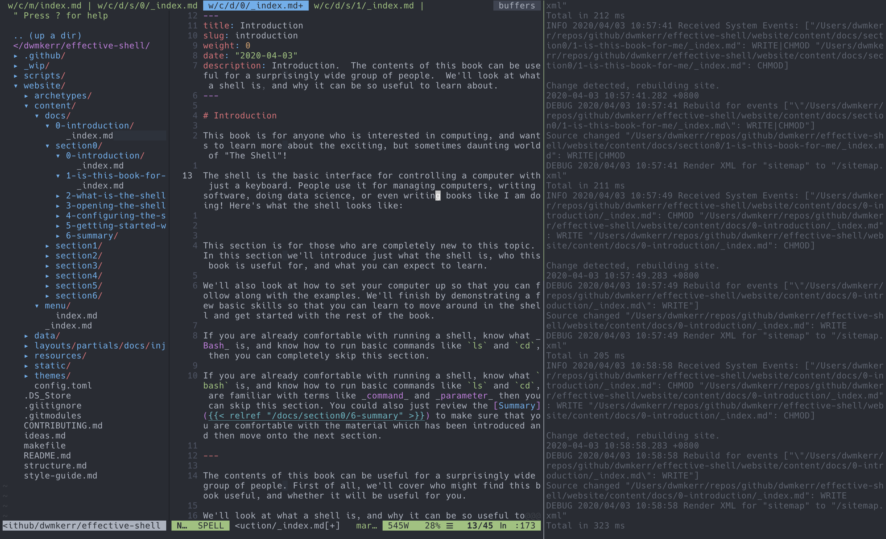

# Introduction

This book is for anyone who is interested in computing, and wants to learn more about the exciting, but sometimes daunting world of "The Shell"!

The shell is the basic interface for controlling a computer with just a keyboard. People use it for managing computers, writing software, doing data science, or even writing books like I am doing! Here's what the shell looks like:

If you are already thinking "no, this looks too geeky for me!" then think again, for almost anyone who uses a computer, or is interested in computing, this book will introduce what the shell is, how it works, and how to use it effectively.

If you are already an experienced user, this book also introduces many advanced topics, tips and tricks, and ways you can increase your productivity in the shell.

The goal of this book is to be a collection of small, contained tutorials on how to use the shell more effectively, you can go through it sequentially or just pick and choose the sections which seem the most interesting.

If you are already comfortable with running a shell, know what `bash` is, and know how to run basic commands like `ls` and `cd`, are familiar with terms like _command_ and _parameter_ then you can skip through some of the earlier sections and pick up the chapters which sound most interesting to you.

All of the content of this book is designed to be suitable to work with Microsoft Windows, Mac OS and Linux. So no matter what system you are running, you should be able to follow along. We will focus primarily on 'Linux Like' environments, which hopefully will give you the skills which you can apply most widely. For Windows, we'll look into how to tweak your system to be able to run all of the samples.

