import WebsiteOnly from '@site/src/components/WebsiteOnly';
import CodeBlock from '@theme/CodeBlock';
import Caret from '@site/src/components/Caret/Caret';

Being able to rapidly move around the shell and manipulate text on the command line is critical to being an effective shell user. As you spend more time in the shell and start composing larger and more complex commands, it's especially important that you can work efficiently. In this chapter, we'll look at some techniques to help you do just that. Before long, you'll be navigating the command line at lightning speed.

If you'd like to see these tricks in action, check out this two-minute video:

<iframe width="560" height="315" src="https://www.youtube.com/embed/xkEFEbGqgaE" title="Flying on the Command Line" frameborder="0" allow="accelerometer; autoplay; clipboard-write; encrypted-media; gyroscope; picture-in-picture; web-share" referrerpolicy="strict-origin-when-cross-origin" allowfullscreen></iframe>

## Basic Navigation Techniques

In this section, we'll look at a number of shortcuts you can use to maneuver the cursor. To begin, use the following command to write the quote to a text file:

```bash
$ echo "When you light a candle, you also cast a shadow." - Ursula Le Guin >> note.txt
```

Once you have executed this command by pressing <kbd>Enter</kbd>, the quote will be written to a file called *note.txt*.

The shortcuts introduced in this chapter allow you to move around and manipulate the command line much more quickly and efficiently than if you were using only the arrow keys or delete key.

To work through the examples in this section, press the up arrow key, which will bring the command back up in your shell with the cursor at the end of the line.

### Go to the Beginning or End of a Line

You can quickly jump to the beginning of the text, no matter where your cursor is currently positioned, with <kbd>Ctrl</kbd>-<kbd>A</kbd>:

<CodeBlock language="bash">
echo "When you light a candle, you also cast a shadow." - Ursula Le Guin >> note.tx<Caret>t</Caret>
</CodeBlock>

<CodeBlock language="bash">
<Caret>e</Caret>cho "When you light a candle, you also cast a shadow." - Ursula Le Guin >> note.txt
</CodeBlock>

The shortcut <kbd>Ctrl</kbd>-<kbd>E</kbd> takes you to the end of the line:

<CodeBlock language="bash">
<Caret>e</Caret>cho "When you light a candle, you also cast a shadow." - Ursula Le Guin >> note.txt
</CodeBlock>

<CodeBlock language="bash">
echo "When you light a candle, you also cast a shadow." - Ursula Le Guin >> note.tx<Caret>t</Caret>
</CodeBlock>

These are two of the most useful shortcuts, and I highly recommend that you incorporate them into your regular shell usage.

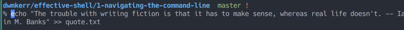

### Move Back or Forward One Word

You can also quickly jump backward or forward one word at a time. Use <kbd>Alt</kbd>-<kbd>B</kbd> to move back one word:

<CodeBlock language="bash">
echo "When you light a candle, you also cast a shadow." - Ursula Le Guin >> note.tx<Caret>t</Caret>
</CodeBlock>

<CodeBlock language="bash">
echo "When you light a candle, you also cast a shadow." - Ursula Le Guin >> note.<Caret>t</Caret>xt
</CodeBlock>

<CodeBlock language="bash">
echo "When you light a candle, you also cast a shadow." - Ursula Le Guin >> <Caret>n</Caret>ote.txt
</CodeBlock>

In this example, using <kbd>Alt</kbd>-<kbd>B</kbd> once takes you back one word to the start of txt. Using it a second time takes you to the start of note. The shell uses the dot (.) character as a word separator; therefore, note and txt are treated as two separate words (they could also be separated by a space or some other non-alphanumeric symbol).

To go back to the beginning of the line (if you are not there already), use <kbd>Ctrl</kbd>-<kbd>A</kbd>:

<CodeBlock language="bash">
<Caret>e</Caret>cho "When you light a candle, you also cast a shadow." - Ursula Le Guin >> note.txt
</CodeBlock>

Now use <kbd>Alt</kbd>-<kbd>F</kbd> to go forward one word at a time:

<CodeBlock language="bash">
<Caret>e</Caret>cho "When you light a candle, you also cast a shadow." - Ursula Le Guin >> note.txt
</CodeBlock>

<CodeBlock language="bash">
echo<Caret> </Caret>"When you light a candle, you also cast a shadow." - Ursula Le Guin >> note.txt
</CodeBlock>

<CodeBlock language="bash">
echo "When<Caret> </Caret>you light a candle, you also cast a shadow." - Ursula Le Guin >> note.txt
</CodeBlock>

Notice that these shortcuts not only jump over each space between the words but also differentiate between symbols and actual words. In this example, the cursor moves from the beginning of the line to the end of the word echo, which is the space that follows it. The space and the quotes that follow echo are two sequential characters that are not part of a word, so the next time <kbd>Alt</kbd>-<kbd>F</kbd> is pressed, the cursor moves to the end of the next word (the space after When).

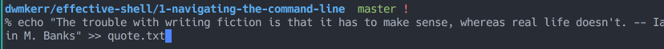

### Delete a Word

To quickly delete a word, place the cursor at the end of it and use <kbd>Ctrl</kbd>-<kbd>W</kbd>. If your cursor is at the end of the line as in the following example, pressing <kbd>Ctrl</kbd>-<kbd>W</kbd> would work like so:

<CodeBlock language="bash">
echo "When you light a candle, you also cast a shadow." - Ursula Le Guin >> note.tx<Caret>t</Caret>
</CodeBlock>

<CodeBlock language="bash">
echo "When you light a candle, you also cast a shadow." - Ursula Le Guin >><Caret> </Caret>
</CodeBlock>

<CodeBlock language="bash">
echo "When you light a candle, you also cast a shadow." - Ursula Le Guin<Caret> </Caret>
</CodeBlock>

<CodeBlock language="bash">
echo "When you light a candle, you also cast a shadow." - Ursula Le<Caret> </Caret>
</CodeBlock>

If the cursor is halfway through a word, <kbd>Ctrl</kbd>-<kbd>W</kbd> will delete only from the beginning of the word to the cursor position:

<CodeBlock language="bash">
echo "When you light a candle, you also cast a sha<Caret>d</Caret>ow." - Ursula Le Guin >> note.txt
</CodeBlock>

<CodeBlock language="bash">
echo "When you light a candle, you also cast a <Caret>d</Caret>ow." - Ursula Le Guin >> note.txt
</CodeBlock>

To delete the next word or character to the right, use <kbd>Alt</kbd>-<kbd>D</kbd>:

<CodeBlock language="bash">
echo "When you light a <Caret>c</Caret>andle, you also cast a shadow." - Ursula Le Guin >> note.txt
</CodeBlock>

<CodeBlock language="bash">
echo "When you light a <Caret>,</Caret> you also cast a shadow." - Ursula Le Guin >> note.txt
</CodeBlock>

<CodeBlock language="bash">
echo "When you light a <Caret>a</Caret>lso cast a shadow." - Ursula Le Guin >> note.txt
</CodeBlock>

Notice that <kbd>Ctrl</kbd>-<kbd>W</kbd> defines a word as any nonspace character, whereas <kbd>Alt</kbd>-<kbd>D</kbd> defines a word as only alphanumeric characters. This is because under the hood different "delete word" functions are available in the shell, and the default keyboard shortcuts use different variants for deleting a word and deleting the next word.

You can look up how each shortcut works by running man bash to open the man page for bash and searching for "commands for moving."

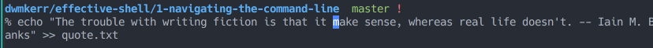

*Demonstration of deleting words and undoing changes*

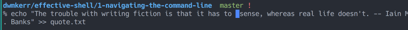

*Deleting forward with <kbd>Alt</kbd>-<kbd>D</kbd>*

### Delete a Line

In bash, you can delete everything from the current cursor position to the beginning of the line with <kbd>Ctrl</kbd>-<kbd>U</kbd>:

<CodeBlock language="bash">
echo "When you light a candle, you also cast a shadow." - <Caret>U</Caret>rsula Le Guin >> note.txt
</CodeBlock>

<CodeBlock language="bash">
<Caret>U</Caret>rsula Le Guin >> note.txt
</CodeBlock>

:::note
If you're using the Z shell, this key combination will delete the *entire* line regardless of where your cursor is. If you're not sure what shell you're using, look at the prompt next to your cursor. If it starts with a hash mark (*#*) or dollar sign (*$*), it's probably bash. If it starts with a percent symbol (*%*), it's probably the Z shell. On most Linux machines, your shell will be bash by default. On macOS systems from 2019 onward, it will be the Z shell. To see exactly what shell you have, run `echo $SHELL`.
:::

To delete everything from the cursor to the end of the line, use <kbd>Ctrl</kbd>-<kbd>K</kbd>:

<CodeBlock language="bash">
echo "When you light a candle, you also cast a shadow."<Caret> </Caret>- Ursula Le Guin >> note.txt
</CodeBlock>

<CodeBlock language="bash">
echo "When you light a candle, you also cast a shadow.<Caret>"</Caret>
</CodeBlock>

This should work the same way in bash and the Z shell.

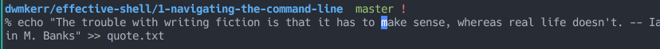

*Using <kbd>Ctrl</kbd>-<kbd>U</kbd> to delete to the beginning*


*Using <kbd>Ctrl</kbd>-<kbd>K</kbd> to delete to the end*

### Undo a Change

Bash also has an undo shortcut: <kbd>Ctrl</kbd>-<kbd>_</kbd> (underscore) will undo the most recent change.

If you find yourself repeatedly using the arrow or delete keys, refer back to this section to remind yourself of the shortcuts. They'll save you a lot of time in the long run!

## Searching Through Commands

Once you have the basic navigation commands down, the next essential shortcuts are search commands. Starting with the current line, you can search backward or forward in your command history with <kbd>Ctrl</kbd>-<kbd>R</kbd> and <kbd>Ctrl</kbd>-<kbd>S</kbd>, respectively.

Let's look at an example. Run these commands on three separate lines to create nine empty files:

```bash
$ touch file1 file2 file3

$ touch file4 file5 file6

$ touch file7 file8 file9
```

Now press <kbd>Ctrl</kbd>-<kbd>R</kbd> to start searching, and you'll see a search prompt in your shell. Because you're searching backward, the prompt tells you that you're doing a reverse search. At the prompt, enter `file` and press <kbd>Ctrl</kbd>-<kbd>R</kbd> repeatedly:

```
(reverse-i-search)`file': touch file7 file8 file9

(reverse-i-search)`file': touch file7 file8 file9

(reverse-i-search)`file': touch file7 file8 file9

(reverse-i-search)`file': touch file4 file5 file6
```

The shell will search the previous commands for the term file, jumping farther back each time you press <kbd>Ctrl</kbd>-<kbd>R</kbd>. This is quite hard to visualize in printed text, so be sure to try it out in your shell. When the shell reaches the end of the search and can't find any more file entries, the prompt will change to something like:

```
(failed reverse-i-search)
```

Press <kbd>Enter</kbd> to get back to the regular prompt. Searching forward with <kbd>Ctrl</kbd>-<kbd>S</kbd> works in much the same way.

:::note
On many terminals, pressing <kbd>Ctrl</kbd>-<kbd>S</kbd> won't search forward — instead it triggers *XOFF*, a legacy flow-control signal that freezes terminal output and makes the shell appear to hang. If this happens, press <kbd>Ctrl</kbd>-<kbd>Q</kbd> (*XON*) to unfreeze it. To free up <kbd>Ctrl</kbd>-<kbd>S</kbd> for forward search, disable flow control with `stty -ixon`.
:::

If your code lines are long, these two shortcuts are often the fastest ways to move to the desired location in the current line. You can also use them to quickly search through your entire command history. For example, to find your last mkdir ("make directory") command, press <kbd>Ctrl</kbd>-<kbd>R</kbd>, enter `mkdir`, and then press <kbd>Ctrl</kbd>-<kbd>R</kbd> again to search backward through all mkdir commands stored in your history.

A quick way to test this is also to search for echo. If you've been using the echo command to enter the quote as in the earlier examples, it should be the first result that the reverse search finds.

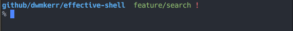

*Searching through command history with <kbd>Ctrl</kbd>-<kbd>R</kbd>*

When you find the command you want, just press <kbd>Enter</kbd> to execute it. If you want to edit the command first, use the left or right arrow keys to go back into normal editing mode. This would be useful if, say, you want to rerun a long *commandname* command but on a different file. You can search for *commandname* and then change the filename.

If you want to cancel the search completely, press <kbd>Ctrl</kbd>-<kbd>G</kbd>. The search prompt will disappear, and whatever you had in the command prompt before you started searching will be returned.

Here are the search operations demonstrated:

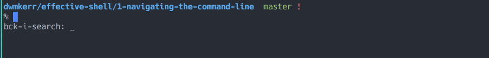

*Press <kbd>Enter</kbd> to execute the found command*


*Use arrow keys to edit the found command*

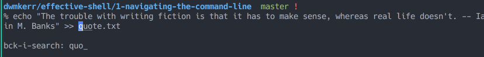

*Press <kbd>Ctrl</kbd>-<kbd>G</kbd> to cancel the search*

## Editing in Place

When working with a long or complex command, you might find it easier to use a text editor instead of the shell. You could just copy the command, paste it into your favorite editor, edit it, and then paste it back into the shell. However, in most cases you can open your text editor right inside the shell.

The default editor for the shell is often set to Vim, which you'll see in detail in Chapter 23. Before going any further, set your editor to nano, which is more user-friendly, like so:

```bash
$ export EDITOR=nano
```

If this command doesn't make sense at the moment, don't worry—it will soon. You'll also learn more about customizing shell features such as the default editor in Chapter 15.

Now that you've set the default editor to nano, you need to enter two shortcut combinations to open it: first, press <kbd>Ctrl</kbd>-<kbd>X</kbd> to signal to the shell that you're about to enter a command, and then press <kbd>Ctrl</kbd>-<kbd>E</kbd> to edit in place. If you don't have any unexecuted code on your command line, the text editor will be empty when it opens; otherwise, it will show your current command.

Let's see this in action. Begin entering a command to write the list of programs in your */usr/bin* folder to a file:

```bash
$ ls -al /usr/bin >> binaries.txt
```

But instead of pressing <kbd>Enter</kbd> to execute this code, press <kbd>Ctrl</kbd>-<kbd>X</kbd>, <kbd>Ctrl</kbd>-<kbd>E</kbd> to edit it in place (see Figure 1-1).

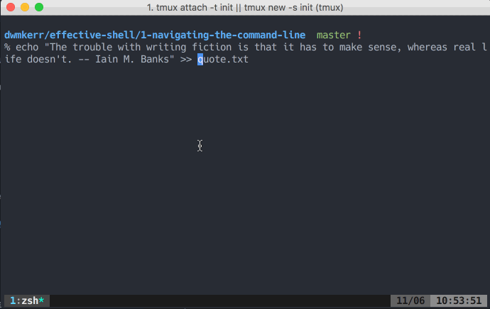

*Figure 1-1: The "edit in place" functionality in nano*

The nano editor uses keyboard shortcuts to save, close, cut, copy, paste, and so on. These shortcuts are shown at the bottom of the screen. You won't be able to click any buttons or menus.

Now you can edit the command text by deleting characters and typing new ones. Save your changes with <kbd>Ctrl</kbd>-<kbd>S</kbd>, and exit the editor with <kbd>Ctrl</kbd>-<kbd>X</kbd>. The shell will then run the edited command. You can see the most recent command by pressing the up arrow. If you want to discard your changes without running the command, close the editor without saving.

:::note
If the editor does not look like the screenshot in Figure 1-1, you may have opened Vim by mistake. If so, type `:q!` and press <kbd>Enter</kbd> to exit Vim, then enter `export EDITOR=nano` to change the default editor for your shell.
:::

Keep in mind that the <kbd>Ctrl</kbd>-<kbd>X</kbd>, <kbd>Ctrl</kbd>-<kbd>E</kbd> shortcut opens the shell's *default* editor, which might not be the one you expect. For example, your shell is unlikely to use Visual Studio Code for editing commands unless you configure it to do so, even if you have set it as your editor for shell scripts. The default editor will be one that works *inside* a shell, because the shell doesn't assume that you have a windowing system running that can open a full-featured editor like Visual Studio Code, Notepad++, or other popular editors.

As you saw at the beginning of this section, you can override the shell's default editor by setting the EDITOR environment variable (see Chapter 10 for more on variables). On my personal machine, I use Vim as my command line editor. To check which editor you're using, enter the following:

```bash
$ echo $EDITOR

vim
```

For now, I wouldn't recommend changing your editor to a graphical one like Visual Studio Code for a couple of reasons. First, some interfaces, like a virtual machine or Raspberry Pi, won't have a desktop system to run a graphical editor, so you'll need to be familiar with a shell-based editor. Second, an external graphical editor runs in a separate window, meaning you've moved out of the shell and away from where you're working. Effective shell users want as few interruptions as possible between coming up with an idea, entering the text, and running a command.

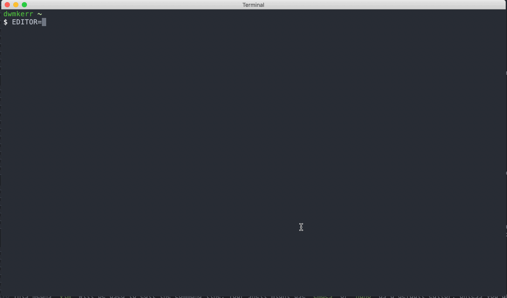

*Using Visual Studio Code as the edit-in-place editor (not recommended)*

The graphical editor opens in a separate window, which can be confusing when you have multiple commands being edited:

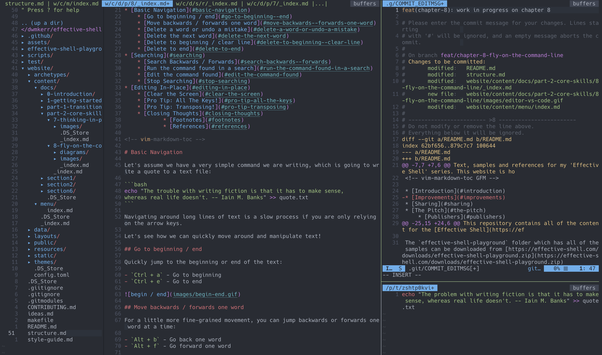

*Managing multiple shell contexts with graphical editors can be confusing*

For shell-based editing, I recommend using the nano editor if you're not familiar with Vim or Emacs. Nano shows shortcuts at the bottom of the screen:

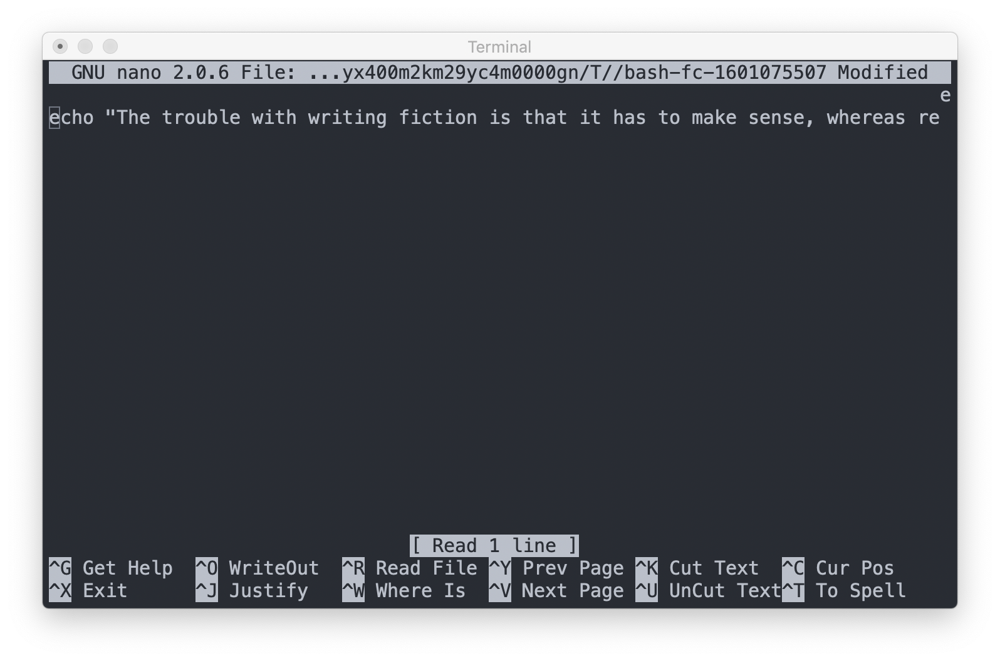

*Nano editor with keyboard shortcuts visible*

We'll look at some more advanced editors in Chapter 23.

## Other Useful Shortcuts

There are a few other shortcuts that, while they don't fit into the categories we've looked at so far, are just as handy.

### Clear the Screen

The shortcut <kbd>Ctrl</kbd>-<kbd>L</kbd> clears the screen but doesn't affect anything unexecuted in your current line. This is very helpful if you have a lot of "noisy" output on the screen and want to clean it up.

:::note
<kbd>Ctrl</kbd>-<kbd>L</kbd> redraws the prompt at the top of the visible area — it doesn't wipe the scrollback buffer, so earlier output is still accessible by scrolling up. The `clear` command behaves the same way by default. To clear the scrollback too, use `clear -x` or `printf '\033[3J'`.
:::

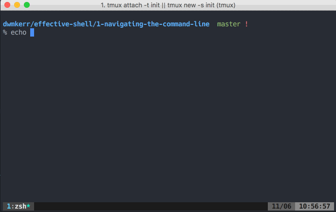

*Using <kbd>Ctrl</kbd>-<kbd>L</kbd> to clear the screen*

### View Your Command History

Running the history command prints the recent history of commands you've entered:

```bash
$ history

1 pwd

2 ls

3 git status

4 clear

5 curl -fsSL effective.sh | bash

...
```

You'll get a numbered list of your command history, with the latest at the bottom. By default, the shell saves about 10,000 lines of history.

:::note
This command works even if you've used <kbd>Ctrl</kbd>-<kbd>L</kbd> to clear the screen.
:::

If you want to rerun any of the commands in your history, enter an exclamation mark (!) and the command's number like so:

```bash
$ !5

effective-shell: preparing to install the 'effective-shell.com' samples...
```

The 5 corresponds to the command curl -fsSL effective.sh | bash, which installs the *effective-shell* samples. Most shells maintain your command history in a history file, and this number is just the line number from that file. You can find the history file's location by running:

```bash
$ echo $HISTFILE

/home/dwmkerr/.bash_history
```

Where the history file is kept depends on your shell, configuration, and operating system, but in most cases the HISTFILE variable will find it for you.

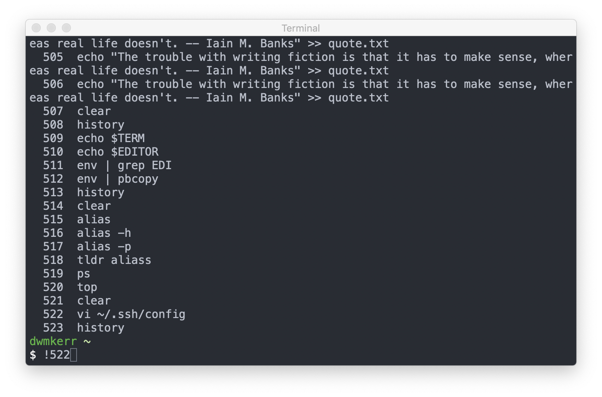

*Using the history command to see and execute recent commands*

### Show All Shortcuts

The bindkey command returns a list of all keyboard shortcuts:

```bash
$ bindkey

"^@" set-mark-command

"^A" beginning-of-line

"^B" backward-char

"^D" delete-char-or-list

"^E" end-of-line

"^F" forward-char

"^G" send-break

"^H" backward-delete-char

"^I" expand-or-complete

"^J" accept-line

"^K" kill-line

"^L" clear-screen

...
```

This is an extremely useful command if you forget a specific keyboard shortcut or even if you just want to see the shortcuts available to you.

:::note
`bindkey` is a Zsh builtin and won't work in Bash. `bind` and `bindkey` are *different* builtins, not alternative forms of the same command. To list the current bindings:

- **Bash:** `bind -p` (and `help bind` for documentation)
- **Zsh:** `bindkey` (and `man zshzle` for documentation)

Neither has a dedicated man page — `man bind` lands on the C socket function, not the shell builtin. A shell-agnostic way to inspect terminal-level key bindings is `stty -a`.
:::

### Transpose Text

*Transposing* text just means swapping it with some other text. Using the <kbd>Alt</kbd>-<kbd>T</kbd> shortcut transposes the two words before the cursor:

```bash
$ cp destination source

$ cp source destination
```

Using the <kbd>Ctrl</kbd>-<kbd>T</kbd> shortcut will transpose the two *letters* before the cursor.

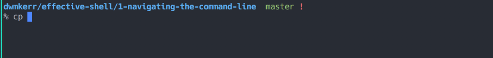

*Using <kbd>Alt</kbd>-<kbd>T</kbd> to transpose words*

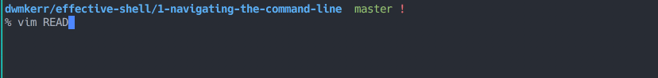

*Using <kbd>Ctrl</kbd>-<kbd>T</kbd> to transpose letters*

## <WebsiteOnly />Flying in Claude Code

Most of the keyboard shortcuts shown in this chapter work in exactly the same way in Claude Code (and similar tools), except that Edit-in-Place is <kbd>Ctrl</kbd>+<kbd>G</kbd>:

| Shortcut | Action |
|----------|--------|
| <kbd>Ctrl</kbd>+<kbd>A</kbd> | Go to beginning of line |
| <kbd>Ctrl</kbd>+<kbd>E</kbd> | Go to end of line |
| <kbd>Alt</kbd>+<kbd>B</kbd> | Move back one word |
| <kbd>Alt</kbd>+<kbd>F</kbd> | Move forward one word |
| <kbd>Ctrl</kbd>+<kbd>W</kbd> | Delete word backward |
| <kbd>Ctrl</kbd>+<kbd>U</kbd> | Delete to beginning of line |
| <kbd>Ctrl</kbd>+<kbd>K</kbd> | Delete to end of line |
| <kbd>Ctrl</kbd>+<kbd>R</kbd> | Search backward in history |
| <kbd>Ctrl</kbd>+<kbd>L</kbd> | Clear screen |
| <kbd>Ctrl</kbd>+<kbd>G</kbd> | Edit in Place |

There are many other Claude Code specific keyboard shortcuts and some of the most useful to consider committing to memory are:

| Shortcut | Action |
|----------|--------|
| <kbd>Alt</kbd>+<kbd>T</kbd> | Toggle extended thinking mode |
| <kbd>Ctrl</kbd>+<kbd>O</kbd> | Toggle the transcript viewer (detailed tool usage) |
| <kbd>Ctrl</kbd>+<kbd>V</kbd> | Paste image from clipboard |
| <kbd>Ctrl</kbd>+<kbd>B</kbd> | Background a running task |
| <kbd>Ctrl</kbd>+<kbd>C</kbd> | Interrupt, or clear the input |
| <kbd>Ctrl</kbd>+<kbd>X</kbd> <kbd>Ctrl</kbd>+<kbd>K</kbd> | Stop all background subagents (press twice to confirm) |
| <kbd>Ctrl</kbd>+<kbd>T</kbd> | Toggle Claude's task list |
| <kbd>Shift</kbd>+<kbd>Tab</kbd> | Cycle permission modes |
| <kbd>Alt</kbd>+<kbd>P</kbd> | Switch model |
| <kbd>Ctrl</kbd>+<kbd>Y</kbd> | Paste text deleted with <kbd>Ctrl</kbd>+<kbd>K</kbd> / <kbd>U</kbd> / <kbd>W</kbd> |
| <kbd>Ctrl</kbd>+<kbd>J</kbd> | Insert a newline without submitting |
| <kbd>Esc</kbd>, <kbd>Esc</kbd> | Clear the input draft, or rewind the conversation |

Claude Code also supports vim-style editing, which you can enable via `/config` → Editor mode. We'll cover vim editing in detail in [A Vim Crash Course](/part-6-advanced-techniques/a-vim-crash-course/). For a complete reference of all Claude Code shortcuts, see the [Interactive Mode documentation](https://code.claude.com/docs/en/interactive-mode).

Under the hood, the reason that many of these shortcuts work consistently in tools like Claude Code is that they use GNU Readline - which we'll look at next.

## <WebsiteOnly />The Power of Readline

All of the movement commands you've learned in this chapter apply to many command-line programs:

1. Bash / 
2. zsh
3. The Python REPL
4. The Node.js REPL
5. Claude Code
6. OpenCode

And many more! The reason is that all of these programs use the same library under the hood to control reading command line input. This library is called *GNU Readline*.

If you are ever looking to go deeper on this topic then search the web for *GNU Readline*. You can actually configure lower level details of how all programs which use readline work, with the [`.inputrc`](https://www.gnu.org/software/bash/manual/html_node/Readline-Init-File.html) configuration file.

This configuration file can be used to configure things like the shortcuts used to move around. All of these shortcuts should be familiar to Emacs users. There is in fact also 'Vi Mode' option for readline, which allows you to use `vi` commands to work with text. You can enter this mode with `set -o vi`.

There's a great cheat sheet on emacs readline commands at [readline.kablamo.org/emacs](http://readline.kablamo.org/emacs.html), which is a very useful reference if you want to dig deeper.

We'll also see *GNU Readline* later on when we talk about writing programs which work well in the shell.

## <WebsiteOnly />Resources

You can download [command-line.png](./images/command-line.png) and use it as a wallpaper:

[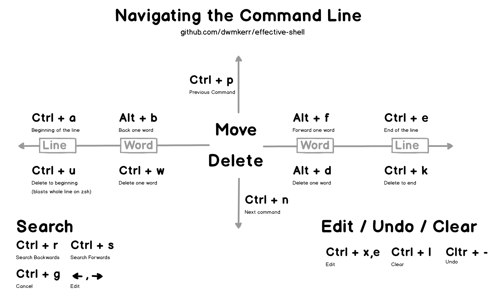](./images/command-line.png)

*Command line navigation shortcuts quick reference*

## Summary

In this chapter, you learned shortcuts for maneuvering your cursor in the shell, which allows you to edit your code quickly and easily. You also saw how to list and search your command history, edit in place with the shell's default text editor, and take advantage of other techniques to work more efficiently on the command line.

In the next chapter, we'll look at how to find files and folders on your system, a process that is often complex and time-consuming even in a GUI environment but is a snap with the shell.
