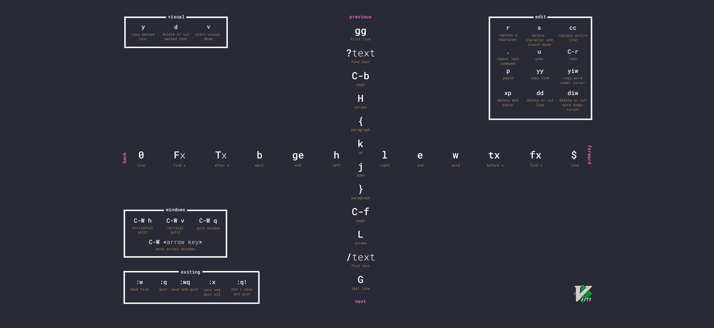

import CodeBlock from '@theme/CodeBlock';
import AnnotatedCommand from '@site/src/components/AnnotatedCommmand/AnnotatedCommand.tsx';
import Caret from '@site/src/components/Caret/Caret.tsx';

In this chapter we're going to introduce the popular Terminal Editor _Vim_. A Terminal Editor is a text editor that you can open directly in your terminal, normally from the shell. Many users find these editors hard to use, and some of them have a reputation for being highly complex.

In this chapter we'll see why we might want to use or at least become familiar with Vim, and show just a few features that might excite you enough to want to dive in and learn more!

## What is a Terminal Editor

A Terminal Editor is any text editor that is designed to run inside a terminal, often from a shell. This means it is designed to be used without a mouse, on a smaller screen, and on a system that might have no graphical user interface or windowing or desktop environment.

Some of the most popular terminal editors you might have hard of are _GNU nano_, _Vim_ and _Emacs_. Let's take a look at why we might want to know how to use a terminal editor.

## Why use a Terminal Editor?

Many technologists will be familiar with Graphical Text Editors, such as [Visual Studio Code](https://code.visualstudio.com/), [Atom](https://atom.io/) and [Sublime](https://www.sublimetext.com/). Software engineers will likely be familiar with Integrated Development Environments such as [Visual Studio](https://visualstudio.microsoft.com/) or the JetBrains family of IDEs which include dedicated environments for many languages, such as [IntelliJ IDEA](https://www.jetbrains.com/idea/) for Java.

So with such a selection of powerful and user-friendly text editing options available, why would you choose to use a Terminal Editor?

There are many reason, but perhaps the most compelling one is that you will not always have a graphical environment available! If you are working on a remote server using the `ssh` tool as described in [Chapter 31 - The Secure Shell](../31-the-secure-shell/index.mdx), you will not have a desktop or windowed environment to run a graphical tool. The _only_ options available for you to edit text, code or scripts in such an environment are terminal editors - because the terminal is your only interface to the server.

There are other times where you might not have easy access to a graphical environment - for example if you are editing a file in a Docker container.

There are some other reasons that being able to use a terminal editor is powerful:

**Maintaining flow** - if you are working in a shell already and need to edit text, being able to quickly do so without leaving the shell, and ideally without even having to touch the mouse, will allow you to maintain your 'flow' while you work.

**Speed of editing** - editors such as Vim and Emacs allow you to be _incredibly_ efficient at editing text, once you get over the initial learning curve. Vim in particular is designed to try and keep your fingers on the home row of the keyboard as much as possible to make it possible to manipulate text very quickly.

**Customisation** - terminal editors can be customised to suit your working style - you can then manage your customisations through dotfiles that you share across environments as described in [Chapter 26 - Managing Your Dotfiles](../../05-building-your-toolkit/26-managing-your-dotfiles/index.md).

**Improving Efficiency in Graphical Editors and other tools** - if you learn how to use Vim or Emacs and find yourself able to edit text very efficiently using their idioms, then you can install plugins in your graphical editors or IDEs, allowing you to edit text using the same commands. There are even browser plugins that let you navigate webpages using Vim style movement commands.

All in all I believe it is extremely useful to get to grips with at least the basics of Vim - you will be more efficient when working with remote machines, when quickly editing text from the shell, and might even find it replaces your other tools for many tasks.

## Introducing Vim

I have chosen Vim as it has the reputation for being the most complex of the terminal text editors to work with, but actually with an hour or two of practice you'll find that it is quite straightforward to use for simple tasks. With just a little knowledge you'll be effective - and as you invest more time in learning you'll become increasingly efficient.

Vim is installed on most Linux distributions out of the box and is an extremely popular editor. But it has a style of editing, called _Modal Editing_ that can be a bit confusing at first.

### What is Modal Editing?

Vim is a _modal text editor_. This means that it runs in different 'modes' - and in each mode the keyboard has different functions. For example, when you are in _Command Mode_ the keyboard is used to enter sequences that manipulate text or move the cursor. In _Insert Mode_ your keyboard is used just like with a normal text editor - typing edits the text on the screen.

### Modal Editing in Action

First, we'll open Vim by running the `vi` command:

```
$ vi

█
~
~
~
~
~                              VIM - Vi IMproved
~
~                               version 8.2.4314
~                           by Bram Moolenaar et al.
~                      Modified by <bugzilla@redhat.com>
~                 Vim is open source and freely distributable
~
~                        Help poor children in Uganda!
~                type  :help iccf<Enter>       for information
~
~                type  :q<Enter>               to exit
~                type  :help<Enter>  or  <F1>  for on-line help
~                type  :help version8<Enter>   for version info
~
~
~
~
~
                                                              0,0-1         All 
```

When Vim is started it either displays the file that it has been asked to open or if no file has been provided it shows the welcome message above.

Vim starts in **Command Mode**. This means that the keys on the keyboard are not used to enter text - they are used to enter commands. One command that is going to be useful is the 'insert' command, which tells vim to enter **Insert Mode**, before the cursor. The position of the cursor in the code block above is shown with a full-block `█` symbol.

Let's insert some text. Enter the characters in the first column of the table below - the output should match what is shown on the right:

| Keystrokes   | Output        |
|--------------|---------------|
| <AnnotatedCommand annotation="Enter insert mode">i</AnnotatedCommand> | <CodeBlock><Caret> </Caret></CodeBlock> |
| <AnnotatedCommand annotation="Enter text">Hello Vim!</AnnotatedCommand> | <CodeBlock>Hello Vim!<Caret> </Caret></CodeBlock> |

The `i` command tells Vim to enter **Insert Mode**. Insert mode is the mode that will be most familiar to you - when Vim is in insert mode your keystrokes enter text in the current file. When Vim is in insert mode it behaves more like a non-modal editor. We can enter some text as shown above.

You might have noticed that when you entered insert mode Vim updated its status bar to show you what mode it is in:

```
Hello Vim!█
~
~
~
-- INSERT --                                                  1,11          All
```

Vim will show you what mode you are in on the status line at the bottom of the screen. Vim's default mode is 'Command Mode' - when Vim is in command mode the mode is not shown - it's what you assume Vim is in unless it tells you otherwise.

To return to Command Mode, press Control and 'C', or 'Escape'. In Vim's documentation a 'chord', which is more than one key pressed at the same time, is shown in angled brackets, to differentiate it from a 'sequence' which is a set of keystrokes pressed one after the other. Control and C is written as `<C-c>` in the documentation for Vim. We will use the same style to describe chords and sequences.

Let's exit insert mode:

| Keystrokes | Output       |
|------------|--------------|
| <AnnotatedCommand annotation="Command mode">&lt;C-c&gt;</AnnotatedCommand> | <CodeBlock>Hello Vim<Caret>!</Caret></CodeBlock> |

You will notice that the `-- INSERT --` text in the status bar is no longer shown - meaning we are back in Command Mode.

Let's exit Vim. When we are in Command Mode, the keystrokes when enter are used to manipulate text or move around. If we want to perform an administrative task, such as saving a file or calling another program, we use what is called an _Ex Command_. _Ex_ is short for 'execute'. When we press the colon `:` keystroke, we enter 'Ex Mode'. This mode is a bit like Insert Mode, but for writing commands:

| Keystrokes | Output |
|------------|--------|
| <AnnotatedCommand annotation="Start ex command">:</AnnotatedCommand> | <CodeBlock>:<Caret> </Caret></CodeBlock> |
| <AnnotatedCommand annotation="Quit without saving">q!</AnnotatedCommand> | <CodeBlock>:q!<Caret> </Caret></CodeBlock> |

Keystrokes we enter after entering Ex mode will show in the status line, showing the text for the command we are building. At this point the status bar for Vim will look like this:

```
Hello Vim!
~                                                                               
~                                                                               
~                                                                               
:q!█
```

Vim is showing us that our current command is `q!`. This command translates to 'quit without saving'. Press the Enter key to execute the command - Vim will now close.

We have seen the basics of modal editing - showing Vim's Command Mode, Insert Mode and Ex Mode. We can also close Vim - which is famously a task that people who haven't used Vim before struggle with! Now let's start building our own Vim Cheatsheet - using Vim - to show more of what it can do!

## Building a Vim Cheat Sheet

We're going to build a Vim Cheatsheet - this will be a great way to show what Vim can do at the same time as documenting our learnings as we go along. You'll then be able to extend your personal Cheatsheet over time with the commands that you find useful.

Let's start by creating a folder to keep the cheat sheet in and initialing an empty Git Repository in the folder so that we can track changes to the cheat sheet. If you need a reminder on how Git works, check [Chapter 27 - Controlling Changes with Git](../../05-building-your-toolkit/27-controlling-changes-with-git/index.md).

First we'll create a new folder, move into it and then initialise an empty Git repository with the main branched named `main`:

```
$ mkdir ~/vim-cheatsheet`
$ cd ~/vim-cheatsheet
$ git init -b main
Initialized empty Git repository in /home/dwmkerr/vim-cheatsheet/.git/
```

## Creating a File in Vim

We now have a new repository ready to hold our cheatsheet. Let's open Vim and tell it that we want to work on a file named `cheatsheet.md`:

```
$ vi cheatsheet.md

█
~                                                                               
~                                                                               
"cheatsheet.md" [New]                                         0,0-1         All
```

The text we are editing in Vim is called a _buffer_. A buffer can be thought of as a view on a file - when we open a file we load the context into a buffer - it is this buffer that Vim shows. When we want to create a new file, we enter text in a new buffer and then save it when we are ready.

Vim is showing us in the status line that we have a buffer named _cheatsheet.md_ and that this is a 'New' buffer - it has not been saved.

The extension `md` at the end of the file is short for 'Markdown'. Markdown is a plain text format that is great for documentation. You write text as normal - you can also use some special characters such as Hash `#` to format things like headings, or dash `-` for bullets. Markdown will be rendered in a very reader-friendl way when we look at on things like GitHub.

Let's enter insert mode, and create a title for our cheatsheet, then exit insert mode.

| Keystrokes         | Output              |
|--------------------|---------------------|
| <AnnotatedCommand annotation="Enter insert mode">i</AnnotatedCommand> | <CodeBlock><Caret> </Caret></CodeBlock> |
| <AnnotatedCommand annotation="Enter text"># Vim Cheatsheet</AnnotatedCommand> | <CodeBlock># Vim Cheatsheet<Caret> </Caret></CodeBlock> |
| <AnnotatedCommand annotation="Enter command mode">&lt;C-c&gt;</AnnotatedCommand> | <CodeBlock># Vim Cheatshee<Caret>t</Caret></CodeBlock> |

Now let's use the `w` (_write_) ex-mode command to save the file. Enter `:w<Enter>` - the Vim status line will to tell us it has written the buffer to disk:

```
# Vim Cheatsheet
~
~
~
"cheatsheet.md" [New] 1L, 17B written                         1,16          All
```

Exit Vim by entering `:q<Enter>`. Let's add this new cheatsheet file to our repository:

```
$ git add cheatsheet.md
```

Let's tell our shell to use Vim as our text editor. We're going to use Vim to work with Git for the duration of this chapter. When you are more familiar with Vim, being able to to work with Git repositories and commands without leaving the shell and using Vim as the editor will start to feel extremely efficient:

```
$ export EDITOR=vi
$ git commit

█
# Please enter the commit message for your changes. Lines starting
# with '#' will be ignored, and an empty message aborts the commit.
#
# Committer: dwmkerr
#
# On branch main
#
# Initial commit
#
# Changes to be committed:
#       new file:   cheatsheet.md
#
~
~
"~/vim-cheatsheet/.git/COMMIT_EDITMSG" 13L, 325B              1,0-1         All
```

Git has opened Vim to ask us to provide a commit message. Git has also provided some helpful information on the changes we are committing - it's told us that we have a new file called _cheatsheet.md_ in the commit. Let's use Vim to enter a commit message:

| Keystrokes           | Output                |
|----------------------|-----------------------|
| <AnnotatedCommand annotation="Enter insert mode">i</AnnotatedCommand> | <CodeBlock><Caret> </Caret></CodeBlock> |
| <AnnotatedCommand annotation="Enter text">add the cheatsheet</AnnotatedCommand> | <CodeBlock>add the cheatsheet<Caret> </Caret></CodeBlock> |
| <AnnotatedCommand annotation="Enter command mode">&lt;C-c&gt;</AnnotatedCommand> | <CodeBlock>add the cheatshee<Caret>t</Caret></CodeBlock> |

Now type `:wq` to _write_ and _quit_ - Git will use the message we have provided for the commit:

```
 1 file changed, 1 insertion(+)
 create mode 100644 cheatsheet.md
```

We've used Vim to create the initial cheatsheet file as well as to quickly set the Git commit message - all without leaving our shell!

## Vim Motions and Movement Commands

Vim commands that move the cursor are called 'Motions'. Understanding how motions work is essential to becoming effective at moving around Vim buffers.

Let's open our cheatsheet in Vim:

```
$ vi cheatsheet.md
```

Now update the file so that it looks like the version below, this will give us some text to play with:

```sh
# Vim Cheatsheet

## Vim Motions

Vim motions are commands used to move the cursor.
```

Now that we have this text, let's see some of the motion commands in action.

The table below shows what I think are the most essential Vim motions:

| Motion | Usage                      | Motion | Usage                      |
|--------|----------------------------|--------|----------------------------|
| `gg`   | Go to beginning of buffer. | `h`    | Go left.                   |
| `G`    | Go to end of buffer.       | `j`    | Go down.                   |
| `0`    | Go to beginning of line.   | `k`    | Go up.                     |
| `$`    | Go to end of line.         | `l`    | Go right.                  |
| `w`    | Go forwards one word.      | `)`    | Go forwards one sentence.  |
| `b`    | Go backwards one word.     | `(`    | Go backwards one sentence. |


Let's see a few of these motions in action. Make sure to use `<C-c>` to exit Insert Mode and enter Command Mode before entering the keystrokes below:

| Keystrokes           | Output                |
|----------------------|-----------------------|
| <AnnotatedCommand annotation="Go to beginning of buffer">gg</AnnotatedCommand> | <CodeBlock><Caret>#</Caret># Vim Motions<br /><br />## Vim Motions</CodeBlock> |
| <AnnotatedCommand annotation="Go right">l</AnnotatedCommand> | <CodeBlock>#<Caret>#</Caret> Vim Motions<br /><br />## Vim Motions</CodeBlock> |
| <AnnotatedCommand annotation="Go left">h</AnnotatedCommand> | <CodeBlock><Caret>#</Caret># Vim Motions<br /><br />## Vim Motions</CodeBlock> |
| <AnnotatedCommand annotation="Go down">j</AnnotatedCommand> | <CodeBlock>## Vim Motions<br /><Caret> </Caret><br />## Vim Motions</CodeBlock> |
| <AnnotatedCommand annotation="Go up">k</AnnotatedCommand> | <CodeBlock><Caret>#</Caret># Vim Motions<br /><br />## Vim Motions</CodeBlock> |

The first motion is `gg` - go to the beginning of the buffer.

The next four motions are `hjkl` - move left, down, up and right. Vim uses these keys as they are all next to each other and on the home row for the right hand. Although it takes a little getting used to, once you use `hjkl` instead of arrow keys to move around you'll wonder how you lived without them - being able to navigate without moving your right hand from the home row let's you navigate text incredibly quickly.

We can use the `0` and `$` motions to go to the beginning and end of a line:

| Keystrokes           | Output                |
|----------------------|-----------------------|
| <AnnotatedCommand annotation="Go to beginning of line">0</AnnotatedCommand> | <CodeBlock><Caret>#</Caret># Vim Motions</CodeBlock> |
| <AnnotatedCommand annotation="Go to end of line">$</AnnotatedCommand> | <CodeBlock>## Vim Motion<Caret>s</Caret></CodeBlock> |

The `w` and `b` motions move backwards and forwards by one word:

| Keystrokes           | Output                |
|----------------------|-----------------------|
| <AnnotatedCommand annotation="Go to beginning of line">0</AnnotatedCommand> | <CodeBlock><Caret>#</Caret># Vim Motions</CodeBlock> |
| <AnnotatedCommand annotation="Go forward one word">w</AnnotatedCommand> | <CodeBlock>## <Caret>V</Caret>im Motions</CodeBlock> |
| <AnnotatedCommand annotation="Go to back one word">b</AnnotatedCommand> | <CodeBlock><Caret>#</Caret># Vim Motions</CodeBlock> |

## Vim Command Counts

Many Vim commands can be provided with a 'count', which indicates how many times the command should be run. This makes motions far more flexible - instead of pressing `jjjjj` to move down five lines, we can just press `5j`.

Let's see how the cursor moves when we add counts to motion commands:

| Keystrokes | Output |
|-|-|
| <AnnotatedCommand annotation="Go to beginning of buffer">gg</AnnotatedCommand> | <CodeBlock><Caret>#</Caret># Vim Motions<br /><br />## Vim Motions</CodeBlock> |
| <AnnotatedCommand annotation="Go down four lines">4j</AnnotatedCommand> | <CodeBlock>## Vim Motions<br /><br /><Caret>#</Caret># Vim Motions</CodeBlock> |
| <AnnotatedCommand annotation="Go forwards three words">3w</AnnotatedCommand> | <CodeBlock>## Vim Motions<br /><br />## Vim <Caret>M</Caret>otions</CodeBlock> |

## Vim Text Insert Commands

Now that we know how to move the cursor with the movement commands, we can move to where we want to insert text and use the `i` command to enter Insert Mode. However, Vim has a set of commands that enter Insert Mode in specific positions - and these can save us moving around unnecessarily!

The most essential 'enter insert mode' commands are:

| Command | Description                                 |
|---------|---------------------------------------------|
| `i`     | Insert at cursor.                           |
| `I`     | Insert beginning of current line.           |
| `a`     | Append text after the cursor.               |
| `A`     | Append text at the end of the current line. |
| `o`     | Open a new line below the position.        |
| `O`     | Open a new line above the current line.     |

These commands make it much faster to quickly enter Insert Mode just where you like. Let's see some of them in action:

| Keystrokes | Output |
|-|-|
| <AnnotatedCommand annotation="Go to beginning of buffer">gg</AnnotatedCommand> | <CodeBlock><Caret>#</Caret># Vim Motions</CodeBlock> |
| <AnnotatedCommand annotation="Open line below current line">o</AnnotatedCommand> | <CodeBlock># Vim Cheatsheet<br /><Caret> </Caret></CodeBlock> |
| <AnnotatedCommand annotation="Enter text, enter command mode">Hello&lt;C-c&gt;</AnnotatedCommand> | <CodeBlock># Vim Cheatsheet<br />Hello<Caret> </Caret></CodeBlock> |
| <AnnotatedCommand annotation="Insert at beginning of line">I</AnnotatedCommand> | <CodeBlock># Vim Cheatsheet<br /><Caret>H</Caret>ello</CodeBlock> |
| <AnnotatedCommand annotation="Enter text, enter command mode">Welcome and &lt;C-c&gt;</AnnotatedCommand> | <CodeBlock># Vim Cheatsheet<br />Welcome and <Caret>H</Caret>ello</CodeBlock> |
| <AnnotatedCommand annotation="Append at end of line">A</AnnotatedCommand> | <CodeBlock># Vim Cheatsheet<br />Welcome and Hell<Caret>o</Caret></CodeBlock> |
| <AnnotatedCommand annotation="Enter text, enter command mode">Vim!&lt;C-c&gt;</AnnotatedCommand> | <CodeBlock># Vim Cheatsheet<br />Welcome and Hello Vim<Caret>!</Caret></CodeBlock> |
| <AnnotatedCommand annotation="Open line above current line, enter command mode">O&lt;C-c&gt;</AnnotatedCommand> | <CodeBlock># Vim Cheatsheet<br /><Caret> </Caret><br />Welcome and Hello Vim</CodeBlock> |

We use the `<C-c>` chord to quickly go back into Command Mode when we have inserted text. This should start to become a habit as you use Vim - it is faster to enter small amounts of text, then go back to command mode and reposition the cursor, than to enter lots of text and use the arrow keys to move around in Insert Mode[^1].

Now that we have seen motions and text insert commands, let's look at some essential Vim operators.

## Vim Operators

A Vim operator is any command that can be applied to a range of text. We can combine _counts_, _motions_ and _operators_ to rapidly manipulate a specific part of the buffer.

Some of the operators that are particularly useful are listed in the table below - we'll see them in action afterwards:

| Operator | Description                                                  |
|----------|--------------------------------------------------------------|
| `c`      | Change the range, i.e. delete the characters and move into insert mode at the beginning of the range.                                            |
| `d`      | Delete the range.                                            |
| `y`      | Yank the range - copy it to a register ready to paste later. |
| `g~`     | Swap case.                                                   |
| `gu`     | Make lowercase ('go lower').                                 |
| `gU`     | Make uppercase ('go upper').                                 |
| `!`      | Send through external program.                               |

We can use operators with a motion to alter a range of text. Let's see some of the basic operators:

| Keystrokes                                   | Output                                                 |
|----------------------------------------------|--------------------------------------------------------|
| <AnnotatedCommand annotation="Go to the beginning of the buffer">gg</AnnotatedCommand> | <pre><Caret>W</Caret>elcome to Vim!</pre>              |
| <AnnotatedCommand annotation="Move forwards one word">w</AnnotatedCommand> | <pre>Welcome <Caret>t</Caret>o Vim!</pre>              | 
| <AnnotatedCommand annotation="Change two words">c2w</AnnotatedCommand> | <pre>Welcome to <Caret> </Caret></pre>                 |
| <AnnotatedCommand annotation="Enter new text, go to Command Mode">to Terminal Editing!&lt;C-c&gt;</AnnotatedCommand> | <pre>Welcome to Terminal Editing<Caret>!</Caret></pre> |
| <AnnotatedCommand annotation="Go uppercase to the beginning of the line">gU0</AnnotatedCommand>  | <pre><Caret>W</Caret>ELCOME TO TERMINAL EDITING!</pre> |

Hopefully from these examples you are starting to get an idea of just how powerful modal editing is - you are able to express complex changes to text, ranges of text, and movements in the buffer with just a few keystrokes.

These operators can also quickly be applied to the current line - just type them twice!

| Operator | Description                                                  |
|----------|--------------------------------------------------------------|
| `cc`      | Change current line, i.e. delete the line and move into insert mode at the beginning of the line.                                            |
| `dd`      | Delete the current line.                                            |
| `yy`      | Yank the current line - copy it to a register ready to paste later. |
| `g~~`     | Swap case for the current line.                                                   |
| `guu`     | Make lowercase ('go lower') for the current line.                                 |
| `gUU`     | Make uppercase ('go upper') for the current line.                                 |

## Search Motions and the 'In' and 'A' Operators

Some of the most powerful motions are the ones that can be used to search for a specific character. These 'search' motions can be used to quickly select a range of characters for an operator to perform on. Let's see a few of the most essential search motions:

| Motion         | Description                                     |
|----------------|-------------------------------------------------|
| `f{character}` | Find the next specified character.              |
| `F{character}` | Find the previous specified character.          |
| `t{character}` | 'To' the next specified character.              |
| `T{character}` | 'To' the previous previous specified character. |

Now let's see how these motions look in action, by quickly moving around a little bit of Python code:

| keystrokes                                   | output                                                 |
|----------------------------------------------|--------------------------------------------------------|
| <AnnotatedCommand annotation="go to next '(' character">f(</AnnotatedCommand> | <CodeBlock language="python">def search_for_word<Caret>(</Caret>word):</CodeBlock> |
| <AnnotatedCommand annotation="go to second previous 'd' character">2fd</AnnotatedCommand> | <CodeBlock language="python"><Caret>d</Caret>ef search_for_word(word):</CodeBlock> |
| <AnnotatedCommand annotation="go to first '_' character">t_</AnnotatedCommand> | <CodeBlock language="python">def searc<Caret>h</Caret>_for_word(word):</CodeBlock> |
| <AnnotatedCommand annotation="go to previous space character">t </AnnotatedCommand> | <CodeBlock language="python">def<Caret> </Caret>search_for_word(word):</CodeBlock> |

Just like any motion, we can add a `{count}` to indicate how many times we want the motion to run.

Two other powerful motions are 'in' and 'a' - these motions are special because they come after the operator. Let's change some text using these motions:

| Keystrokes                                   | output                                                 |
|----------------------------------------------|--------------------------------------------------------|
| <AnnotatedCommand annotation="Find first '(' character">f(</AnnotatedCommand> | <CodeBlock language="python">def search_for_word<Caret>(</Caret>word):</CodeBlock> |
| <AnnotatedCommand annotation="Go uppercase in brackets">gUi)</AnnotatedCommand> | <CodeBlock language="python">def search_for_word(<Caret>W</Caret>ORD):</CodeBlock> |
| <AnnotatedCommand annotation="Make entire line lowercase">guu</AnnotatedCommand> | <CodeBlock language="python"><Caret>d</Caret>ef search_for_word(word):</CodeBlock> |
| <AnnotatedCommand annotation="Find first bracket, delete a 'brackets'">f(da(</AnnotatedCommand> | <CodeBlock language="python">def search_for_word<Caret>:</Caret></CodeBlock> |

When you have searched for a character, you can use the following keystrokes to find the next or previous result:

| Motion         | Description                                     |
|----------------|-------------------------------------------------|
| `;` | Move to the next result for the search motion. |
| `,` | Move to the previous result for the search motion. |

##  The 'In' and 'A' Modifiers

The 'in' and 'a' modifiers for an operator are particularly useful when you want to change the contents of something like brackets, parenthesis, braces and so on. If you use `ca)` for example, you are saying 'Change a Brackets' - the brackets are removed and you are put into insert mode at the position the brackets were in. In comparison, `ci{` changes 'in' braces, removing the text inside the braces, but keeping the braces themselves.

If you use an open bracket or brace, a space is added before and after the text you insert, if you use a close bracket or brace, no spaces are used:

| Keystrokes                                   | Output                                                 |
|----------------------------------------------|--------------------------------------------------------|
| <AnnotatedCommand annotation="Go to first open bracket">g(</AnnotatedCommand> | <CodeBlock language="python">def search_for_word<Caret>(</Caret>word):</CodeBlock> |
| <AnnotatedCommand annotation="Change in brackets">ci)</AnnotatedCommand> | <CodeBlock language="python">def search_for_word<Caret>(</Caret>):</CodeBlock> |
| <AnnotatedCommand annotation="Enter text, return to Command Mode">word = "default"&lt;C-c&gt;</AnnotatedCommand> | <CodeBlock language="python">def search_for_word(word = "default"<Caret>)</Caret>):</CodeBlock> |
| <AnnotatedCommand annotation="Change a quotes">ca"</AnnotatedCommand> | <CodeBlock language="python">def search_for_word(word = <Caret>)</Caret>:</CodeBlock> |
| <AnnotatedCommand annotation="Enter text, return to Command Mode">'sample'&lt;C-c&gt;</AnnotatedCommand> | <CodeBlock language="python">def search_for_word(word = 'sample<Caret>'</Caret>):</CodeBlock> |

## Editing Commands in Vim

We're going to update our cheatsheet with a few notes - at this stage you can add any notes that you think are the most relevant, here are the first few lines of what I have added:

```markdown
# Vim Cheatsheet

## Vim Motions

Vim motions are commands used to move the cursor. Essential motions are:

* `hjkl` - move the cursor left/down/up/right
* `w` - forward one word
* `b` - back one word
* `(` - back one sentence
* `)` - forwards one sentence
* `0` - beginning of line
* `$` - end of line
* `gg` - beginning of buffer
* `G` - end of buffer

Motions can take a `{count}` - this indicates how many motions we want to make, such as `3w` to move forwards three words.
```

Before we continue we should note that there are three new Markdown syntax features we have used:

1. The `##` characters, which indicate a sub-heading
2. The `*` character, which indicates an item in a bullet list (a dash `-` can also be used for this)
3. The backtick `` ` `` character, which can surround text to indicate that it is code and should be rendered as such

These simple formatting features will make the cheatsheet look excellent when it is viewed on GitHub or in a suitable editor - here's how it looks on GitHub at the moment:


Let's look at another way we can use Vim in our day to day work. We'll enter a shell command that has a mistake, and quickly edit the command and fix the mistake in Vim. Let's add these changes to Git - and show one more way to use Vim. Enter the line of text below in the shell but don't press 'Enter' to execute it yet!

```
$ git commit -m 'added more detail on motions'
```

This command will commit the changes - but we haven't added any yet! Rather than fixing this by moving around the command line, let's just open the current shell command line in Vim. Press `^x^e` (Control X, Control E) - this is the shell command to open the current line in the editor:

<CodeBlock>
<Caret>g</Caret>it commit -m 'added more detail on motions'<br />
~<br />
~<br />
~<br />
"/tmp/bash-fc-5094983766" 1L, 45B                             1,1           All<br />
</CodeBlock>

Let's fix up the command with our new Vim skills:

| Keystrokes                                   | Output                                                 |
|----------------------------------------------|--------------------------------------------------------|
| <AnnotatedCommand annotation="Enter insert mode">i</AnnotatedCommand> | <CodeBlock><Caret>g</Caret>it commit -m 'added more detail on motions'</CodeBlock> |
| <AnnotatedCommand annotation="Add text, enter command mode">git add . && &lt;C-c&gt;</AnnotatedCommand> | <CodeBlock>git add . &&<Caret> </Caret>git commit -m 'added more detail on motions'</CodeBlock> |
| <AnnotatedCommand annotation="Write and quit">:wq</AnnotatedCommand> | (Vim closes and `git commit` completes) |

Being able to rapidly edit the current shell command in Vim is a huge time saver.

## Next Steps with Vim

Vim is a huge topic - we've barely scratched the surface but I hope have focused on the features that you can use most immediately. As you use Vim more, I would recommend learning about the following features in order:

1. The dot command
2. Visual mode
3. Yank and paste and registers
4. Search and replace
5. Customising Vim with the _~/.vimrc_ file
6. Macros

There are a few resources that I would recommend. The first is `vimtutor` and the next are some excellent online resources and books.

### Vimtutor

Vim comes installed with a very useful `vimtutor` program. You can run this program to open Vim with a special file that describes the key functionality of Vim.

Use this program regularly while you are learning Vim to see how familiar you are getting and refresh your skills!

### Vimcasts

The excellent website [Vimcasts](http://vimcasts.org/) by Drew Neil has some superb videos on how to use Vim - from the basics to some really advanced functionality.

Drew Neil is an extremely skilled Vim user and does a superb job of making a complex subject easy to follow.

### Practical Vim & Modern Vim

If you are enjoying using Vim, Drew Neil's books "Practical Vim" and "Modern" Vim should be on your bookshelf! They are truly excellent and again, just like his Vimcasts, make a complex subject much more user friendly.

### The Vim Shortcuts Wallpaper

Something I found useful when learning Vim was to have a wallpaper with the most common shortcuts. There are a number available on the web if you search for "Vim Wallpaper" - the one I currently use is below:



Unfortunately I have not been able to find the name of the original author. I found this file at:

https://wallha.com/wallpaper/vim-cheat-sheet-minimalism-linux-1250034

## Summary

In this chapter we introduced the concept of the terminal editor. We looked at the essentials of Vim, Insert Mode, Command Mode, motions, operators and more. We also introduced some resources that will help with your learning journey.

In the next chapter we'll look at another essential tool - the Terminal Multiplexer.

[^1]: There is also another benefit to short commands - it makes them easier to repeat with the _Dot Command_ which is not covered in this chapter but something that you will learn about as you use Vim more.
