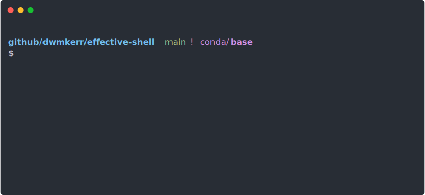
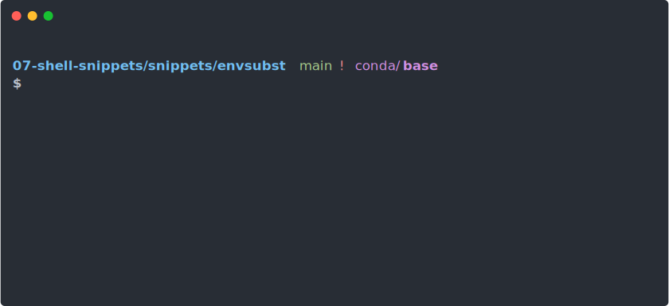

After finishing the [Effective Shell Book](https://amzn.to/4ho0F91) I still find myself regularly discovering or remembering techniques that are huge time-savers. I've called these **Effective Shell Snippets** and will update this page with them from time to time, so check back regularly!

### Git + AI: Interactively Staging Changes, Summarising with AI

A fun snippet I built is the function `aigac` - this is short for "AI Git Add & Commit". It performs an interactive patch add of changes to the working tree, commits the changes, then uses the [Terminal AI](https://github.com/dwmkerr/terminal-ai) tool to create a commit message with a title and description that follows [conventional commit](https://www.conventionalcommits.org/en/v1.0.0/) syntax:


The function looks like this:

```bash title="https://github.com/dwmkerr/dotfiles/blob/main/shell.functions.d/aigac.sh"
aigac() {
  # Add untracked files but none of their content - so that 'git add --patch'
  # lets us interactively stage new files as well as existing file changes.
  git add -N .
  git add --patch

  # If there's no changes, bail.
  if git diff --cached --quiet; then
    echo "No changes staged for commit."
    return 1
  fi

  # Generate the commit message using terminal-ai. Pipe it into 'git commit'
  # by using the '-F -' (i.e. read from the stdin file). Make sure we edit it
  # in the editor first with '-e'.
  git diff --cached |\
    ai -- 'summarise this git diff into a conventional commit, e.g. feat(feature): short description\n\nlong description' |\
    git commit -e -F - 
}
```

This snippet may change over time - you should be able to find the latest version in my [`dotfiles`](https://github.com/dwmkerr/dotfiles).

### Open GitHub for Current Directory

When I'm working on some code I often want to open its GitHub home page, to check for issues, see the status of pipelines and so on. You can use the [`gh`](https://github.com/cli/cli) CLI for many of these operations, but if I just want to open the webpage, I like use the `ghopen` function:


This command will open the URL shown in your browser.

Here's the code:

```bash title="https://github.com/dwmkerr/dotfiles/blob/main/shell.functions.d/ghopen.sh"
ghopen() {
    # Get the origin for the current repo.
    local origin=$(git remote get-url origin 2> /dev/null)

    # Bail if we're not in a github repo.
    if [[ ($? -ne 0) || ("${origin}" != *github*) ]]; then
        echo "current dir '$(basename "${PWD}")' is not in a github repo..."
        return
    fi

    # The origin probably looks like this:
    # git@github.com:dwmkerr/effective-shell.git
    # The org/repo is everything after the colon and before '.git'.
    local org_repo=$(echo "${origin%.git}" | cut -f2 -d:)
    local url="http://github.com/${org_repo}"

    # Let the user know what we're opening, formatting org/repo in green, open.
    echo -e "opening github.com/\e[32m${org_repo}\e[0m"
    python3 -c "import webbrowser; webbrowser.open_new_tab('${url}')"
}
```

Some useful techniques - all of which are covered in various chapters across the book!

- Stream Redirection: We pipe errors from `git` to `/dev/null` so that we don't spam the user's screen, and check the result of the command with `$?`
- Conditionals: The Bash 'if statement' lets us check whether the origin contains the text 'github'
- Manipulating Text: The `cut` command can quickly cut out everything after the `:` in the origin
- Shell Expansion: We can use the `${origin%.git}` brace expansion to remove `.git` from the end of a variable
- Opening a browser with `python3` is more portable than using `open` or similar

:::tip

A super useful comment on [Reddit](https://www.reddit.com/r/commandline/comments/1jeqznz/comment/miswst8/?utm_source=share&utm_medium=web3x&utm_name=web3xcss&utm_term=1&utm_content=share_button
) on an alternative way to do this!

:::

### Makefile Help

This is a snippet I include in every Makefile that I use. It simply adds a default recipe called `help` that shows each recipe in the Makefile along with a description:



All you need to add to your Makefile is the recipe `help` shown below. To add a description to any other recipe just add a comment that follows its name!

:::warning

Makefiles must be indented with tabs, not spaces, copy the source-code from [`makefile-help`](https://github.com/dwmkerr/makefile-help) if the code below doesn't work, it seems that docusaurus might transform tabs to spaces.

:::

```makefile title="https://github.com/dwmkerr/makefile-help"
default: help

.PHONY: help
help: # Show help for each of the Makefile recipes.
	@grep -E '^[a-zA-Z0-9 -]+:.*#'  Makefile | sort | while read -r l; do printf "\033[1;32m$$(echo $$l | cut -f 1 -d':')\033[00m:$$(echo $$l | cut -f 2- -d'#')\n"; done

.PHONY: example
example: # Here's an example of how to add a description!
	@echo "Hello!"
```

This is also documented in a little repo at [github.com/dwmkerr/makefile-help](https://github.com/dwmkerr/makefile-help).

### Dot files and `envsubst`

The `envsubst` command can be used to quickly create and populate template files. When combined with `.env` files, which are a common feature of projects that need to manage secrets, you can rapidly inject secrets or configuration into workflows. Here's a quick demo - which is detailed below:



In this demo we:

- Show the contents of a `.env` file. This is shown in colour by using `bat` - a popular alternative to `cat`.
- Show the contents of a `secret.template.yaml` file - which has placeholders for sensitive confiratu

```bash
# First create a template.
cat <<EOF > secret.template.yaml
apiVersion: v1
kind: Secret
metadata:
  name: my-secret
type: Opaque
data:
  username: \${USERNAME}
  password: \${PASSWORD}
EOF

# Demo is better in colors. This is the template above but from bat.
alias cat="bat --plain --theme base16 --force-colorization --language yaml" && clear

# Let's check how this looks.
cat secret.template.yaml

# Now demo substitute env vars. Pipe into cat for colors.
USERNAME=developer PASSWORD=123 envsubst < config.template.yaml | cat

# Demo:

# Setup
source ./init.sh

# Show secret.
bat secret.template.yaml

# Show env.
bat .env

# Show subsitution.
source .env
envsubst < secret.template.yaml

# Show more.
PASSWORD=123 envsubst < secret.template.yaml
```

### Free up a port

It's really easy to leave applications that are listening to a port, such as application servers or docker containers running by mistake. In this circumstance you can find the process that is using the port, grab its process ID and then kill it. But beyond the fact that `lsof` needs to be used, I always forget the command.

The `killport` function finds the process using the port, kills it, and shows a quick summary:

```
$ killport 3000
killed process with id 48022 using port 3000: next-server (v15.3.3)
```

In this case I use the `killport` function defined below:

```bash
killport() {
  local name="killport"
  if [[ "$1" == "-h" ]]; then
    echo "usage: ${name} <port>"
    echo "  Kills the process using the specified port, e.g:"
    echo "  ${name} 8080"
    exit 0
  fi

  # Show help if port number was not provided.
  if [[ -z "$1" ]]; then
    echo "error: no port specified"
    echo "usage: ${name} <port>"
    return 1
  fi

  local port="$1"
  
  # Find the process id using the port.
  local pid=$(lsof -ti :${port})
  
  if [[ -z "$pid" ]]; then
    echo "no process found using port ${port}"
    return 1
  fi
  
  # Get process info before killing it
  local process_info=$(ps -p ${pid} -o comm | tail -n 1)
  
  # Kill the process
  kill ${pid}
  
  if [[ $? -eq 0 ]]; then
    echo "killed process with id ${pid} using port ${port}: ${process_info}"
  else
    echo "failed to kill process ${pid} using port ${port}"
    return 1
  fi
} 
```

Lots of fun tweaks could be made to this function, such as:

- Asking for operator to confirm before killing the process
- Listing all processes using a port range, or all ports
- Allowing the user for force kill if a regular kill doesn't free up the port
