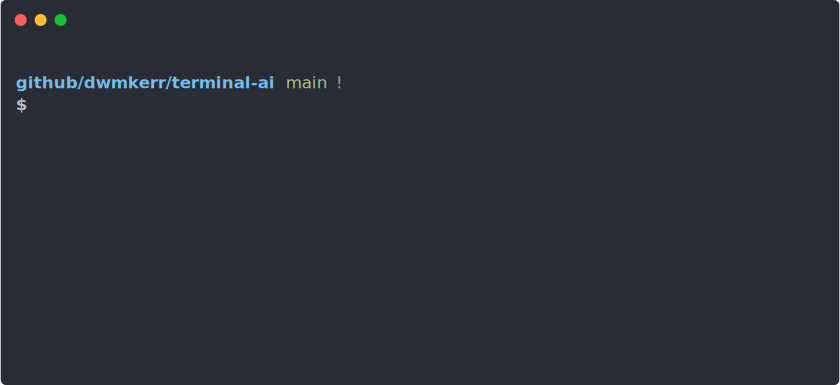

After finishing the [Effective Shell Book](https://amzn.to/4ho0F91) I still find myself regularly discovering techniques that are huge time-savers. I've called these **Effective Shell Snippets** and will update this page with them from time to time, so check back regularly!

### Git + AI: Interactively Staging Changes, Summarising with AI

A fun snippet I built is the function `aigac` - this is short for "AI Git Add & Commit". It performs an interactive patch add of changes to the working tree, commits the changes, then uses the [Terminal AI](https://github.com/dwmkerr/terminal-ai) tool to create a commit message with a title and description that follows [conventional commit](https://www.conventionalcommits.org/en/v1.0.0/) syntax:



The function looks like this:

```bash
aigac() {
  # Add untracked files but none of their content - so that 'git add --patch'
  # lets us interactively stage new files as well as existing file changes.
  git add -N .
  git add --patch

  # If there's no changes, bail.
  if git diff --cached --quiet; then
    echo "No changes staged for commit."
    return 1
  fi

  # Generate the commit message using terminal-ai. Pipe it into 'git commit'
  # by using the '-F -' (i.e. read from the stdin file). Make sure we edit it
  # in the editor first with '-e'.
  git diff --cached |\
    ai -- 'summarise this git diff into a conventional commit, e.g. feat(feature): short description\n\nlong description' |\
    git commit -e -F - 
}
```

This snippet may change over time - you should be able to find the latest version in my [`dotfiles`](https://github.com/dwmkerr/dotfiles).
