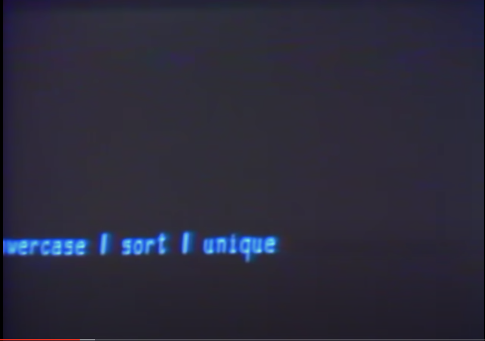
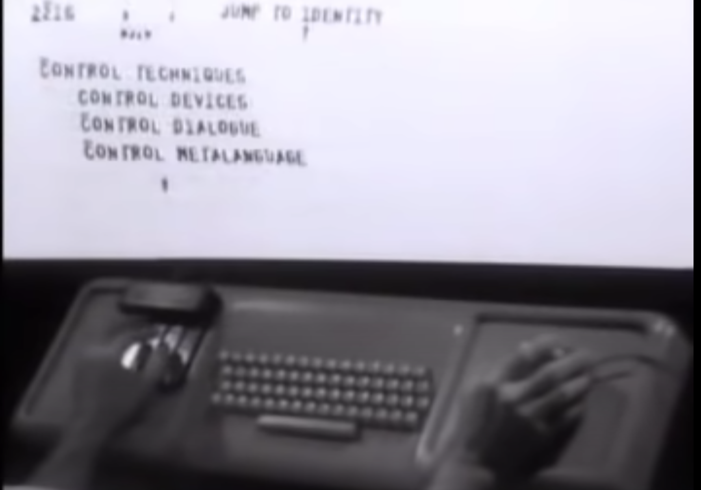
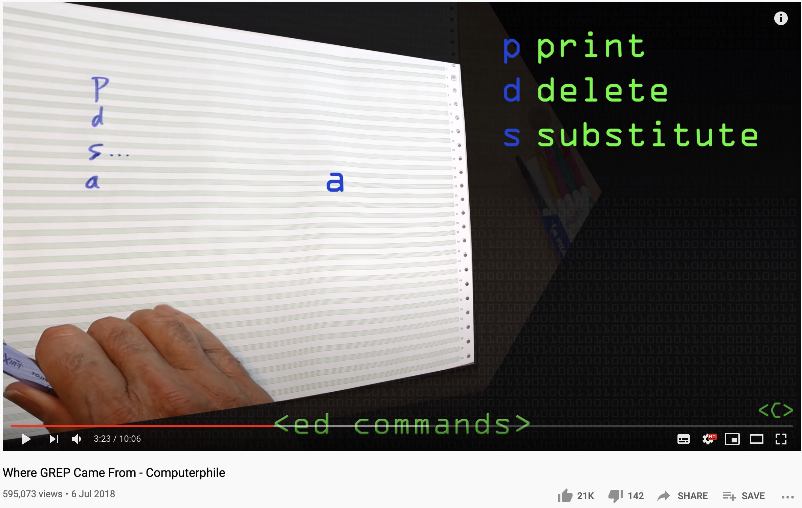

# Recommended Reading

:::info **Work In Progress**

This section is being expanded regularly, so check back often to find more recommendations!

:::

Some great books and articles for specific topics are listed below.

## Fantastic Books

Each of these books would make a great addition to your bookshelf if you are a technologist. Many of these books I have read multiple times and still go back to as a reference.

<table>
  <tr>
    <td></td>
    <td>
      
<strong><a href="https://www.amazon.com/Applied-Cryptography-Protocols-Algorithms-Source/dp/0471117099">Applied Cryptography: Protocols, Algorithms, and Source Code in C - Bruce Schneier</a></strong>

      
This is the absolute best book around on cryptography - from concepts, protocols all the way to advanced topics. There are code examples in C that allow you to really see how these concepts work in practice. This is an excellent book for someone who wants to learn about cryptography but also have the option to go deep into the topics that interest them.

    </td>
  </tr>
</table>

### [Shell Scripting by Jason Cannon](https://www.amazon.com/Shell-Scripting-Automate-Command-Programming-ebook/dp/B015FZAXU6)

Short and sweet, this is a good book for absolute shell scripting beginners.

### [Wicked Cool Shell Scripts - Dave Taylor & Brandon Perry](https://nostarch.com/wcss2)

Ideal for systems administrators and power users who can benefit from automating processes across many platforms. This book contains a lot of tips on how to standardise the behaviour of programs across Linux and Unix systems. If you find yourself regularly shell scripting and want to start to build a library of your own scripts to run across machines, this is a great book to read. It will be particularly useful for anyone who faces challenges on incompatibilities and inconsistencies between programs on different systems.

### [Practical Vim: Edit Text at the Speed of Thought, Drew Niel](https://www.amazon.com/Practical-Vim-Thought-Pragmatic-Programmers/dp/1934356980)

Absolutely the best book I've read on Vim, perfect for users of all levels. Written by Drew Niel, who is the author of the amazing [Vimcasts](http://vimcasts.org/) series.

### [Joshua Levy - The Art of the Command Line](https://github.com/jlevy/the-art-of-command-line)

This is a wonderful repository, which aims to help you "Master the command line, in one page". This page is full of useful resources and is a superb reference for users from novice all the way to advanced!

## Essential Online Resources

These resources are available online and are particularly useful.

### The Missing Semester of Your CS Education

The introduction in the site says it better than I could!

Classes teach you all about advanced topics within CS, from operating systems to machine learning, but there's one critical subject that's rarely covered, and is instead left to students to figure out on their own: proficiency with their tools. We’ll teach you how to master the command-line, use a powerful text editor, use fancy features of version control systems, and much more!

https://missing.csail.mit.edu/

Thanks to [Lennart R. Wilke](https://www.linkedin.com/in/lrwilke/) for sharing this with me!

### [Maarten Billemont - Bash Guide](http://mywiki.wooledge.org/BashGuide)

This is an excellent and very detailed resource on bash. It goes into a lot of detail on how things are implemented and is a great resource to find all of the low level details you might be interested in. There is also a more modern version being currently drafted at [https://guide.bash.academy/](https://guide.bash.academy/).

## Great Books

## Great Videos

### The UNIX Operating System

This is a fascinating video from the late 60s - you might be amazed at how much of the stuff you see here is still fundamental to how we work with computers today. The shell, pipelines, the file system and more:

### The Mother of All Demos

Another fascinating video from the late 60s - see the mouse, hypertext, word processing and more:

### Where Grep Came From - Computerphile

Professor Brian Kerninghan explains where the `grep` tool came from:

## Advanced

- [The #! magic, details about the shebang/hash-bang mechanism on various Unix flavours
](https://www.in-ulm.de/~mascheck/various/shebang) - Excellent article on the internals of how different Unix platforms handle shebangs.

## Research

The following articles and links were particularly useful when writing this book:

Great source of shell tricks and tips:

- https://twitter.com/krisnova/status/1109618657305333761?s=11
- Useful Linux commands: https://www.thegeekstuff.com/2010/11/50-linux-commands/

## TODO

Books I'm reading as part of the research for this book.

- [ ] How Linux Works, 2nd Edition: What Every Superuser Should Know - Brian Ward
- [ ] Wicked Cool Shell Scripts, 2nd Edition: 101 Scripts for Linux, OS X, and UNIX Systems - Dave Taylor
- [ ] The Linux Command Line: A Complete Introduction - William E. Shotts Jr.
- [ ] [Modern Vim: Craft Your Development Environment with Vim 8 and Neovim, Drew Niel](https://pragprog.com/book/modvim/modern-vim)
- [ ] [Serious Cryptography: A Practical Introduction to Modern Encryption by Jean-Philippe Aumasson](https://smile.amazon.com/Serious-Cryptography-Practical-Introduction-Encryption/dp/1593278268/ref=tmm_pap_swatch_0?_encoding=UTF8&qid=&sr=)
