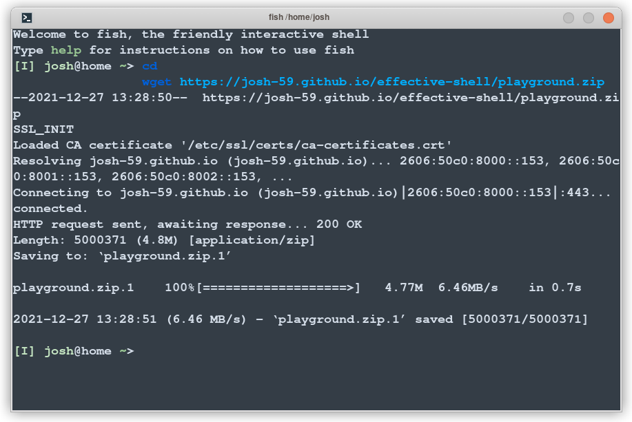
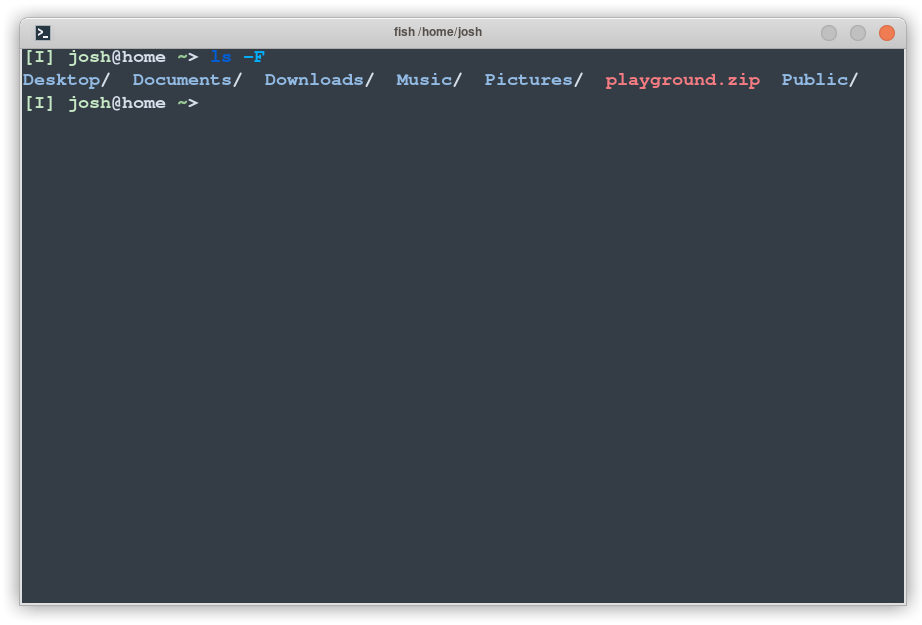
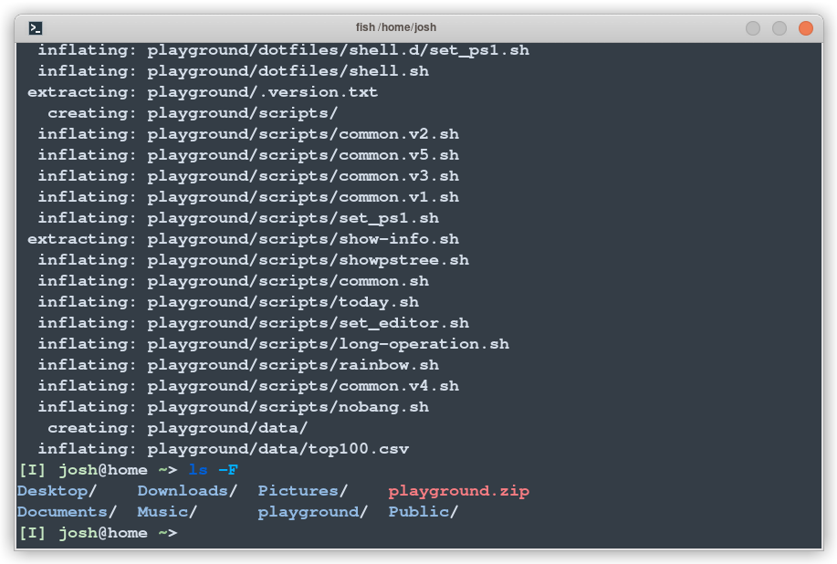

# Chapter 4 - Creating a Playground

Before we start copying, deleting, moving and renaming files, we should create a 'playground' area we can work in. We don't want to test all of this on our own personal files until we know exactly what we're doing! 

To help with this, I've created a zipped-up 'samples' file which has a lot of files in it which we can use to play with. Now the file itself is available on the [effective-shell.com](https://josh-59.github.io/effective-shell/) website, right here:

[https://josh-59.github.io/effective-shell/playground.zip](https://josh-59.github.io/effective-shell/playground.zip)

We *could* open up a web browser, download the file, unzip it and then start from there, but this book is all about how to deal with everyday tasks in your shell, so let's skip the browser and do it in the shell instead!

Open your shell&mdash; If you're not sure how to do that, it's OK, just check [Chapter 2 - Opening the Shell]().

Now that you have your shell open, we can run the `wget` (_Web Get_ ) command to download the zip file. Let's download it to our Home folder: 

```sh
cd
wget https://josh-59.github.io/effective-shell/playground.zip
```

You'll see something like this:



When you call the `wget` command, you can give it any web address and it'll download it to your current folder. It also shows the progress of the download interactively (particularly useful if it's a big file!).

Now that we've downloaded the file, let's look at our home directory with a quick call to `ls`:



Cool - we have the zip file downloaded! Now we need to work out how to unzip it so we can get to the files in the zip archive.

## Extracting the Zip

Right now we have a zip file. We need to extract it&mdash; Unpack the files so that we can play with them. Again, in a system with a graphical user interface, this is easy, generally you just right click on it. But we're going to use the shell for this!

Run the command:

```sh
unzip ~/playground.zip
```

Now let's look at what we've got with the `ls` command:



Excellent - we've now got a _folder_ which contains all of the files in the zip archive.
