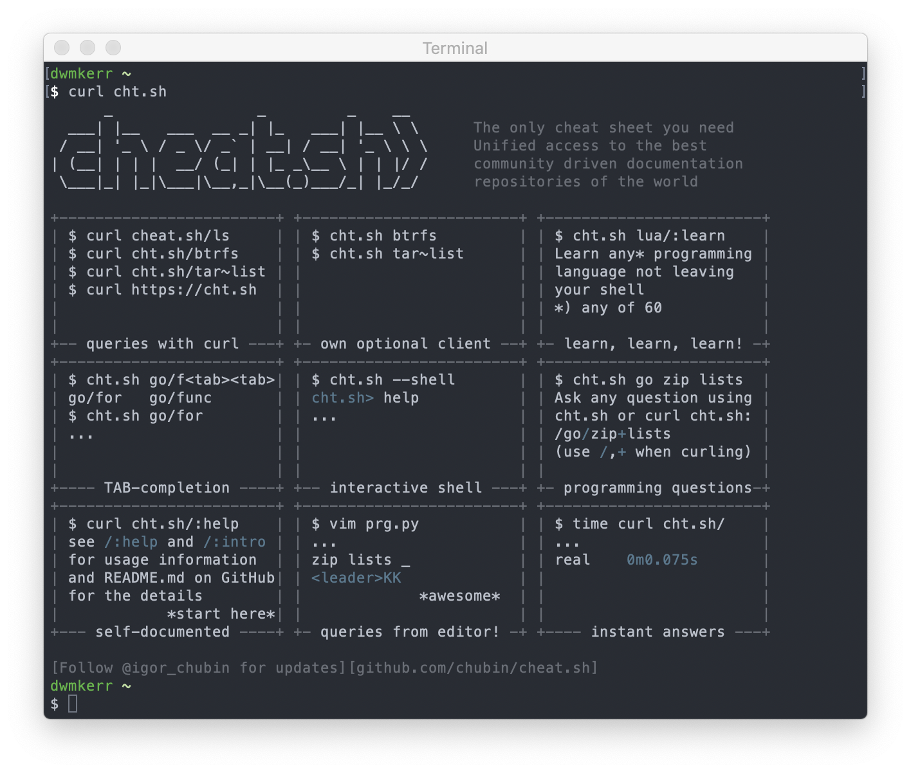

# Chapter 4 - Getting Help

In the earlier chapters I've introduced quite a few commands. 
Having to remember all of these commands and their parameters would be very hard. 
Fortunately there are built-in capabilities in the shell to help.

In this chapter I'll show you how to quickly get help when working with tools in the shell, without disrupting your flow!

# Getting Help is Important!

If you are trying to be more effective when using the shell, it is crucial to know how to quickly look things up.

There'll be many circumstances where you'll need to open a browser to search for help. But there's also a wealth of information only a few keystrokes away. Looking up parameters, checking how to run commands, C library documentation, or even useful information like ASCII charts are available directly in the shell.

Being able to access this information quickly, without jumping into a browser or interrupting your flow is going to be one of the most crucial things you can do to become an _effective_ shell user.

First we're going to look at the standard help system which is available on all Unix-like systems, which is `man` (short for 'manual'). Then we'll see a useful tool you can installed called `tldr`, which might be more helpful for day-to-day use. Finally we'll take a look at the `cht.sh` site as an alternative source for help.

# Understanding 'man'

Most tools you encounter in the shell have manual pages available. Many people will be familiar with the `man` command to get help on a tool, but there is a lot more help available than people often realise.

## Getting help on a command

The most basic way to get help on a command is with `man`. Here's an example:

```
$ man cp


CP(1)                     BSD General Commands Manual                    CP(1)

NAME
     cp -- copy files

SYNOPSIS
     cp [-R [-H | -L | -P]] [-fi | -n] [-apvX] source_file target_file
     cp [-R [-H | -L | -P]] [-fi | -n] [-apvX] source_file ...
        target_directory

DESCRIPTION
     In the first synopsis form, the cp utility copies the contents of the
     source_file to the target_file.  In the second synopsis form, the con-
     tents of each named source_file is copied to the destination
     target_directory.  The names of the files themselves are not changed.  If
     cp detects an attempt to copy a file to itself, the copy will fail.

...
```

The `man` command opens the manual for the given tool. These manuals should contain all command line options and details of how to use the tool.

You can scroll up and down through the content with the arrow  keys. This scrolling capability actually is not part of `man` - it is available because the information is presented in the shell *pager*. A pager is a tool for looking through content which might not easily fit on a screen.

## Using the pager

The first thing you might notice is that you can move through the manual pages with the arrow keys.

The `man` command finds the appropriate manual page (often shortened to 'manpages') and then opens the page in a pager tool. The pager is what is providing the keyboard interface to look through the file.

On most systems, the pager will be the `less` program. There are lots of commands you can use to navigate through files with `less`, but the bare essentials are:

- `d` - Scroll down half a page
- `u` - Scroll up half a page
- `j` / `k` - Scroll down or up a line. You can also use the arrow keys for this
- `q` - Quit
- `/<search>` - Search for text
- `n` - When searching, find the next occurrence
- `N` - When searching, find the previous occurrence

There are *many* other commands, but the set above is normally what I find myself using the most.

If you are interested, you can actually see what your pager is with the command below:

```sh
$ echo $PAGER
less
```

The `$PAGER` environment variable is used to tell the shell what program to use for paging. A few more details can be found with the `man man` command.

You can put any text content into your pager - try this:

```sh
ls -al /usr/bin | less
```

This lists the contents of the `/usr/bin` folder, piping the output to `less` so we can easily scroll through it.

There are alternative pagers available (on many Unix-y systems you'll have `less`, `more` and `most`) but in general you'll normally get what you need with `less`.

# The Alternative - Help

Sometimes you'll look something up in the manual and get the 'builtins' page. For example:

```sh
$ man cd
BUILTIN(1)                BSD General Commands Manual               BUILTIN(1)

NAME
     builtin, !, %, ., :, @, {, }, alias, alloc, bg, bind, bindkey, break,
     breaksw, builtins, case, cd, chdir, command, complete, continue,

# (I've skipped the bulk of the output to save space!)
```

This happens when the command you are looking up is not actually a program with a manual page, but a built-in shell command. Most shells have a way get help on such commands - `bash` for example has `help`:

```sh
$ help cd
cd: cd [-L|[-P [-e]] [-@]] [dir]
    Change the shell working directory.

    Change the current directory to DIR.  The default DIR is the value of the
    HOME shell variable.

# (I've skipped the bulk of the output to save space!)
```

This is all I'll say about `help` for now. We visit it again in [Chapter 10 - Understanding Commands](, where we talk more about built-in commands. For now we'll go back to the `man` command, which works across all shells as it is a Linux feature rather than a shell specific feature!

## Manual Sections

You'll often see tools referred to in manpages with numbers after them. Take a look at `man less`:


The number is the manual **Section Number**. The different sections of the manual are documented and can be found on most Unix-like systems in `man`'s documentation, which you can check by running `man man`[^1]. Here's what you'd get on Ubuntu 16:

- **Section 1** - Executable programs or shell commands
- **Section 2** - System calls (functions provided by the kernel)
- **Section 3** - Library calls (functions within program libraries)
- **Section 4** - Special files (usually found in `/dev`)
- **Section 5** - File formats and conventions (e.g. `/etc/passwd`)
- **Section 6** - Games
- **Section 7** - Miscellaneous (including macro packages and conventions), e.g. `man(7)`, `groff(7)`
- **Section 8** - System administration commands (usually only for root)
- **Section 9** - Kernel routines (Non standard)

Not all of these explanations will be entirely clear to everyone, so we'll go through the sections in detail shortly.

If you want to, you can specifically choose *which* section of the manual you are looking in by using:

```
man <section> <search>
```

You can also get more information about the sections themselves by opening up the `intro` page. For example:

```
$ man 1 intro

INTRO(1)                  BSD General Commands Manual                 INTRO(1)

NAME
     intro -- introduction to general commands (tools and utilities)

DESCRIPTION
     Section one of the manual contains most of the commands which comprise...
```

Why would you do this, and why would you care? In general you won't need to worry about the sections unless you are looking for something which has an entry in _multiple_ sections and you want to specify which one you use.

Another reason it is useful to know about the sections is that a _lot_ of documentation (online and offline) includes a section number _after_ the name of a command or file. Knowing what the section is can be useful in this case.

Here are a few examples of entries from each section, which illustrate what each section is for.

### Section 1: Programs and Shell Commands

These are programs - probably what you are going to be looking up most regularly! For example, `man 1 time` shows:

```
TIME(1)                   BSD General Commands Manual                  TIME(1)

NAME
     time -- time command execution

SYNOPSIS
     time [-lp] utility

DESCRIPTION
     The time utility executes and times utility.  After the utility finishes, time writes the total time
     elapsed, the time consumed by system overhead, and the time used to execute utility to the standard
     error stream.  Times are reported in seconds.

...
```

### Section 2: System Calls

You'll probably not use this section unless you are doing systems programming[^2]. This section contains info on the available Linux Kernel system calls. For example, running `man 2 chown` gives:

```
CHOWN(2)                    BSD System Calls Manual                   CHOWN(2)

NAME
     chown, fchown, lchown, fchownat -- change owner and group of a file

SYNOPSIS
     #include <unistd.h>

     int
     chown(const char *path, uid_t owner, gid_t group);
...
```

This entry shows you how you would call the function if you were programming for the Kernel.

### Section 3: Library Calls

These are the manpages for the C standard library functions. For example, `man 3 time`:

```
TIME(3)                  BSD Library Functions Manual                  TIME(3)

NAME
     time -- get time of day

LIBRARY
     Standard C Library (libc, -lc)

SYNOPSIS
     #include <time.h>

     time_t
     time(time_t *tloc);
...
```

You would use this information if you were writing programs to run on the system.

Here we can see why the sections are important to know about. There are _multiple_ entries for `time`. We need to use the sections to differentiate between them.

Running `man time` would *not* open the page above, because `man` searches the library in ascending section order, meaning that it actually finds `time(1)` and shows the pages for the `time` program, not the `time` C library call.

Because of the potential ambiguity of names if no section number is included, in lots of Linux documentation you'll see the man section number written next to library calls, system calls, programs and so on (things will refer to `sed(1)` or `time(3)` for example.

### Section 4: Devices

This section deals with the special devices which live in the `/dev/*` folder. For example, running `man 4 random` shows:

```
RANDOM(4)                BSD Kernel Interfaces Manual                RANDOM(4)

NAME
     random , urandom -- random data source devices.

SYNOPSIS
     pseudo-device random

DESCRIPTION
     The random device produces uniformly distributed random byte values of
     potentially high quality.
...
```

Again, we see that section numbers can be important. If you just run `man random`, you'll see:

```
RANDOM(3)                BSD Library Functions Manual                RANDOM(3)

NAME
     initstate, random, setstate, srandom, srandomdev -- better random num-
     ber generator; routines for changing generators

LIBRARY
     Standard C Library (libc, -lc)

SYNOPSIS
     #include <stdlib.h>

     char *
     initstate(unsigned seed, char *state, size_t size);

     long
     random(void);
...
```

Which is the manpage for `random(3)`, which is C library function, not the `/dev/random` file!

We'll see more of these special files later in the book.

### Section 5: File Formats

This section details special files in the system. For example, `man 5 crontab` shows:

```
CRONTAB(5)                  BSD File Formats Manual                 CRONTAB(5)

NAME
     crontab -- tables for driving cron

DESCRIPTION
     A crontab file contains instructions to the cron(8) daemon of the gen-
     eral form: ``run this command at this time on this date''.  Each user
     has their own crontab, and commands in any given crontab will be exe-
     cuted as the user who owns the crontab.  Uucp and News will usually
     have their own crontabs, eliminating the need for explicitly running
     su(1) as part of a cron command.
...
```

Which describes the crontab file used to define scheduled tasks. Again, this is different to `man crontab` which would document `crontab(1)`. Similarly, `man 5 passwd` is going to show something quite different to `man passwd`.

You'll potentially use this section if you are performing system administration.

### Section 6: Games

Nothing says it better than `man 6 intro` itself (this'll not work on a Mac sadly, but try it on another Linux system):

```
...
DESCRIPTION
       Section 6 of the manual describes all the games and funny little programs available on the system.
...

```

There are probably a few silly programs available on your system, here you'll find their manuals. For example, `man 6 banner` on a Mac shows:

```
BANNER(6)                      BSD Games Manual                      BANNER(6)

NAME
     banner -- print large banner on printer

SYNOPSIS
     banner [-d] [-t] [-w width] message ...

DESCRIPTION
     Banner prints a large, high quality banner on the standard output.  If
     the message is omitted, it prompts for and reads one line of its stan-
     dard input.
...
```

This section is going to be highly dependent on your operating system!

### Section 7: Miscellaneous

This is where you'll find additional assorted documentation. For example, `man 7 ascii` shows:

```
ASCII(7)             BSD Miscellaneous Information Manual             ASCII(7)

NAME
     ascii -- octal, hexadecimal and decimal ASCII character sets

DESCRIPTION
     The octal set:

     000 nul  001 soh  002 stx  003 etx  004 eot  005 enq  006 ack  007 bel
...
```

### Section 8: System Commands

We've actually already seen one of these commands mentioned, in the manpage for `crontab(5)` it mentions `cron(8)`. Let's see, with `man 8 cron`:

```
CRON(8)                   BSD System Manager's Manual                  CRON(8)

NAME
     cron -- daemon to execute scheduled commands (Vixie Cron)

SYNOPSIS
     cron [-s] [-o] [-x debugflag[,...]]
```

These are commands which system administrators would normally run. You might open section eight unexpectedly, for example `man chmod` will open `chmod(1)`, but `man chown` will open `chown(8)`, as it is a system command.

Some distributions might vary for section nine. On my Mac it contains information about the kernel interfaces, a C style guide and some more.

### Getting the Index of Manual Section

Manpages are just files on the filesystem, so you can get the index of a section just by looking in the appropriate folder.

For example, to index the available system calls, try `ls /usr/share/man/man2`:

```
EV_SET.2
FD_CLR.2
FD_COPY.2
FD_ISSET.2
FD_SET.2
FD_ZERO.2
_exit.2
accept.2
access.2
acct.2
...
```

This is quick and easy way to see what sort of entries you have on your system. If you want to work out where an entry lives, use the `-w` flag:

```
$ man -w printf
/usr/share/man/man1/printf.1
```

There are other ways to show the index of each section, but they vary a lot from system to system so showing the actual files is probably easier.

### Searching the Manual

You can search the manpage titles and summaries with `man -k`. For example, `man -k cpu` shows:

```
cpuwalk.d(1m)            - Measure which CPUs a process runs on. Uses DTrace
dispqlen.d(1m)           - dispatcher queue length by CPU. Uses DTrace
gasm(n), grammar::me::cpu::gasm(n) - ME assembler
```

You can find more advanced options for searching by using your newfound `man` skills on `man` itself.

You can also use the `apropos` or `whatis` commands to search through the manuals. However, for simplicity I suggest just remember `man -k`!

# Introducing tl;dr

In general for this book I'm trying to avoid suggesting too many non-standard tools which don't come pre-installed on systems. However, this one is just too good to miss!

Let's say I need to find and replace some text in a file. I know I can do this with the `sed` command, but have forgotten the syntax. So I run `man sed`:


Wow, that's a lot of detail! And this is just page one of six!

Now let's compare this to the output from `tldr` (which is short for "Too Long, Didn't Read"). All I need to do is run `tldr sed`:


The first example is exactly what I'm looking for. Now for any more detail than a few basic examples, I'm going to have to go to the manual, but for the basics this is great.

You can install the [`tldr`](https://github.com/tldr-pages/tldr) tool with `npm install -g tldr`. It's open source and community maintained. You will need Node.js installed to install the tool, the instructions are available online.

I'd recommend `tldr` as a first-call for checking to see how to use a command.

# The Online Cheatsheet

One final resource which I think is worth sharing is the website [www.cheat.sh](https://www.cheat.sh). This is a _fantastic_ online collection of 'cheat sheets'.

These sheets cover almost all of the tools you will encounter, programming languages and more. But the real beauty of the tool is how it integrates into the shell. To see what I mean, just run the following command:

```sh
$ curl cht.sh
```

You will see something like this:



The `curl` command we'll see again and again. It is a tool which lets you download content from the web. If we load the `cheat.sh` website (or its shortened version, `cht.sh`) from the shell, we get a text version of the website. We can now look at all sorts of content by following the guide shown.

The Cheat.sh site aggregates many data sources - including `tldr`! This means we can get information on tools without even having to install a tool like `tldr` locally.

This online cheatsheet is a wonderful resource. As well as guides for specific tools, there are entire courses on programming languages. You can even use it to search for the answers to questions, these features are powered by Stack Overflow. For example:

```sh
$ curl cht.sh/"How do I copy a folder in bash?"
```

You'll see something like this:


Now that can be a real time saver!

# Summary

In this chapter we looked at some of the ways we can get help. To quickly summarise:

- The `man` tool can be used to look at the manual page for a topic
- The `man` pages are grouped into sections, we can see them with `man man`
- The `tldr` tool shows a very short description of a tool, which covers the most common use cases only
- The `cht.sh` website can be used directly from the shell to get help on tools or even ask specific questions

# Footnotes

[^1]: Weirdly satisfying to run.
[^2]: Which it is always fun to try if you get the chance, and a great way to learn more about the fundamentals of the operating system.
[^3]: Dash is a paid product. Full disclosure - I don't get any money from them or anyone else to write about anything, all content is 100% based on my experiences. I don't run ads on my site either.
