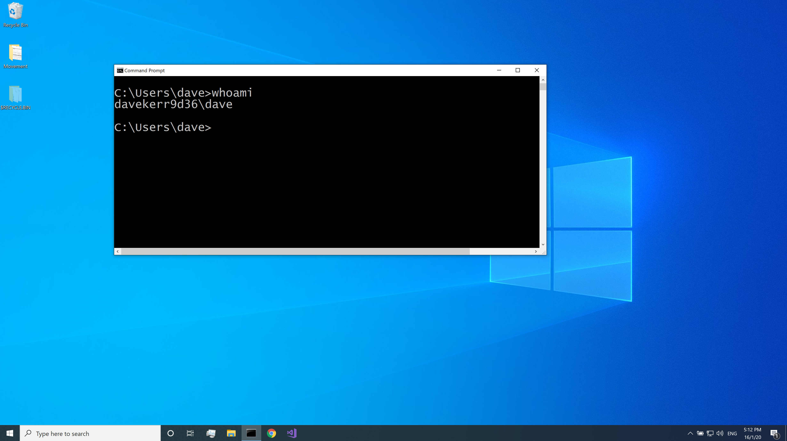
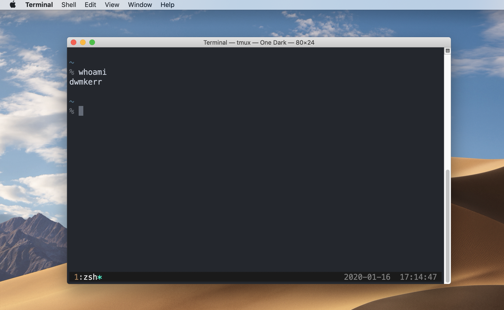
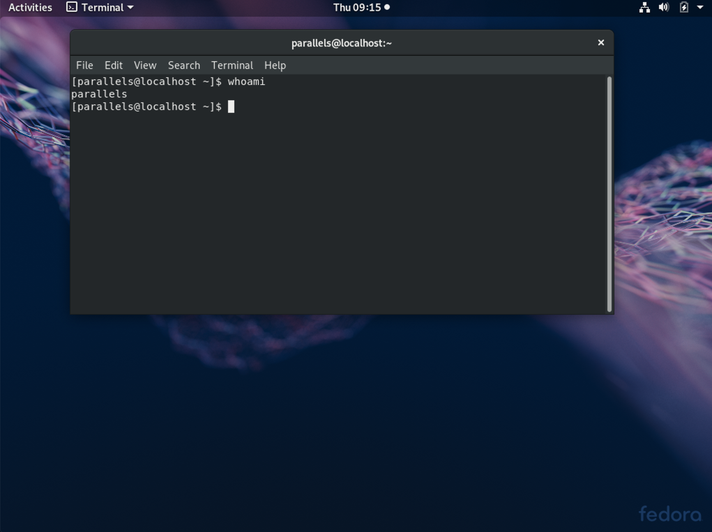

# Chapter 1 - What is the Shell?

The shell is the basic interface for controlling a computer with just a keyboard. 
It consists of a [read, evaluate, print](https://en.wikipedia.org/wiki/Read%E2%80%93eval%E2%80%93print_loop)  loop in which the user is queried for instructions interactively. People use it for managing computers, writing software, doing data science, or even writing books like I am doing! 

Here's what it looks like on Windows:

And on a Mac:

And here's what it looks like on Fedora, a popular Linux distribution:

It might come as a surprise that _many_ technical computer users (programmers, data scientists, systems administrators, etc.) spend a lot of time using an interface which looks like it's from the sixties.
Why would someone choose to use such an interface?

- Typing is __fast__: A skilled shell user can manipulate a system at dazzling speeds just using a keyboard. Typing commands is generally _much_ faster than exploring through user interfaces with a mouse
- Shells are __programmable__: Users will often program as they work, creating scripts to automate time-consuming or repetitive processes
- Shells are __portable__: A shell can be used to interface to almost any type of computer, from a mainframe to a Raspberry Pi, in a very similar way.

All of the content of this book is designed to be suitable to work with Microsoft Windows, Mac OS and Linux. 
So no matter what system you are running, you should be able to follow along. 
We will focus primarily on 'Linux Like' environments, which hopefully will give you the skills which you can apply most widely. 
For Windows, we'll look into how to tweak your system to be able to run all of the samples.

---

**Footnotes**

[^1]: On Windows you might need to run `start .` and on Linux, `xdg-open .`.
