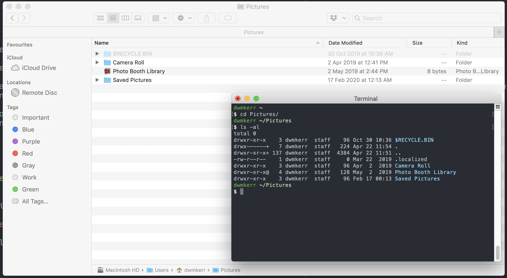

# Chapter 2 - Navigating Your System

Switching from a graphical user interface to the shell can take some getting used to. First we'll take a look at how to navigate your system using the shell, and get information on files and folders in the system.

This section will introduce the `pwd`, `ls`, `cd`, `pushd` and `popd` commands, as well as the concepts of the "working directory" and "environment variables". We'll also take a bit of a look into how "Paths" work.

If these commands far familiar to you then feel free to jump to the next chapter! Otherwise, let's get started.

# The Working Directory

Perhaps the easiest way to start to understand how to navigate your system using the shell is to use a graphical interface as an illustration of how we often navigate. Open your shell, and enter the following command:

```sh
pwd
```

You should see something like this:


When we open a folder in a graphical user interface, we are always viewing the contents of a folder, or directory. When you open the shell, the same applies - we are always sitting in a specific directory.

The `pwd` command is the _Print Working Directory_ command. It shows the full path of the directory that you are in. You might not use this command very often, as in many shells you can see the directory you are in (if you cannot see this in your shell, you'll find out how to do this in [Chapter 18](#TODO)).

There's one more way to find the working directory. It is stored in an _Environment Variable_ called `PWD`.

An environment variable is just a bit of data that you can access from your shell. You can create them, you can change them, and there are some which are set for you by the system or the shell to help you out.

Try the following command:

```sh
echo "My current working directory is: $PWD"
```

You should see something like this:


The dollar symbol is used to tell the shell we want to use the `PWD` variable, not write out the _text_ `PWD`. We'll see a lot more about environment variables as we continue through the book. 

# Listing the Contents of the Working Directory

In the graphical user interface, we can also see the files and folders in the current directory. In the shell, we don't see this content. But we can show the contents of the current working directory with the following command:

```sh
ls
```

You should see something like this:


The `ls` command is the _List Directory Contents_ command. It will show the contents of a directory. If we don't give it any parameters, it will show the contents of the current directory.

There are a lot of options for the `ls` command. In [Chapter 5](#TODO) we'll see how to find out the options for commands. For now, let's look at one of the most common options `-l`. This shows the contents as a list:

```sh
ls -l
```


A little like the 'details' view in a graphical user interface, this list view shows us more details, such as who owns the file or folder, when it was modified, and more. Again, we'll see more details on this later.

# Changing the Directory

In a graphical user interface, you move to a different directory by clicking on it.

In the shell, you run the `cd` command. Try it out with:

```sh
# Move to the pictures directory...
cd Pictures

# ...then list the contents of the directory.
# Note that the '-al' flags mean show *all* files, as a *list*.
ls -al
```

Note that when you see shell commands, everything which starts with a hash symbol is a comment. These comments are just for readability, you don't need to include them. But if you are saving your own shell snippets (or "scripts"), then you might find comments a useful way to remind yourself of what you are hoping to achieve with the commands, or to make the script more readable.

On my system, we'll see the following output:



The `cd` command is the _Change Directory_ command. You might see a pattern here - shell commands often are very short (to make it easier to type them quickly) and are often made up of the first letters of the description of the command (`pwd` for _Print Working Directory_, `cd` for _Change Directory_).

Now that you know how the `cd` command works, you will be able to move around to different folders. At this stage, it's important to talk a little bit about how _paths_ work in systems.

# Understanding Paths

In Linux, Windows and MacOS (and most other operating systems), _paths_ are the 'addresses' of files or folders.

There are two types of paths - _Absolute Paths_ and _Relative Paths_. An absolute path is one which gives the exact location of a file. For example, on my computer, the absolute path to the folder I am writing this book in is:

```
/Users/dwmkerr/repos/github/dwmkerr/effective-shell
```

Absolute paths _always_ start with a slash. That's how the system knows it is an absolute path. The `/` is the _root_ of the file system - basically it's the folder which _everything_ else lives in.

If I have an absolute path, I know _exactly_ where the file or folder is. Let's compare this to a _relative path_. Below is the _relative path_ in my shell for the file I'm writing right now:

```
website/content/docs/part-1-transitioning-to-the-shell
```

This path is _relative_ to my current working directory in the shell. This means that this path only makes sense if you use it from a specific directory. If I am in my `Pictures` folder, and I want to move to the `2020-photos` folder, I could do it in two ways. The first is with an absolute path:

```sh
cd /Users/dwmkerr/Pictures/2020-photos
```

The second is with a relative path:

```sh
cd 2020-photos
```

In short - relative paths are often useful if you want to move to something _within the current directory_ and absolute paths are useful if you need to move to _somewhere completely different_.

# The Special Dot and Dot Dot Folders

As you experiment with these commands, you might have noticed that  every folder contains two other folders, one with the name `.` and one with the name `..`. Run `ls -al` on the `pictures` folder to see an example:

```sh
ls -al pictures
```

You should see something like this:


This picture highlights two special folders - `.` and `..`. These are special folders which exist in _every_ folder in the system.

The first folder, `.`, represents the folder it is in. Why would this be useful? Well, sometimes we just want a quick way to say the equivalent of "right here" in a command. For example, if I wanted to copy the current folder to a backup folder, I could do this:

```sh
cp . /backup
```

The `cp` command is the _Copy_ command, and we'll see it in the next chapter. But the key thing to note is that we can use `.` to tell the command to copy the folder we are in right now.

The `..` folder means _the parent folder_. You can use this to "go up" to the parent folder, for example:

```sh
cd ..
ls .
```

Would give:


Note that we've used `cd ..` to _change directory to the parent folder_ then `ls` to _list the contents of the current folder_. We could also just have used `ls` on its own as it defaults to the current folder.

The `..` folder can be helpful if you need to navigate to a location which is outside of your current folder. For example, if I am in the `pictures` folder and I want to move to the `scripts` folder, I can just use:

```sh
cd ../scripts
ls
```

And we'll see this:


# The Home Directory

There is one more special part of the file system we have to know about. That is the _Home Directory_. In Linux-like systems every user has their own personal directory where they can keep their files and folders.

This directory can always be accessed through the `~` character. For example, no matter where I am in the system, I can run the following command to move to my home directory and show the contents:

```sh
cd ~
ls
```

This would show something like this:


This makes moving around your home directory very easy. For example, on a Mac, to go to your pictures folder from anywhere, you can always just run:

```sh
cd ~/Pictures
```

Your home directory on most computers will be where you keep your documents, pictures, videos and so on. Normally this directory is _not accessible_ to other users of the system. Each user in a system gets their own home directory.

You can also see the home directory by using the special `HOME` environment variable:

```sh
echo "My home directory is: $HOME"
```

This would show something like this:


One useful trick - running `cd` without any parameters will always take you home! So to go home, just run:

```sh
cd
```

Now that we know about relative paths, absolute paths, and the special dot and dot dot folders, and the home directory we can continue learning how to navigate the shell!

# Pushing and Popping the Working Directory

One thing we might want to do is quickly move from one location to another, then go back again. Let's say for example I am working in on this chapter, but I want to check my downloads. One way to do this is with this `pushd` command:

```sh
pushd ~/Downloads
ls
popd
```

After I've checked my downloads, I can run `popd` to go back to where I was:


The `pushd` command 'pushes' a new working directory onto a stack - moving you there. The `popd` command 'pops' the working directory off the top of the stack. A stack is a structure often used in computers; we can actually push lots of different files to the working directory stack.

Why is it called a stack? Well, the reason is that if we were to visualise the structure, it might look like a stack of plates or similar. Here's how `pushd` and `popd` would look if we were to visualise it:


These commands can be useful if you need to move to other locations but want to be able to quickly go back to where you were before afterwards.

# Going Back

One last trick which can save time is the following command:

```sh
cd -
```

This is a special parameter for `cd` which tells it to _go back_ to the last location you moved to. Here's how it might look if you use it:


This can only be used to go back to the last directory. If you need to be able to go backwards multiple times or through a history of directories, you might need to use `pushd` and `popd` instead.

# Summary

In this chapter we introduced the following:

- The `pwd` (_print working directory_) command shows the current working directory
- The `$PWD` environment variable holds the current working directory
- The `ls` (_list_) command shows the contents of the current directory or a given directory
- The `ls -l` command shows the contents of the current directory as list
- The `cd` (_change directory_) changes the current working directory
- Absolute paths are paths which specify the exact location of a file or folder...
- ...Relative paths are paths which are relative to the current directory
- The `.` special folder means 'this folder'
- The `..` special folder means 'the parent folder'
- The `~` special folder is the 'home directory'
- The `$HOME` environment variable holds the user's home directory
- You can run `cd` at any time to quickly go to your home directory
- You can use `pushd` and `popd` to push and pop the working directory stack
- You can use the `cd -` command to go back to the last location
