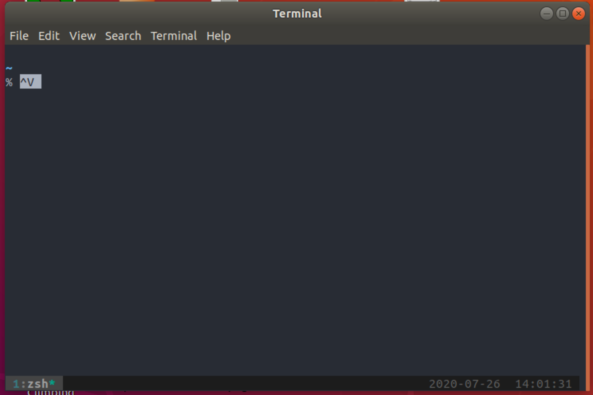

# Chapter 3 - Becoming a Clipboard Gymnast

For those who are new to the shell, we've covered a lot. In this chapter we'll slow down the pace of new commands a bit and instead focus on a core skill which you already be familiar with - using the clipboard.

You have probably already been using the clipboard with the shell, copying and pasting commands and their outputs. However, there's a lot more we can do with the clipboard. Now we'll look at how to take this to the next level. We'll also briefly introduce introduce _aliases_ and _pipelines_, which will be covered in a lot more detail in later chapters.

## The Most Basic Clipboard Commands

You are probably used to using the keyboard to access the clipboard, using the Cut, Copy and Paste commands. The keyboard shortcuts are probably already locked in as muscle memory:

| Command | Windows Shortcut | Linux Shortcut | MacOS Shortcut |
|---------|------------------|----------------|----------------|
| Cut     | `Ctrl` + `X`     | `Ctrl` + `X`   | `⌘` + `X`      |
| Copy    | `Ctrl` + `C`     | `Ctrl` + `C`   | `⌘` + `C`      |
| Paste   | `Ctrl` + `V`     | `Ctrl` + `V`   | `⌘` + `V`      |

In the shell, you may find that these commands don't run as expected. For example, in the screenshot below I have tried to use `Ctrl` + `V` a few times paste into terminal on Ubuntu:



Instead of the contents of the clipboard being dropped into the shell, we see the text `^V`. Why is this?

Well, some of this is historical. The reason the `Ctrl` key is _called_ the _Control Key_ is that it is used to send _control sequences_ to the computer. When we're using the Control Key, the characters we send are not plain text, they're used to perform actions. This is something that is probably pretty familiar - `Ctrl` + `P` is pretty universally 'Print' for example.

Now most shells and command-line interfaces pre-date graphical user interfaces (and even new shells tend to follow the conventions of earlier ones to ensure a consistent experience for users who are used to working with shells). Shells have a whole bunch of control sequences which actually pre-date the clipboard itself.

Some of the control sequences used in the shell you might already be familiar with. For example, if you have a program running and want to cancel it, you might be used to using `Ctrl` + `C`. This actually sends a signal to the program and terminates it (there's a lot more about this in later articles).

The `Ctrl` + `C` combination terminates the current program. What about `Ctrl` + `V`? This actually is the _verbatim insert_ command. It tells the shell to write out the _next_ keystroke you give it, instead of processing them normally. This allows you to write out 'special' characters like the escape key, or even the `Ctrl` + `V` command.

In this case if you press `Ctrl` + `V` again it writes out the text `^V`. The hat symbol `^` represents `Ctrl`. You can try writing out some different sequences:

Different shells and different terminals can handle these sequences in different ways, and often the behaviour can be customised. For now, let's just quickly look at the basics of how to use Cut / Copy / Paste in each environment.

**Windows**

If you are using a _Command Prompt_, then the usual shortcuts will work fine. However, most of the time we will be using Bash. In this case the shortcuts will _not_ work. Instead, select the _Use Ctrl+Shift+C/V as Copy/Paste_ option from the properties menu:


You can now use `Ctrl+Shift+C` for copy and `Ctrl+Shift+V` for paste. You can also copy text by just dragging the cursor over it with the right mouse button.

**Linux**

On most Linux systems you'll be using the Gnome terminal, which means that you can use `Ctrl+Shift+C` for copy and `Ctrl+Shift+V` for paste. You can also right click on text with the cursor to select it.

**MacOS**

Mac users can just use `⌘ + C` for copy and `⌘ + V` for paste. The shell doesn't use the special Mac Command character `⌘`, which means the default keyboard mappings on MacOS work fine in a shell as they do not clash with anything.

Now that we've got the basics out of the way, and learnt far more than we probably wanted to about control keys, we can look at more ways to use the clipboard.

## TODO Sharing

Verbatim insert

## Use the Shell on the Clipboard

*Note for Linux Users: In this article I'll use the `pbcopy` and `pbpaste` commands to access the clipboard, which are available on a Mac only. To get access to the same commands on other platforms, check [Appendix: Clipboard Access on Linux](#appendixclipboardaccessonlinux)*

You can easily use shell commands on the contents of your clipboard. Just use `pbpaste` to output the clipboard, run the output through some commands, then use `pbcopy` to copy the result.

Try copying the following text:

```
Kirk Van Houten
Timothy Lovejoy
Artie Ziff
```

Then in the shell, run:

```bash
pbpaste
```

You should see the contents of the clipboard. Now we'll look at some ways that shell access to the clipboard can help with common tasks.

## Removing Formatting

Don't you hate it when you have to copy formatted text and don't have an easy way to paste it as *unformatted* text? Here's an example, I want to copy this Wikipedia page on 'bash', and paste it into a Word document:


Many programs have a shortcut to paste the contents of the clipboard  (such as 'command + shift + v') but if you are like me you might find yourself pasting *into* a plain text editor just to copy *out* the plain text.

If you just run the command `pbpaste | pbcopy`, you can easily strip the formatting:


We're just piping out the clipboard (which ends up as plain text, cause we're in a terminal!) and then piping that plain text *back into the clipboard*, replacing the formatted text which was there before.

This little trick can be very useful. But we can use the same pattern to quickly manipulate the contents of the clipboard in more sophisticated ways.

## Manipulating Text

Let's say someone has emailed me a list of people I need to invite to an event:


The problem is:

1. The list is in Excel and is formatted
1. The list has duplicates
2. I need to turn each name into an email address like 'Artie_Ziff@simpsons.com'

And I want to email everyone quickly.

We can quickly handle this task without leaving the shell.

Copy the raw text below if you want to try out the same commands and follow along:

```
Artie Ziff
Kirk Van Houten
Timothy Lovejoy
Artie Ziff
Nick Riviera
Seymore Skinner
Hank Scorpio
Timothy Lovejoy
John Frink
Cletus Spuckler
Ruth Powers
Artie Ziff
Agnes Skinner
Helen Lovejoy
```

First, we copy the text to the clipboard.

Now we can paste and sort:

```
$ pbpaste | sort
Agnes Skinner
Artie Ziff
Artie Ziff
Artie Ziff
Cletus Spuckler
Hank Scorpio
Helen Lovejoy
John Frink
Kirk Van Houten
Nick Riviera
Ruth Powers
Seymore Skinner
Timothy Lovejoy
Timothy Lovejoy
```

Then remove the duplicates:

```
$ pbpaste | sort | uniq
Agnes Skinner
Artie Ziff
Cletus Spuckler
Hank Scorpio
Helen Lovejoy
John Frink
Kirk Van Houten
Nick Riviera
Ruth Powers
Seymore Skinner
Timothy Lovejoy
```

Replace the space with an underscore:

```
$ pbpaste | sort | uniq | tr " " "_"
Agnes_Skinner
Artie_Ziff
Cletus_Spuckler
Hank_Scorpio
Helen_Lovejoy
John_Frink
Kirk_Van_Houten
Nick_Riviera
Ruth_Powers
Seymore_Skinner
Timothy_Lovejoy
```

Then add the final part of the email address:

```
$ pbpaste | sort | uniq | tr " " "_" | sed 's/$/@simpsons.com/'
Agnes_Skinner@simpsons.com
Artie_Ziff@simpsons.com
Cletus_Spuckler@simpsons.com
Hank_Scorpio@simpsons.com
Helen_Lovejoy@simpsons.com
John_Frink@simpsons.com
Kirk_Van_Houten@simpsons.com
Nick_Riviera@simpsons.com
Ruth_Powers@simpsons.com
Seymore_Skinner@simpsons.com
Timothy_Lovejoy@simpsons.com
```

This looks perfect! We can now put the transformed text back onto the clipboard:

```
$ pbpaste | sort | uniq | tr ' ' '_' | sed 's/$/@simpsons.com' | pbcopy
```

All in all we have the following pipeline:

1. `pbpaste` - output the clipboard
2. `sort` - order the output
3. `uniq` - deduplicate the rows
4. `tr ' ' '_'` - replace spaces with underscores
5. `sed /$/@simpsons.com` - add the email domain to the end of the row

Building this in one go is hard, let's look at little more at the pipeline.

I hope this was useful! Please comment if you have any questions or tips. To see further articles as they come out, follow the repo at:

[github.com/dwmkerr/effective-shell](https://github.com/dwmkerr/effective-shell)

Or just follow [@dwmkerr](twitter.com/dwmkerr) on Twitter.

## Thinking in Pipelines

Some of these commands might be unfamiliar, some might not make sense, and you might be thinking 'how would I remember that'. Actually, there are many ways to solve the problem above, this is the one I came up with by *iteratively* changing my input text.

Here's what I mean - you'll see that I actually build a pipeline like this step-by-step:


(P.S - if you are wondering how I am jumping backwards and forwards a word at a time, check the last chapter '[Navigating the Command Line](www.dwmkerr.com/effective-shell-part-1-navigating-the-command-line/)').

What we're doing here is only possible because these simple commands all follow 'the Unix Philosophy'. They do one thing well, and each command expects it's input to become the input of *another* command later on. Specifically:

1. The commands are primitive and simple - `sort` is sorting a list, `uniq` is making elements unique.
2. The commands don't produce unnecessary output - `sort` doesn't add a header such as `Sorted Items`, which is great because otherwise it would clutter our pipeline.
3. We are chaining commands together, the output of one becomes the input of another.

We don't need a command such as 'Take a muddy list, sort and clean it, then turn pairs of words into an email address' - with a few simple 'workhorse' commands we can easily build this functionality ourselves.

These workhorse commands will be introduced and detailed as we go through the series. We'll also spend a lot more time looking at pipelines.

# Appendix - Clipboard Access on Linux

If you are using Linux, there is no `pbcopy` and `pbpaste` commands. You can use the [`xclip`](https://linux.die.net/man/1/xclip) tool to create equivalent commands.

First, install `xclip`:

```bash
sudo apt-get install -y xclip
```

Then add the following to your `.bashrc` file:

```bash
# Create mac style aliases for clipboard access.
alias pbcopy="xclip -selection c"
alias pbpaste="xclip -selection c -o"
```

Obviously you can use any alias you like! The article assumes that `pbcopy` and `pbpaste` have been used.
