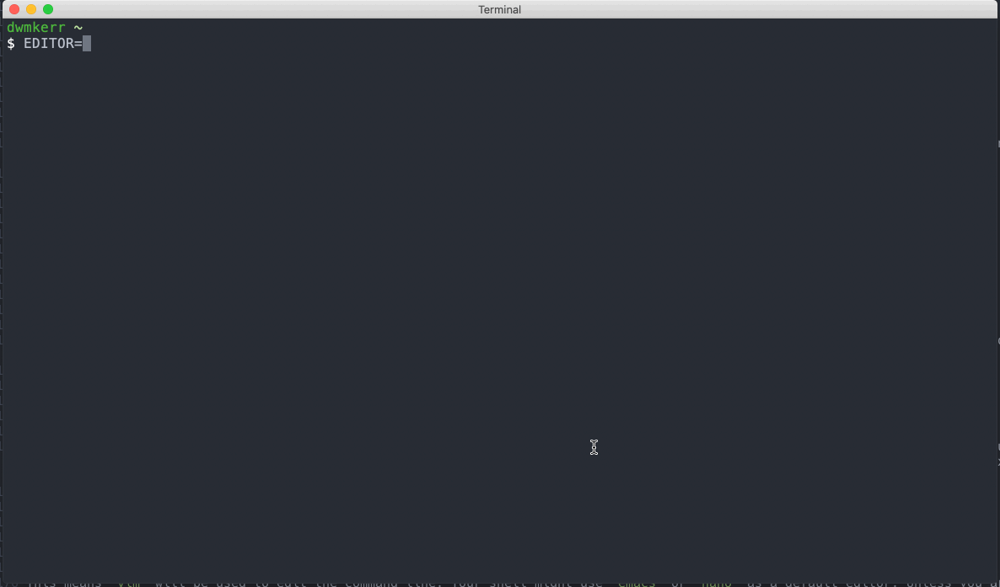

# Chapter 8 - Fly on the Command Line

This is my favourite chapter of the book! The tricks I picked up on rapidly moving around in the command line have saved me an enormous amount of time over the years.

In this chapter, we'll look at the ways you can rapidly move your cursor around on the command line, as well as how to easily open up the current command in an editor (which is _incredibly_ useful if you realise you are building a more complex sequence of commands).

Below is a quick reference which you can use - we'll see each operation in more detail as we go through the chapter!

[](https://github.com/dwmkerr/effective-shell)

<!-- vim-markdown-toc GFM -->

* [Basic Navigation](#basic-navigation)
    * [Go to beginning / end](#go-to-beginning--end)
    * [Move backwards / forwards one word](#move-backwards--forwards-one-word)
    * [Delete a word or undo a mistake](#delete-a-word-or-undo-a-mistake)
    * [Delete the next word](#delete-the-next-word)
    * [Delete to beginning / clear line](#delete-to-beginning--clear-line)
    * [Delete to end](#delete-to-end)
* [Searching](#searching)
    * [Search Backwards / Forwards](#search-backwards--forwards)
    * [Run the command found in a search](#run-the-command-found-in-a-search)
    * [Edit the command found](#edit-the-command-found)
    * [Stop Searching](#stop-searching)
* [Editing In-Place](#editing-in-place)
* [Clear the Screen](#clear-the-screen)
* [See the History and Execute a Recent Command](#see-the-history-and-execute-a-recent-command)
* [Pro Tip: All The Keys!](#pro-tip-all-the-keys)
* [Pro Tip: Transposing!](#pro-tip-transposing)
* [The Power of Readline](#the-power-of-readline)

<!-- vim-markdown-toc -->

# Basic Navigation

Let's assume we have a very simple command we are writing, which is going to write a quote to a text file:

```bash
echo "The trouble with writing fiction is that it has to make sense,
whereas real life doesn't. -- Iain M. Banks" >> quote.txt
```

Navigating around long lines of text is a slow process if you are only relying on the arrow keys.

Let's see how we can quickly move around and manipulate text!

## Go to beginning / end

Quickly jump to the beginning or end of the text:

- `Ctrl + a` - Go to beginning
- `Ctrl + e` - Go to end


## Move backwards / forwards one word

For a little more fine-grained movement, you can jump backwards or forwards one word at a time:

- `Alt + b` - Go back one word
- `Alt + f` - Go forward one word


## Delete a word or undo a mistake

As this is the first operation we're seeing which _changes_ the text, it is useful to remember how to _undo_ any changes you make!

- `Ctrl + w` - Delete a word
- `Ctrl + -` - Undo most recent change


## Delete the next word

We've seen how to delete the word on or behind the cursor, now let's see how to delete the _next_ word:

- `Alt + d` - Delete next word


Remember, just like any edit you can undo these changes with the `Ctrl + -` command.

## Delete to beginning / clear line

In the Bash shell, you can delete all the way to the beginning of the line with `Ctrl + u`. However - if you are using the Z-Shell this will delete the entire line!

- `Ctrl + u` - Delete to beginning of line OR delete line


## Delete to end

You can also delete all of the way to the end of the line.

-  `Ctrl + k` - Delete to end


When you find yourself repeatedly using the arrow or delete keys, refer back to this section to remind yourself of the shortcut - it will save a lot of time in the long run!

# Searching

Once you have the basic navigation commands down, the next essential is _searching_. Let's assume we've run the following three commands:

```bash
$ command1 param1 param2 param3
$ command2 param4 param5 param6
$ command3 param7 param8 param9
```

You can search backwards or forwards with `Ctrl + r` and `Ctrl + s`. This will search in the current line and then iteratively through previous lines:


People often remember this as searching through the history - but remember that it actually searches the _current line_ as well. So this is often the fastest way to move to the desired location in the current line.

This is useful for searching in the current command, but can be also used to quickly search backwards and forwards through the command history:


As you type, your command history is searched, the most recent commands coming first. Use the arrow keys to edit the command, press enter to execute it, or `Ctrl + g` to cancel the search.

I think it's a little easier to see these commands in action with a more realistic example, so here's how they look with the text we used earlier.

## Search Backwards / Forwards

Search backwards or forwards through the current line and also the history:

- `Ctrl + r` - Search backwards (_reverse_ search)
- `Ctrl + s` - Search forwards


## Run the command found in a search

This one is easy! Just hit `Enter`:


## Edit the command found

When you have found the command or positioned the cursor where you want it, use the Left or Right arrow keys to stop searching and to go back into the normal editing mode:


## Stop Searching

Cancel the search and return back to the text as it was before you started with the `Ctrl + g` command:


# Editing In-Place

These tips and tricks are helpful, but if you are working with a really long or complex command, you might find it useful just to jump into your favourite editor. This is one of those tricks that when you know it, you'll wonder how you lived without it!

Use `Ctrl + x , Ctrl + e` to edit-in place, opening the current command line in your default editor:


Now it's important to explain that this is the _shell's_ default editor. This might not be the same as the default editor for your operating system. You can see what the shell is using as its default editor by printing the contents of the `EDITOR` environment variable. For example, my shell will show this:

```
$ echo $EDITOR
vim
```

This means `vim` will be used to edit the command line. Your shell might use `emacs` or `nano` as a default editor. Unless you are familiar with `vim` or `emacs`, you might not find them particularly user friendly as an editor. You can change your default editor by setting the `EDITOR` variable. For example, below I set the editor to `code` (with the `-w` flag which tells the `code` program not to return control immediately back to the shell but instead wait until I've finished editing the file):



Now this works (just about), but I wouldn't recommend using a Graphical Editor like Visual Studio Code for this. The reason is that because the editor runs in a separate window, it is actually easy to lose track of it (or the shell). You pause to take a short break, come back, close the editor and the contents are either lost or written to the shell (and if you see in the example above, the shell actually _executed_ the command, rather than just putting it in the command line ready for me to execute).

The other reason to avoid a graphical editor is that if you are using a shell on another user's machine, the editor might not be present (or might be configured differently). In general however, the main reason to avoid a graphical editor is that it moves the _context_ of the command away from where you are in the shell to another place, which can be confusing. If you see the screenshot below, I have _two_ editors open:


The top right pane has my `git commit` command running (which is asking me to write a description of my changes) and the bottom right pane has the command line editor running (where I am testing out the commands for this chapter).

In this example, each editor has taken the place of the contents of the shell, so there's no ambiguity about _which_ command I am editing. If I was to open a graphical editor, it would open multiple tabs for this operation and I'd have to track which tab was which.

It can be daunting to learn an editor like `vim` or `emacs`. Chapter 27 goes into more detail on the terminal based text editors - for now if you are not familiar with these programs I recommend you use the `nano` editor. Nano is small, simple and shows the shortcuts in a convenient menu at the bottom of the screen:


In Chapter 18 we'll see how to make permanent customisations to the shell, configuring things like the default editor.

# Clear the Screen

Probably the shortcut I use the most is `Ctrl + l`, which clears the screen without trashing your current command. Here's how it looks:


This is very helpful if you have a lot of noise and output on the screen and are ready to start with a fresh command.

# See the History and Execute a Recent Command

Just a few days ago a friend showed me a fantastic trick. If you run the `history` command, the shell will print the recent history of commands you have entered. But as an added bonus, you can _execute_ any of these commands by entering an exclamation mark and the number next to the command:


The number is actually just the _line number_ in the _history file_. Most shells maintain a history of commands which have been entered (to allow for things like searching through old commands). Where this history file is kept will depend on your shell, configuration and operating system, but in most cases you can find the file by running:

```sh
echo $HISTFILE
```

There are many configuration options for the shell history. But the main thing to remember is that you can see recent history with the `history` command and quickly execute the command at line `n` by running `!n`.

# Pro Tip: All The Keys!

You can use the `bindkey` command to see a list of all keyboard shortcuts:

```
$ bindkeys
"^@" set-mark-command
"^A" beginning-of-line
"^B" backward-char
"^D" delete-char-or-list
"^E" end-of-line
"^F" forward-char
"^G" send-break
"^H" backward-delete-char
"^I" expand-or-complete
"^J" accept-line
"^K" kill-line
"^L" clear-screen
...
```

This is an extremely useful command to use if you forget the specific keyboard shortcuts, or just want to see the shortcuts which are available.

# Pro Tip: Transposing!

If you've mastered all of the commands here and feel like adding something else to your repertoire, try this:


The `Alt + t` shortcut will transpose the last two words. Use `Ctrl + t` to transpose the last two letters:


These two commands were new to me when I was researching this chapter. I can't see myself ever being able to remember the commands more quickly than just deleting the last two words (`Ctrl+w` twice!) or characters and re-typing them, but perhaps you'll find them useful!

# The Power of Readline

All of the movement commands you've learned in this chapter apply to:

1. Bash
2. zsh
3. The Python REPL
4. The Node.js REPL

And many more! The reason is that all of these programs use the same library under the hood to control reading command line input. This library is called *GNU Readline*.

If you are ever looking to go deeper on this topic then search the web for *GNU Readline*. You can actually configure lower level details of how all programs which use readline work, with the [`.inputrc`](https://www.gnu.org/software/bash/manual/html_node/Readline-Init-File.html) configuration file.

This configuration file can be used to configure things like the shortcuts used to move around. All of these shortcuts should be familiar to Emacs users. There is in fact also 'Vi Mode' option for readline, which allows you to use `vi` commands to work with text. You can enter this mode with `set -o vi`.

There's a great cheat sheet on emacs readline commands at [readline.kablamo.org/emacs](http://readline.kablamo.org/emacs.html), which is a very useful reference if you want to dig deeper.

We'll also see _GNU Readline_ later on when we talk about writing programs which work well in the shell.

I Hope that was useful! Being able to rapidly move around the command line will hopefully save you time and make you a more confident user of not just the shell, but many command line programs.

---

**Footnotes**

GIFs were made with [LICEcap](http://www.cockos.com/licecap/).
