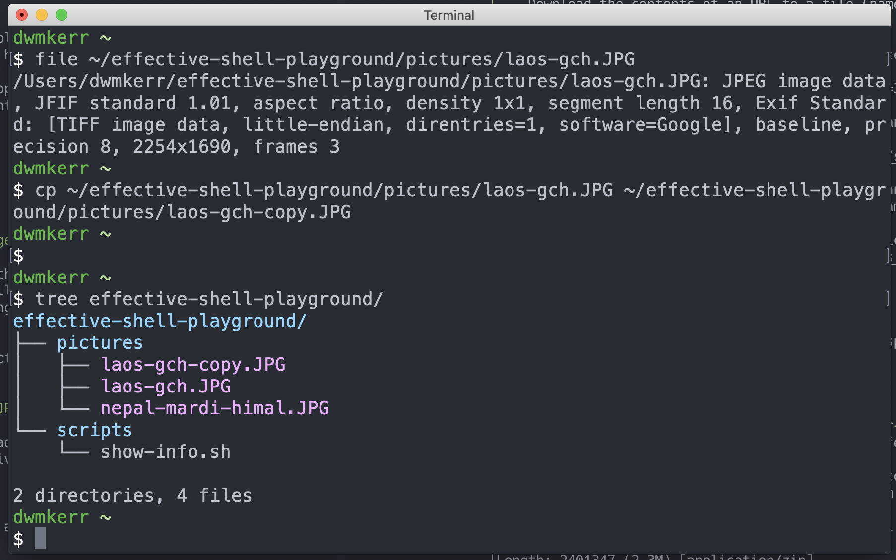
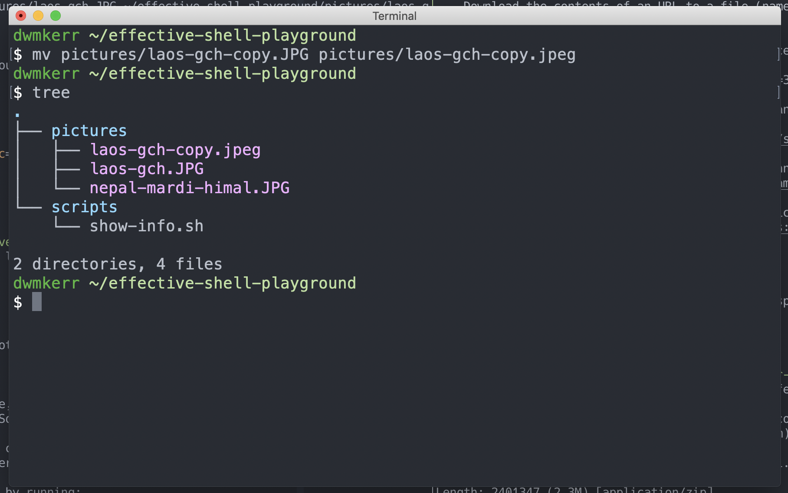
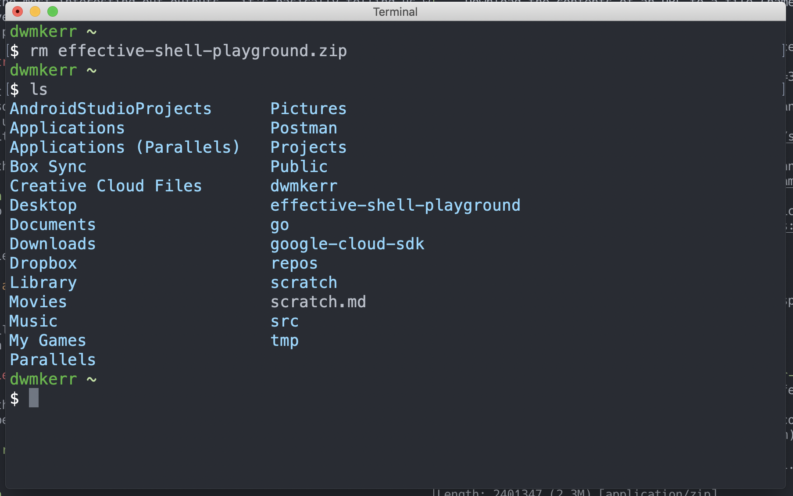
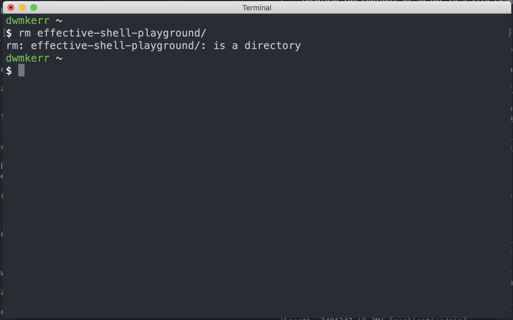
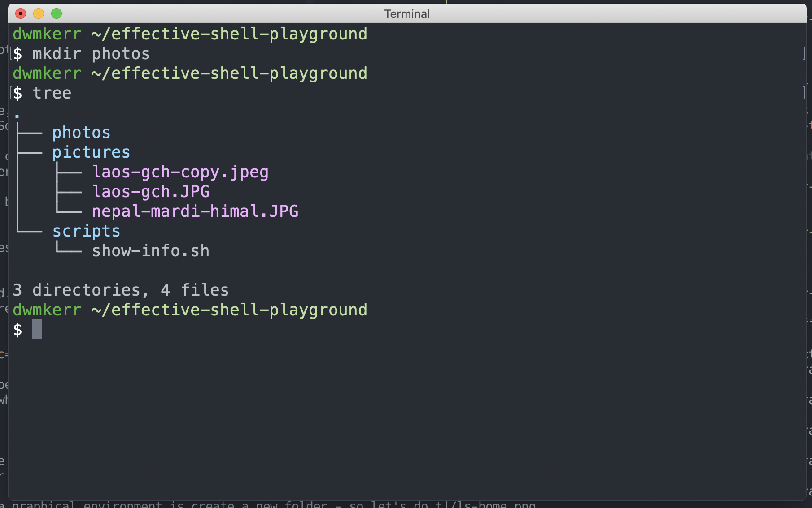
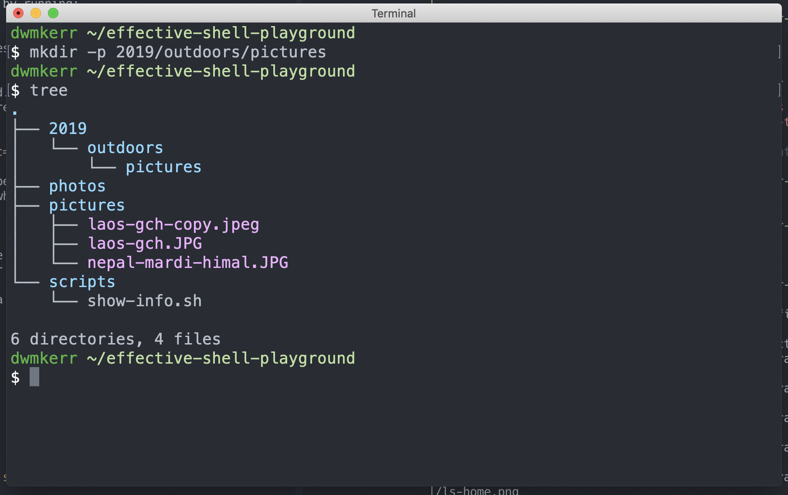
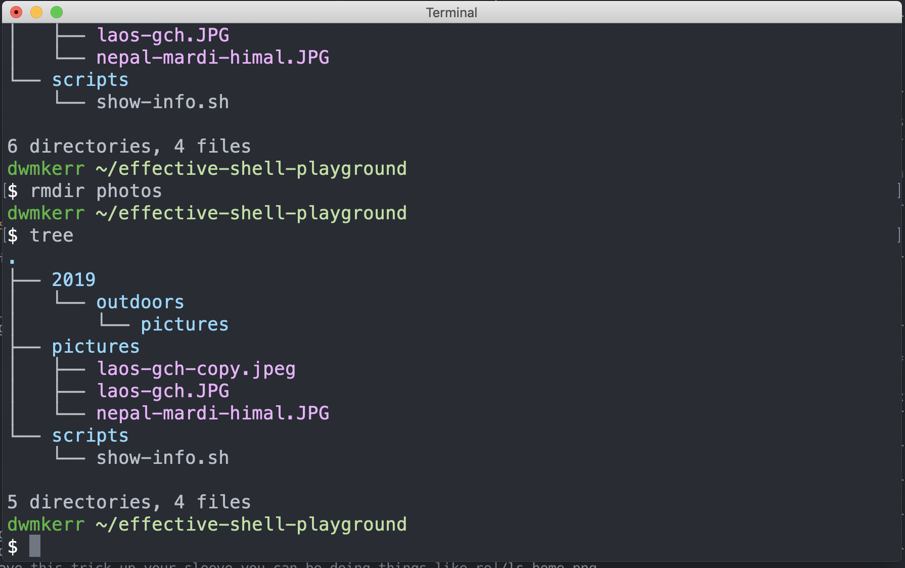
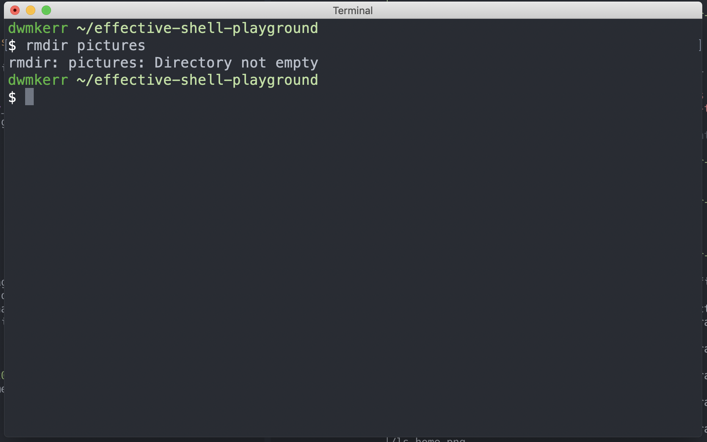

# Chapter 6 - Managing Your Files

Downloading, unzipping, copying, moving, renaming and deleting files in a graphical user interface is normally fairly intuitive. Now we'll learn how to perform the same operations in a shell. Once you can organise your files, you are well on your way to being able to use the shell more effectively for day to day tasks.


This chapter will introduce the `touch`, `cp`, `mv`, `rm`, `mkdir`, `rmdir`, `cat` and `zip` commands. 

## Creating Files


## Copying a File

Let's say we really love that photo, and we want to make a copy of it. We can do that easily by using the `cp` (_Copy) command:

```sh
cp ~/effective-shell-samples/pictures/laos-gch.JPG ~/effective-shell-playground/pictures/laos-gch-copy.JPG
```

This makes a copy of the file - if you are not sure if it has worked, just run:

```sh
tree ~/effective-shell-samples
```



We can see we've made a copy.

## Renaming or Moving Files

You might have noticed that the photos have different endings - one of them ends in `.JPG`. Let's rename it so that it has the ending `.jpeg` to be consistent with the others.

To do this, we use the `mv` (_Move_) command. When it comes down to it, moving a file or renaming a file amount to the same kind of operation, so one command can do both.

Rename the copy we made of the photo by running:

```sh
mv pictures/loas-gch-copy.JPG pictures/loas-gch-copy.jpeg
```

Let's run `tree` to see what happened. Remember - now that our working folder is the playground, we don't even need to tell `tree` where to look, if we give it no arguments it'll assume we're looking at the working directory:



Much nicer! Now our copied file has been moved to have a new name. It's in the same folder still, but you can use `mv` to also change what folder a file is in.


## Deleting Files

Now that we've downloaded and unzipped the file, we don't need the zipped version any more. So let's delete this file.

The `rm` (_Remove_) command can be used to delete a file. If we run:

```sh
rm ~/effective-shell-samples.zip
ls | grep samples
```

Then we'll see the following:



Notice that the zip file is gone - just the folder is left.

By the way - be really careful with the `rm` command. Unlike in a graphical interface, it won't put files you delete into a recycle bin, they are blatted forever! In a later chapter we'll see some ways to change this behaviour for your local machine, but always remember, `rm` is a little risky!

However one thing it _will_ do to try and help you not make mistakes is let you know if you are trying to delete a _folder_, not a file.

Run the following command to try and delete the unzipped folder:

```sh
rm ~/effective-shell-samples
```



The `rm` command has not succeeded in this case - it's warning us that we're not deleting a file, but a whole directory.

Now we can get around this by adding the `-r` flag, which means 'recursive' - i.e. not just the folder but everything in it. But use this with caution!

## Creating a New Folder

Perhaps we're not happy with the name `pictures` for our folder we've been playing with, maybe we'd prefer to have them all in a folder called `photos`?

Probably the first thing we'd do in a graphical environment is create a new folder - so let's do thee same here!

Run the commands:

```sh
mkdir photos
tree
```

And we should see:



We've use the `mkdir` command, which is short for _Make Directory_. This is how we create a new folder in the shell.

Now let's say we wanted to be _really_ organised, and create a photos folder by year and topic, perhaps `2019/outdoors/pictures`. In a graphical user interface, we'd have to create each folder one at a time. In the shell, it's easy!

```sh
mkdir -p 2019/outdoors/pictures
tree
```

Let's see how it looks:



All we had to do was add the `-p` flag (which means "make the parent folder if it doesn't already exist) and we can create a whole set of subfolders. Now we're starting to see why knowing the shell can be powerful - if you know you have this trick up your sleeve you can be doing things like re-organising files _more effectively_ in a shell than in your graphical user interface!

## Copying or Moving Multiple Files with Wildcards

Let's copy the photos that we have in the `pictures` folder into the `photos/2019/outdoor/climbing` folder.

When we run the `cp` or `mv` command, we can use a _wildcard_ to specify the files we are copying and moving. A wildcard is a simple pattern which can be used to select multiple files. Here's how we can copy the photos over:

```
cp pictures/* photos/2019/outdoor/climbing
```

Here's how it works for 
Now we need to copy over our files from the `pictures` folder to the `2019/outdoor/photos` folder. We'll use exactly the command we used before to copy a file - `cp`:

```sh
$ cp pictures/* photos/2019/outdoors/climbing/

$ tree photos
photos
├── 2019
│   └── outdoors
│       └── climbing
│           ├── laos-gch-copy.jpeg
│           ├── laos-gch.JPG
│           └── nepal-mardi-himal.jpeg
└── 2020
    └── outdoors
        └── climbing

6 directories, 3 files
```

Here we've used the _wildcard_ symbol, which is `*`, to say "everything in the folder". Many commands can take wildcards as inputs. We'll see much more about them later!


## Deleting Folders

Now that we have our more organise `2019/outdoors/photos` folder, we don't need the `photos` folder we created. So let's delete it! Remember how `rm` removes a file, and `mkdir` creates a folder? Well `rmdir` will remove a folder!

```sh
rmdir photos
tree
```



As an important sidenote, just how `rm` doesn't move files to your recycle bin, so you cannot undo the operation, `rmdir` works the same way. So if we try to remove a directory which has things in it, such as the `pictures` directory, it will fail:

```sh
rmdir pictures
```



In this case, it is actually easier to just call `rm -r pictures`. Why is that? Well it's just like we saw in the earlier example - `rm` can delete files or directories. And if the directory is not empty, we just add the `-r` (_Recursive_) flag to tell it to delete the directory and everything it contains.

# Summary

In this chapter we introduced the following: 


- The `mkdir` command can create a folder - it can even create a whole tree of folders if you pass the `-p` (_create parent directories) flag.
- The `cp` (_copy_) command can copy a file.
- The `mv` (_move_) command can move or rename a file.
- The `rm` (_remove_) command can delete a file.
- The `rm` command won't delete a folder which has files in it, unless you tell it to by adding the `-r` (_recursive_) flag.
- The `rmdir` command can delete a folder - but just like `rm` it will fail if the folder is not empty!
- When we delete files in the shell with `rm` or `rmdir` they are gone forever, no recycle bin!
