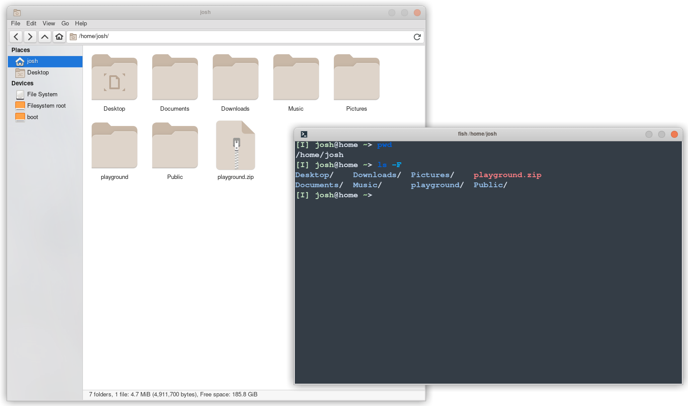
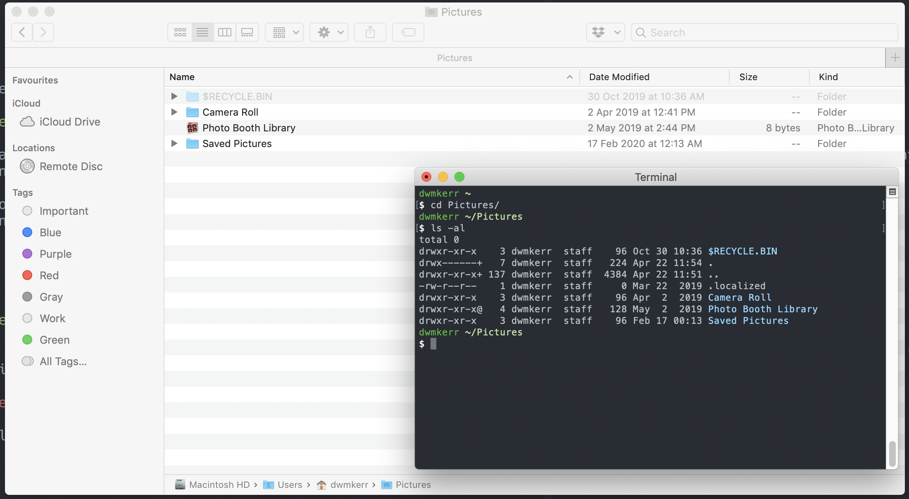
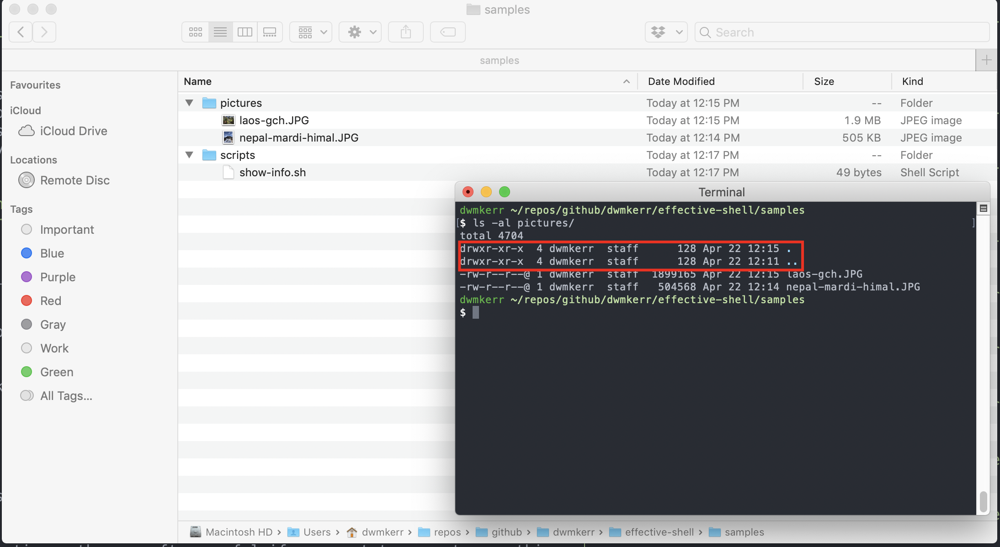
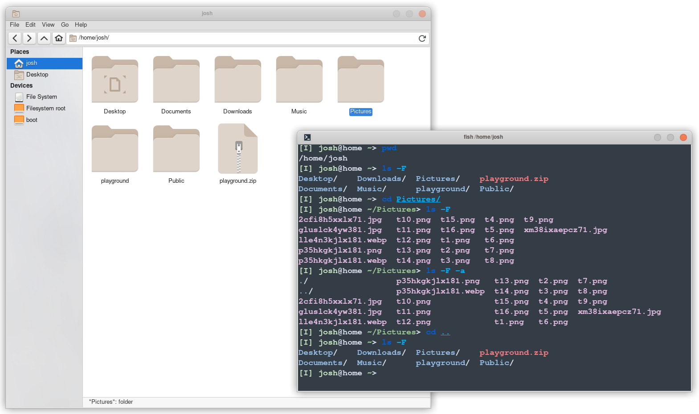
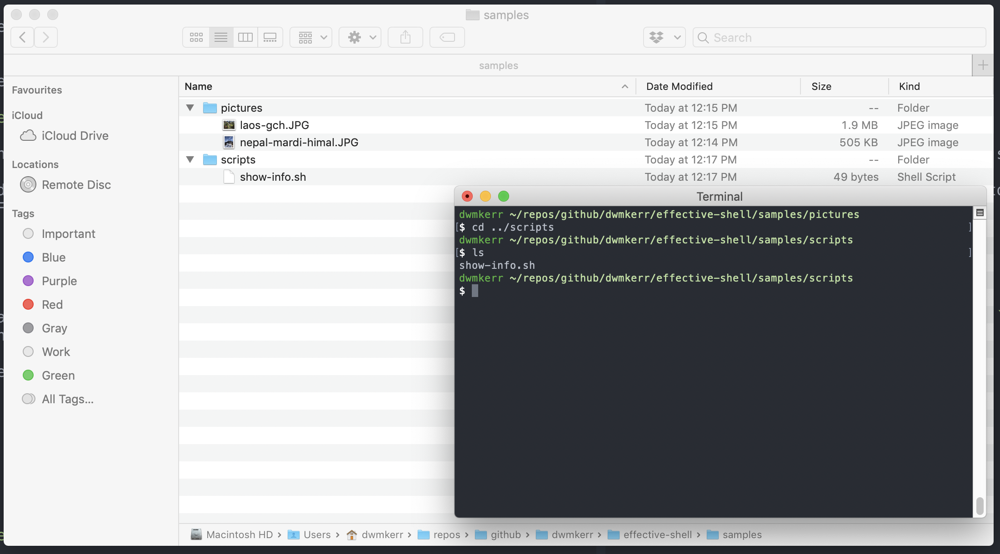
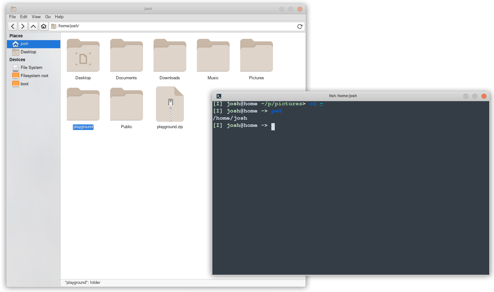
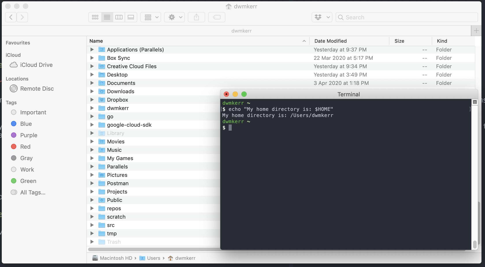

# Chapter 5 - Navigating Your System

Perhaps the easiest way to start to understand how to use the shell is to learn how actions within it might correspond to those done with a graphical interface. 

## The Working Directory

When we open a folder in a graphical user interface, we are always viewing the contents of a folder, or directory. When you open the shell, the same applies - we are always sitting in a specific directory.
We can tell the shell to print the current working directory with the `pwd` command.

You should see something like this:

<a href="images/pwd.png"></a>

The `pwd` command shows the full path of the directory that you are currently in. 

## Listing the Contents of the Working Directory

In the graphical user interface, we can see all files and folders in the current directory. 
In the shell, we don't see this content, but we can tell the shell to print it with the `ls` command.  

It'll look something like this:

<a href="images/ls.png"></a>


The `ls` command _lists_ the contents of a given directory.  By default, it prints the files and directories of the shell's current directory.

## Changing the Directory

In a graphical user interface, you move to a different directory by clicking on it.
In the shell, we run the `cd` command:

```sh
cd Pictures
ls 
```

On my system, we'll see the following output:

<a href="images/cd.png"></a>

_cd_ stands for _Change Directory._ You might see a pattern here - shell commands often are very short (to make it easier to type them quickly) and are often made up of the first letters of the description of the command (`pwd` for _Print Working Directory_, `cd` for _Change Directory_).

Now that you know what the `cd` command does, you should be able to move around to different folders. At this stage, it's important to talk a little bit about how paths work in Linux-like environments.

# Understanding Paths

In Linux, Windows and MacOS (and most other operating systems), _paths_ are the "addresses" of files or folders.
There are two types of paths, _absolute_ and _relative_. 
An absolute path is one which gives the exact location of a file. 
On Windows, absolute paths start with a drive letter.
On Linux-like operating systems, absolute paths start with a slash, `/`. 

For example, on my computer, the absolute path to the folder I am writing this book in is:

```
/Users/dwmkerr/repos/github/dwmkerr/effective-shell
```

The `/` is the _root_ of the file system&mdash; basically, it's the folder which _everything_ else lives in.

If I have an absolute path, I know _exactly_ where the file or folder is. Let's compare this to a _relative path_. Below is the _relative path_ in my shell for the file I'm writing right now:

```
website/content/docs/part-1-getting-started
```

Since this path does not begin with a slash, it is taken
relative to the shell's current working directory. 
This means that this path only makes sense if you use it from a specific directory. 

If I am in my `Pictures` folder, and I want to move to the `2020-photos` folder, I could do it in two ways. 
The first is with an absolute path:

```sh
cd /Users/dwmkerr/Pictures/2020-photos
```

The second is with a relative path:

```sh
cd 2020-photos
```

When navigating the filesystem, you will typically use relative paths.

# The Special Dot and Dot Dot Folders

As you experiment with these commands, you might have noticed that  every folder contains two other folders, one with the name `.` and one with the name `..`. Run `ls -al` on the `pictures` folder to see an example:

```sh
ls -al pictures
```

You should see something like this:



This picture highlights two special folders - `.` and `..`. These are special folders which exist in _every_ folder in the system.

The first folder, `.`, represents the folder it is in. Why would this be useful? Well, sometimes we just want a quick way to say the equivalent of "right here" in a command. For example, if I wanted to copy the current folder to a backup folder, I could do this:

```sh
cp . /backup
```

The `cp` command is the _Copy_ command, and we'll see it in the next chapter. But the key thing to note is that we can use `.` to tell the command to copy the folder we are in right now.

The `..` folder means _the parent folder_. You can use this to "go up" to the parent folder, for example:

```sh
cd ..
ls .
```

Would give:



Note that we've used `cd ..` to _change directory to the parent folder_ then `ls` to _list the contents of the current folder_. We could also just have used `ls` on its own as it defaults to the current folder.

The `..` folder can be helpful if you need to navigate to a location which is outside of your current folder. For example, if I am in the `pictures` folder and I want to move to the `scripts` folder, I can just use:

```sh
cd ../scripts
ls
```

And we'll see this:



# The Home Directory

There is one more special part of the file system we have to know about. That is the _Home Directory_. In Linux-like systems every user has their own personal directory where they can keep their files and folders.

This directory can always be accessed through the `~` character. For example, no matter where I am in the system, I can run the following command to move to my home directory and show the contents:

```sh
cd ~
ls
```

This would show something like this:



This makes moving around your home directory very easy. For example, on a Mac, to go to your pictures folder from anywhere, you can always just run:

```sh
cd ~/Pictures
```

Your home directory on most computers will be where you keep your documents, pictures, videos and so on. Normally this directory is _not accessible_ to other users of the system. Each user in a system gets their own home directory.

You can also see the home directory by using the special `HOME` environment variable:

```sh
echo "My home directory is: $HOME"
```

This would show something like this:



One useful trick - running `cd` without any parameters will always take you home! So to go home, just run:

```sh
cd
```

Now that we know about relative paths, absolute paths, and the special dot and dot dot folders, and the home directory we can continue learning how to navigate the shell!

# Summary

In this chapter we introduced the following:

- The `pwd` (_print working directory_) command shows the current working directory
- The `ls` (_list_) command shows the contents of the current directory or a given directory
- The `cd` (_change directory_) changes the current working directory
- Absolute paths specify the exact location of a file or folder
- ...Relative paths are relative to the current working directory
- The `.` special folder means 'this folder'
- The `..` special folder means 'the parent folder'
- The `~` special folder is the 'home directory'
- You can run `cd` at any time to quickly go to your home directory

- Relative paths are useful if you want to move to something _within the current directory_ 
- Absolute paths are useful if you need to move to _somewhere completely different_.
