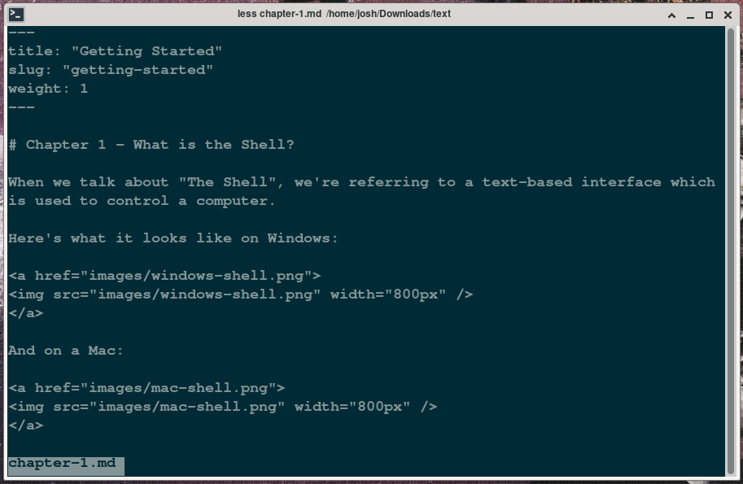

# Chapter 7 - Viewing a File

In this chapter, I'll show you how to look through the contents of a file through the terminal. 
To do so, we'll use what's called a *paging utility*&mdash; a program that displays one screenful (page) of a file at a time.
On most systems, the default paging utility is the 
[`less`](https://www.greenwoodsoftware.com/less/) program. 


In [Chapter 6]() we downloaded a playground of files and unzipped them, so now we can start to play with them.
We'll start by `cd`'ing into the `text` folder, then viewing a file:

```sh
$ cd effective-shell-playground
$ cd text
$ less chapter-1.md
```

You should see:



## Basic Controls 

You can scroll up and down through the content with the arrow keys. 
Alternatively, you can keep you fingers on the home row and use `j` and `k`:
- `j` or Down Arrow - Scroll down one line
- `k` or Up Arrow - Scroll up one line

Some other controls are:
- `d` - Scroll down half a page
- `u` - Scroll up half a page
- `h` - Display help

And to quit, use `q`.
- `q` - Quit

## Searching 
It's very handy to be able to locate some particular text within a file.
To do so, type a forward-slash `/`, followed by the search text, followed by the
enter key.
Then, `n` will jump you to the next occurence
- `/<search>` - Search for text
- `n` - When searching, find the next occurrence
- `N` - When searching, find the previous occurrence

`less` supports many other commands, but the set above is normally what I find myself using the most.

## Other pagers and `PAGER` Environment Variable

There are alternative pagers available (on many Unix-y systems you'll have `less`, `more` and `most`) but in general you'll normally get what you need with `less`.

If you are interested, you can actually see what your pager is with the command below:

```sh
$ echo $PAGER
less
```

# Summary

In this chapter we looked at how to view the contents of a file. To quickly summarise:

- The `less` paging utility can be used to look at the contents of a file 
- `less` will assume the file contains text
- Use `k` and `j` to scroll up and down a file's contents
- Type `q` to quit
