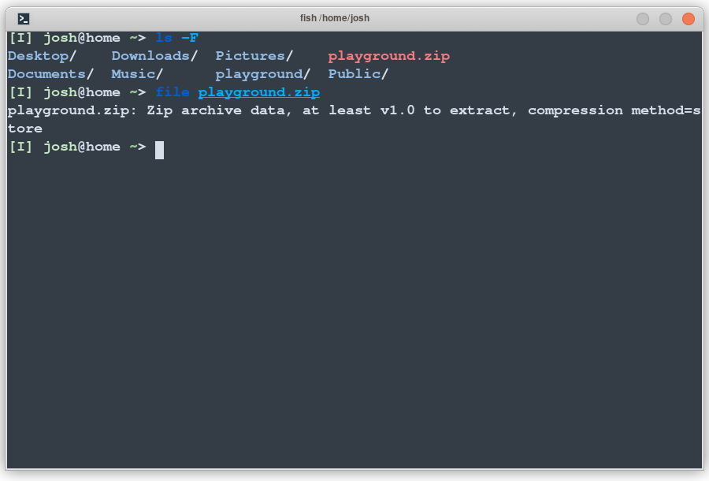
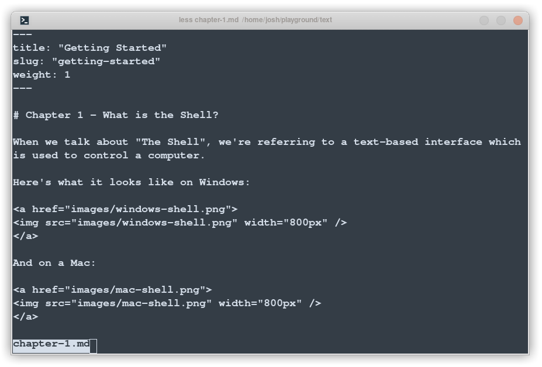
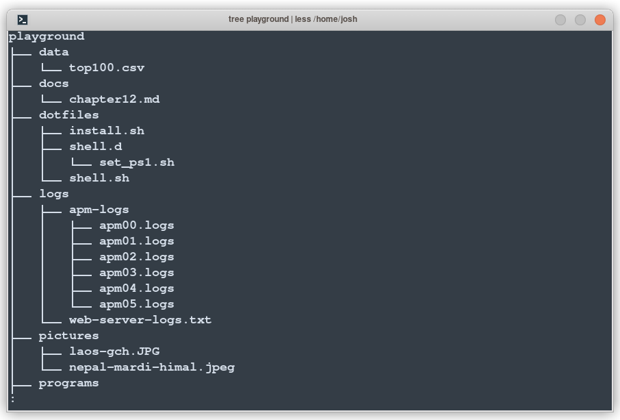

# Chapter 7 - Viewing Files and Directories

In this chapter, I'll show you how to inspect a file, look through the contents of a file through the terminal, and inspect a directory's full contents.


In [Chapter 4]() we downloaded a playground of files and unzipped them, so now we can start to play with them.
We'll start by `cd`'ing into the `text` folder, then viewing a file:


## Finding out about a file

One of the interesting things you can do in a shell is ask it to tell you more about a file, using the `file` command. This can be useful if you've got something, but aren't sure what it might be. Let's try it out now:

```sh
cd
file playground.zip
```



The `file` command is showing us we have a zip file.
If ever we are unsure what a files is, the `file` command is a great place to start.

## Viewing a file with `less`

To view the contents of a file, we'll use what's called a *paging utility*&mdash; a program that displays one screenful (page) of a file at a time.
On most systems, the default paging utility is the 
[`less`](https://www.greenwoodsoftware.com/less/) program. 

```sh
$ cd effective-shell-playground
$ cd text
$ less chapter-1.md
```

You should see:



## Basic Controls 

You can scroll up and down through the content with the arrow keys. 
Alternatively, you can keep you fingers on the home row and use `j` and `k`:
- `j` or Down Arrow - Scroll down one line
- `k` or Up Arrow - Scroll up one line

Some other controls are:
- `d` - Scroll down half a page
- `u` - Scroll up half a page
- `h` - Display help

And to quit, use `q`.
- `q` - Quit

With these basic controls in-hand, you can now view a file on the terminal!

## Searching 
It's very handy to be able to locate some particular text within a file.
To do so, type a forward-slash `/`, followed by the search text, followed by the
enter key.
- `/<search>` - Search for text
- `n` - When searching, find the next occurrence
- `N` - When searching, find the previous occurrence

`less` supports many other commands, but the set above is normally what I find myself using the most.
There are alternative pagers available (on many Unix-y systems you'll also have `more` and `most`) but in general you'll normally get what you need with `less`.

## Examining the Contents of a Directory

Let's take a look at what is in the playground. In a graphical user interface, we'd open the folders and look at the files. In the shell, we can use the `tree` command to show the contents of a folder.

Now the `tree` command is installed on most systems, but it is not necessarily standard.
We can check if it's installed with 

```sh
tree --version
```

If you are on Linux, you will likely already have it. If not, use your distributions package manager to get it (e.g. `apt install tree`).
Try it out with:

```sh
tree playground | less
```



The `tree` command shows you all of the folders and files in a location. 
Since there is more text than can fit on a page, we are 
[piping]()
its output into `less`, the paging utility!

# Summary

In this chapter we looked at how to view the contents of a file. To quickly summarise:

- The `less` paging utility can be used to look at the contents of a file 
- Use `k` and `j` to scroll up and down a file's contents
- Type `q` to quit
- The `file` command can be used to ask the shell what it thinks a file is (this is quite useful because unlike on some systems, not all files in Linux have a file ending).
- The `tree` command can show the files and folders in a given directory, or the current directory by default.
