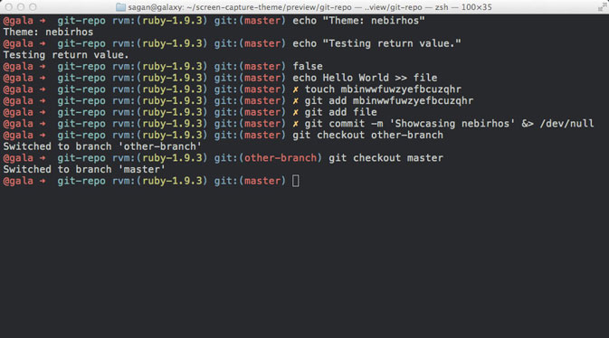
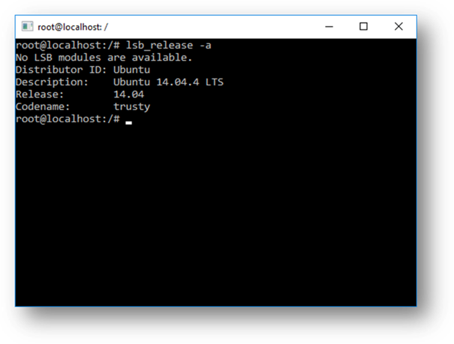

# Interlude - A Computer in a Nutshell

The diagram below shows a simplified view of a typical computer:

Already there's a lot going on.

Your computer is going to have a CPU[^1] and memory[^2], and almost certainly a network adapter[^3] and display adapter[^4]. Most computers will have at least one hard disk. For home PCs, there'll also likely be a bunch of peripherals, such as a mouse, keyboard, printers, flash drives, webcams and so on.

### The Operating System

The operating system is the piece of software installed on a computer that can interface with the *hardware*. Without hardware, such as a CPU, memory, a network adapter, a graphics card, disk drives and so on, there's not much that you can do with the computer. The operating system is the primary interface to this hardware. No normal programs will talk to hardware directly - the operating system abstracts this hardware away and provides a *software* interface to it.

The abstractions the operating system provides are essential. 
Developers don't need to know the specifics of how to work with individual devices from different vendors; the operating system provides a standardised interface to all of this. It also handles various tasks such as making sure the system starts up properly.

The operating system is generally broken down into two parts - the *kernel* and *user space*:

Let's look at these in more detail.

### The Kernel

This is the part of the operating system that is responsible for the most sensitive tasks: interfacing with physical devices, managing the resources that are available for users and programs, starting up the various systems that are needed, and so on.

Software running in the kernel has direct access to resources, so is _extremely_ sensitive. The kernel will balance resources between the programs in user space, which we'll look at shortly. If you've ever had to install 'drivers', these are examples of pieces of software that will run in the kernel - they'll have direct access to a physical device you've installed, and expose it to the rest of the software on the computer.

Why 'kernel'? The kernel is the soft, edible part of a nut or seed, which is surrounded by a shell. Below you can see a walnut - the kernel is the soft bit in the middle, and the shell surrounds and protects it. This is a useful metaphor that is used for parts of a computer.

*(By Kkchaudhary11 - Own work, CC BY-SA 4.0, https://commons.wikimedia.org/w/index.php?curid=49069244)*

The operating system kernel really is the _core_ of the operating system. It's such a sensitive area of the operating system that we actually want to avoid running software in it if possible[^5]. And that is where _user space_ comes in.

### User Space

The vast majority of programs run in 'user space' (also commonly called 'user land').

When a program starts, the kernel will allocate it a private segment of memory and provide _limited_ access to resources. The program is given access to a library of functions by the operating system, which it can use to access resources such as files, devices and so on. Programs in user space are essentially in sandboxes, where there is a limit to how much damage they can do.

For example, a program running in user space can use the standard [`fopen`](http://man7.org/linux/man-pages/man3/fopen.3.html) function, which is provided on almost every operating system as part of the [C Standard Library](https://www.gnu.org/software/libc/). This allows a program to attempt to open a file. The operating system will make a decision on whether the program is *allowed* to open the file (based on things such as permissions, where the file is and so on) and then, if it is OK with the call, will give the program access to the file. Under the hood, this 'user space' call translates to a system call in the kernel.

Now that the key components have been introduced, we can look at the _shell_. The name should come as no surprise, as it is a _wrapper_ or outer layer to the operating system (which itself contains the sensitive nugget of the kernel).

### The Shell

So what is the shell? The shell is just a general name for any *user space* program that allows access to resources in the system, via some kind of interface.

Shells come in many different flavours but are generally provided to aid a human operator in accessing the system. This could be interactively, by typing at a terminal, or via scripts, which are files that contain a sequence of commands.

For example, to see all of the files in a folder, the human operator *could* write a program in a language such as C, making system calls to do what they want. But for day-to-day tasks, this would be repetitive. A shell will normally offer us a quick way to do that exact task, without having to manually write a program to do it.

Here's an example, where a shell is being used to show the 'png' images in the folder I am working in[^6]:

So a shell is a user-space program to interface with the computer. But there a few more moving parts than just a shell we are seeing in the image above. There are different types of shells, there are terminal programs, and there are the programs or commands that the shell calls (in the example above, `tree` is a program). Let's pick these apart.

Here's a diagram that more accurately shows what is going on:

 
We've introduced a few new things here. There's a _user_, who is interfacing with a _terminal_, which is running a _shell_, which is showing a _command prompt_. The user has written a command that is calling a program (in this case, the `tree` program).

Let's dissect this bit by bit.

### The Terminal

We're not _directly_ interacting with the 'shell' in this diagram. We're actually using a _terminal_. When a user wants to work with a shell interactively, using a keyboard to provide input and a display to see the output on the screen, the user uses a *terminal*.

A terminal is just a program that reads input from the keyboard, passes that input to another program (normally a shell), and displays the results on the screen. A shell program on its own does not do this - it requires a terminal as an interface.

Why the word _terminal_? This makes sense when you look at how people interfaced with computers historically. Input to a computer might be through punch cards, and output would often be via a printer. The *Teletype Terminal*[^7] became a common way for users to interface with computers.

*(Photograph by Rama, Wikimedia Commons, Cc-by-sa-2.0-fr, CC BY-SA 2.0 fr, https://commons.wikimedia.org/w/index.php?curid=17821795)*

At this time, computers were very large, complex, and expensive machines. It was common to have *many* terminals connected to a single large machine (or 'mainframe'), or a few terminals that people would share. But the terminal itself was just a human interface to the operating system. A more modern terminal would be something like an IBM 3486:

*(By ClickRick - Own work, CC BY-SA 3.0, https://commons.wikimedia.org/w/index.php?curid=6693700)*

This is a very small computer in its own right but still basically just a dumb screen and keyboard connected by a cable to a larger mainframe computer in another location.

This mechanism is still very much the case today. When I want to work with a computer in a data centre, I don't go and find the machine, plug in a keyboard and a display and directly interface to it. I run a *terminal program* on my computer to provide access to the remote machine. My terminal program allows me to use my keyboard and display to work with a remote machine - all via a *secure shell* - which is a secured-shell connection over a network.

So terminals in many ways are quite simple - they are interfaces. But because they are quite simple programs, we can't do much with them. So normally, the first thing that a terminal program will do is run a _shell_ program - a program that we can use to operate the computer.

There's nothing special about terminals - anyone can write a program to operate as a terminal, which is why you will see many different terminals around. Examples are the standard 'terminal' app for MacOS X, the [gnome-terminal](https://wiki.gnome.org/Apps/Terminal/VTE) for Linux, and [iTerm2](https://www.iterm2.com/) and [Hyper](https://hyper.is/). There's a bunch of screenshots of different setups at the end of the article.

## Back to the Shell

Now that we've described the terminal, we can go back and look at the shell in detail.

The shell is the program that is going to take input from somewhere and run a series of commands. When the shell is running in a terminal, it is normally taking input interactively from the user. As the user types in commands, the terminal feeds the input to the shell and presents the output of the shell on the screen.

A shell program can also take input from files; these files will then generally be 'shell scripts'. This might be used to run automated operations, such as cleaning up certain folders when a computer starts.

Shells can write output to files or other locations, and so on. You can run a shell program outside of a terminal - you just won't be able to interface with it using a keyboard or display. And in fact, lots of operations happen in this way: automated scripts, startup tasks, installers and so on.
 
So what else does a shell do? Most of the features are related to helping human operators work with the system more efficiently.

- Quickly enter commands, see the history of commands and quickly restructure commands (see [Chapter 8 - Fly on the Command Line]())
- Navigate through the file system, moving from folder to folder (see [Chapter 5 - Navigating Your System]()), which makes it easier for an operator to navigate the file system
- Chain the output of commands together - for example, taking the output of one basic program, such as the `tree` program we saw, and writing it to a file (see [Chapter 15 - Thinking in Pipelines]())
- Offer a programming language, allowing the operator to perform more complicated tasks

And a lot more! In fact, that's what the whole book is about - how to get the most from these powerful programs, particularly for those who use them regularly.

### The Command Prompt or Command Line

The last part of the diagram, which we haven't covered yet, is the *command prompt*.

When a *shell* is running in *terminal*, it knows that a human operator will be interfacing with it. So to make sure that the operator has some kind of visual hint that _they have to enter commands_, the shell will output some kind of prompt.

I've included a set of screenshots at the end of the article, just after this section, and you can see how some different command prompts look.

Note that shells don't have to use command prompts - if you use a shell program to execute a script, there will be no command prompt. Shells only show a prompt when they know they are being used interactively. Many programs which allow a user to operate interactively will show a command prompt.

Shell command prompts can be customised, so they will often look different from machine to machine. Below is an example that shows a _lot_ of technical information. This is from the highly popular [oh-my-zsh](https://ohmyz.sh/) framework for the 'Z Shell' shell, which is very popular among developers:

*(Source: https://ohmyz.sh/)

### Shell Commands and Different Shells

A lot of the 'commands' in a shell, such as `cat` (which shows the contents of a file), are actually just simple programs, which will interface with the kernel. No matter what shell you use, these commands will behave the same way, because really all you are doing is calling another program.

Some commands, such as `cd` (change directory), are built into the shell. Some commands are functions that have been defined, or aliases to other commands (for more details on commands, see [Chapter 8 - Kinds of Commands]()). Commands will often differ between shells.

Not all shells are created equal - anyone can write a shell program, maybe creating a simple interface to the computer or a highly complex one with many features. In fact, a later article in this series will look at the genealogy of the most common shells.

On most Unix-like systems, the default shell is a program called `bash`, which stands for " Bourne Again Shell" (the name and history around it will be discussed at length in the later article). But there are many other shells: the C Shell, the Korn Shell, Z Shell and Fish, just to name just a few.

Users and administrators can configure what shell they like to use. When a terminal opens, it will immediately start the user's preferred shell program. It is possible to change this. Different users will have different preferences, given that shells offer varying features. This can cause complexity when working with systems, as we cannot always expect every user to have the same shell, or even for the same shell to be set up consistently, as they can be extensively customised.

Let's review the earlier diagram again:

We can see the real internals of what is going on in this "Terminal -> Shell -> Program" chain in the diagram above quite easily.

Try the command `pstree -psa $$` in a shell[^8]:

The first `systemd` process is the primary process for the OS - it is process number `1`, which initialises everything else. The second `systemd` process is the process that is running the interface for my user. We can ignore these for now; they are internals to how the operating system boots and starts processes.

What is interesting is that we can see a _terminal_ (the gnome terminal), which has started my preferred _shell_ (which is `zsh`), which is running a _command_ (the program `pstree`). Here we can see the exact chain as shown in the diagram earlier.

### That's a Wrap!

These are the key technologies and concepts that surround a shell.

If you are interested in more technical details of working with shells, then my [Effective Shell](https://github.com/effective-shell) series goes into these topics in depth. The goal of this series is to help teach techniques that making working with shells more efficient.

To close the article, below are some examples of different terminals, shells, command prompts and so on.

#### Example: iTerm 2 / tmux / zsh

In this example, we have:

- A MacOS operating system
- iTerm2 as the terminal program
- `tmux` running as a 'terminal multiplexer' (see [Effective Shell: Terminal Multiplexers](https://github.com/dwmkerr/effective-shell#coming-soon))
- `zsh` (Z Shell) as the shell program, using 'oh my zsh', which is easily recognised by the `%` sign in the command prompt.
- A customised command line, which shows the user and folder on one line, with only the `%` symbol below, to leave lots of space for the input commands[^10].

#### Example: Bash

In this example, we have:

- A Linux operating system (Ubuntu 14)
- The gnome terminal
- `bash` as the shell
- In the second screenshot, the user has 'root privileges', and to indicate this, `bash` helpfully changes the default command prompt from a dollar sign to a hash sign

#### Example: Windows Explorer

In this example, we have:

- The Windows 10 operating system
- No terminal
- The `explorer.exe` program showing us a _graphical_ shell

This looks different from previous examples. The program, which shows the familiar Windows interface, `explorer.exe`, is in fact a shell as well, offering interactive access to the operating system and computer resources. The bulk of the Windows APIs to interact with this interface are in the [Shell Library](https://msdn.microsoft.com/en-us/library/windows/desktop/bb773177(v=vs.85).aspx). I also maintain a popular library for building extensions to the graphical Windows shell - [sharpshell](https://github.com/dwmkerr/sharpshell).

#### Example: Windows Command Prompt

In this example, we have:

- The Windows 10 operating system
- The command prompt terminal and shell

In Windows, the terminal and shell are combined into a single `cmd.exe` program. There's an excellent article on the internals - [Microsoft DevBlogs: Windows Command-Line: Inside the Windows Console](https://devblogs.microsoft.com/commandline/windows-command-line-inside-the-windows-console/)

#### Example: Windows PowerShell

In this example, we have:

- The Windows 10 operating system
- The PowerShell terminal

PowerShell is an improvement on the 'command prompt' program that was originally used in Windows, offering much more functionality for scripting and other modern shell features.

#### Example: Windows Subsystem for Linux (WSL)

In this example, we have:

- The Windows 10 operating system
- The `Bash.exe` program

This screenshot, from [MSDN: Frequently Asked Questions about Windows Subsystem for Linux](https://docs.microsoft.com/en-us/windows/wsl/faq) shows Bash running in Windows. This is a relatively new feature at the time of writing, allowing Windows users to use a Linux interface to the PC. This is a feature that may become increasingly valuable, as in general it is challenging to write shell code that can run on Windows and Unix-like systems.

## Share and Discuss

If you enjoyed this article, please do share it! Feel free to include suggestions, improvements or corrections in the comments below.

---

**Useful References**

- A simple Linux kernel module, showing how basic kernel programming works in Linux: [github.com/dwmkerr/linux-kernel-module](https://github.com/dwmkerr/linux-kernel-module)
- [How Linux Works - Brian Ward](https://www.amazon.com/How-Linux-Works-2nd-Superuser/dp/1593275676)
- [StackExchange: What is the exact difference between a 'terminal', a 'shell', a 'tty', and a console?](https://unix.stackexchange.com/questions/4126/what-is-the-exact-difference-between-a-terminal-a-shell-a-tty-and-a-con/4132)
- [Microsoft: Inside the Windows Console](https://devblogs.microsoft.com/commandline/windows-command-line-inside-the-windows-console/)

---

**Footnotes**

[^1]: CPU: central processing unit. This is the chip in the computer that does most of the work (which after many layers of abstraction eventually becomes arithmetic and sending simple instructions to other places).

[^2]: Memory is the 'working space' where the state of your system is stored. If you are writing a document, the text lives in memory, until you save it, when it then gets written to a hard drive. Memory is _ephemeral_ - everything is gone when you turn off the power to it.

[^3]: This is the part of your computer that knows how to do things like connect to a WiFi network, or has a network socket you might plug a network cable into.

[^4]: This is the part of your computer you plug the screen into.

[^5]: This is because a mistake in _Kernel Mode_ programs can have disastrous  effects. It could access any files, no matter who they belong do, control the hardware, install more software - almost anything. Errors in this code can cause terrible issues (like the infamous Windows 'blue screen of death'), and malicious code in the kernel essentially has full access to not only all your data but also your webcam, network adapter and so on.

[^6]: As an aside, if you are curious about the visual style of my setup or customisations that have been made, everything in my setup is available online on my 'dotfiles' repo - [github.com/dwmkerr/dotfiles](https://github.com/dwmkerr/dotfiles).

[^7]: And that's where the 'TTY' acronym you will see sometimes comes from. Enter the `ps` command, and you'll actually see the TTY interface each process is attached to. This is a topic that will come up later in the series.

[^8]: `$$` is a Bash [internal variable](https://www.tldp.org/LDP/abs/html/internalvariables.html#PROCCID). These will also be covered in a later article in the series.

[^9]: Feel free to see my [dotfiles](https://github.com/dwmkerr/dotfiles) to configure a similar setup for yourself.
