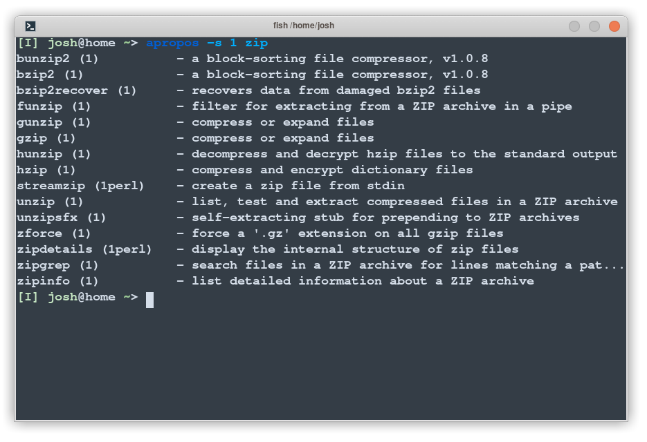

<!--

## Getting the Index of Manual Section

Manpages are just files on the filesystem, so you can get the index of a section just by looking in the appropriate folder.

For example, to index the available system calls, try `ls /usr/share/man/man2`:

```
EV_SET.2
FD_CLR.2
FD_COPY.2
FD_ISSET.2
FD_SET.2
FD_ZERO.2
_exit.2
accept.2
access.2
acct.2
...
```

This is quick and easy way to see what sort of entries you have on your system. If you want to work out where an entry lives, use the `-w` flag:

```
$ man -w printf
/usr/share/man/man1/printf.1
```

There are other ways to show the index of each section, but they vary a lot from system to system so showing the actual files is probably easier.

-->


# Chapter 11 - Man Pages

The onboard help system revolves around a collection of manual pages&mdash; files, stored in `/usr/share/man`.  Here we'll introduce three useful commands that interact with them.

## `whatis` 

The first command we'll introduce is `whatis`.
It prints a simple one-line summary of commands, system calls and library functions:


The number in parenthesis indicates the manual section number of the page. We'll get to that in the next chapter.

While useful for orientating oneself, the `whatis` command does not offer a great deal of detail.  
For that, we'll have to look into the manual pages themselves.

## `man`

The `man` command opens the manual for the given tool. 
These manuals explain all command line options and details of how to use the tool&mdash; a plethora of information, to be sure.

For example, entering

```sh
man cp
```
gives:


You can scroll up and down through the content with `j` and `k`, or the arrow keys. 
This scrolling capability actually is not part of `man` - 
it is available because the information is presented in the [shell pager](), usually, `less`.

Anyways, each manual page is broken down into sections, such as `NAME`, `SYNOPSIS`, etc. The manual system is standard across \*nix systems, as are these commands.

## `apropos`

You can search the manpage titles and summaries with `apropos`:



Here we've restricted our search to Section 1, shell commands and tools.

# Summary

In this chapter we looked at some of the ways to use the standard online manual.  To quickly summarise:

- The `man` tool can be used to look at the manual page for a topic
- These manual pages contain detailed information about their respective topic.
- Use `whatis` if you're curious about a command
- Use `apropos` when you're looking for a command
