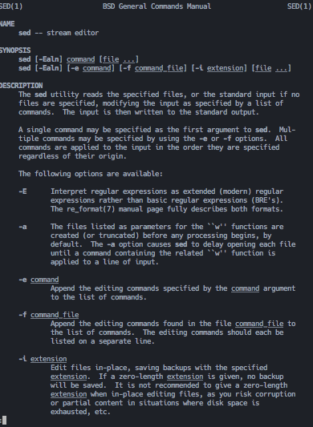
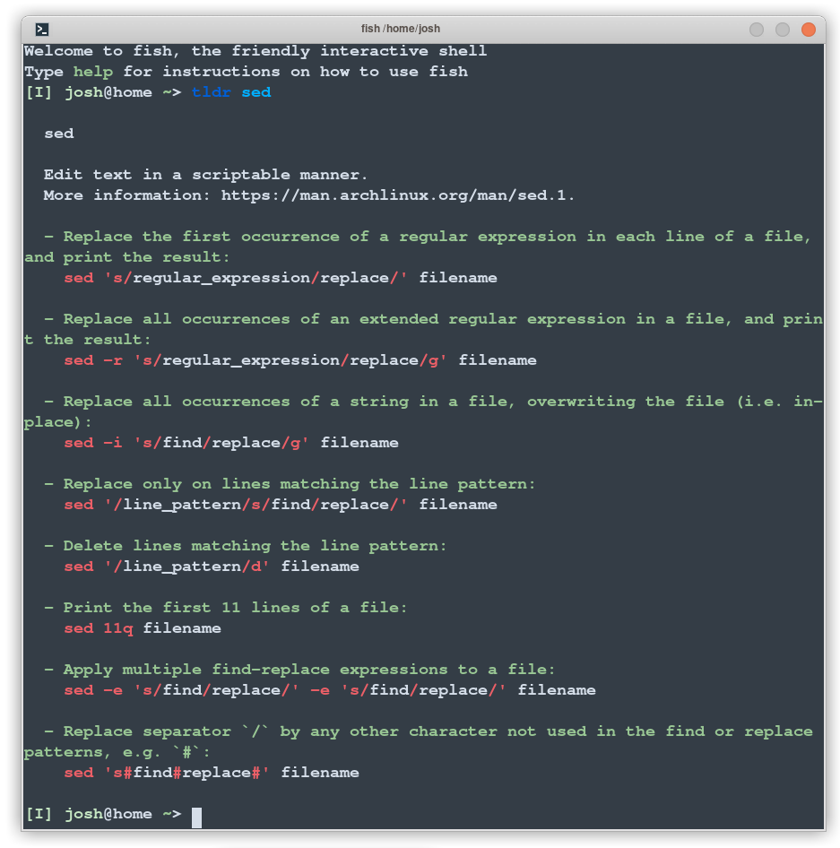
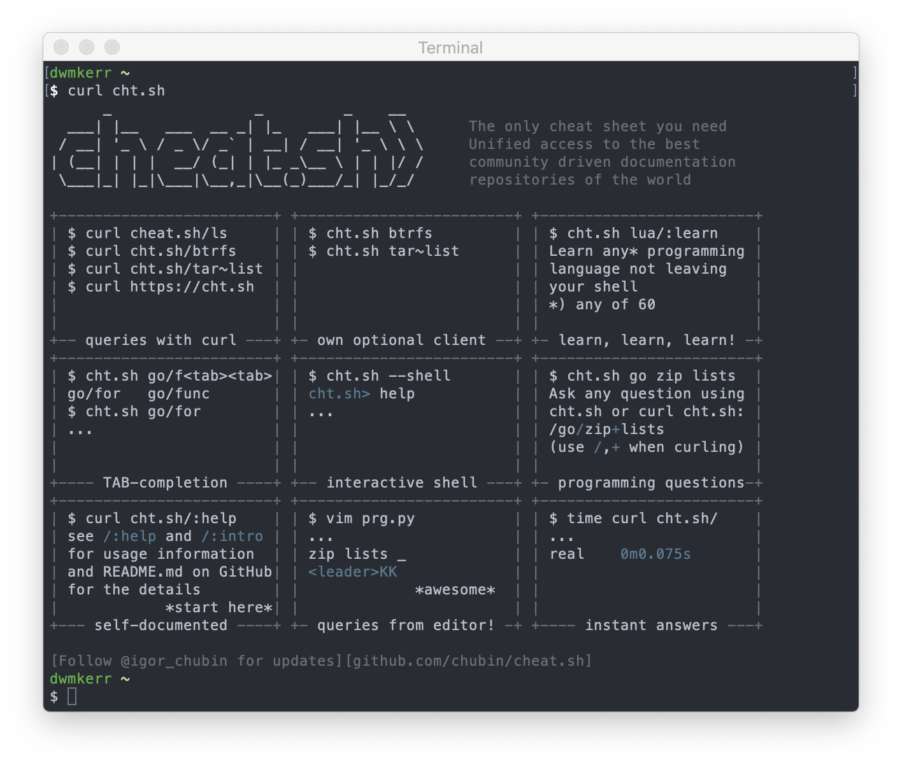

# Chapter 13 - Other Sources of Help 

## The `help` Command

The `help` command is a [shell builtin]() that offers help on the shell itself.  

For example, the Bash builtin `source` reads and executes the contents of a file in \*this\* shell's context:

```sh
$ help source
source: source filename [arguments]
    Read and execute commands from FILENAME and return.  The pathnames
    in $PATH are used to find the directory containing FILENAME.  If any
    ARGUMENTS are supplied, they become the positional parameters when
    FILENAME is executed.

    [...]
```

But remember: `help` is a builtin; you might not find it in all shells (you won't find it in `zsh`, for example). This highlights again the challenges of builtins.

## `tldr`

In general for this book I'm trying to avoid suggesting too many non-standard tools which don't come pre-installed on systems. However, this one is just too good to miss!

Let's say I need to find and replace some text in a file. I know I can do this with the `sed` command, but have forgotten the syntax. So I run `man sed`:



Wow, that's a lot of detail! And this is just page one of six!

Now let's compare this to the output from `tldr` (which is short for "Too Long, Didn't Read"). All I need to do is run `tldr sed`:



The first example is exactly what I'm looking for. Now for any more detail than a few basic examples, I'm going to have to go to the manual, but for the basics this is great.

You can install the [`tldr`](https://github.com/tldr-pages/tldr) tool with `npm install -g tldr`. It's open source and community maintained. You will need Node.js installed to install the tool, the instructions are available online.

I'd recommend `tldr` as a first-call for checking to see how to use a command.

# The Online Cheatsheet

One final resource which I think is worth sharing is the website [www.cheat.sh](https://www.cheat.sh). This is a _fantastic_ online collection of 'cheat sheets'.

These sheets cover almost all of the tools you will encounter, programming languages and more. But the real beauty of the tool is how it integrates into the shell. To see what I mean, just run the following command:

```sh
$ curl cht.sh
```

You will see something like this:



The `curl` command we'll see again and again. It is a tool which lets you download content from the web. If we load the `cheat.sh` website (or its shortened version, `cht.sh`) from the shell, we get a text version of the website. We can now look at all sorts of content by following the guide shown.

The Cheat.sh site aggregates many data sources - including `tldr`! This means we can get information on tools without even having to install a tool like `tldr` locally.

This online cheatsheet is a wonderful resource. As well as guides for specific tools, there are entire courses on programming languages. You can even use it to search for the answers to questions, these features are powered by Stack Overflow. For example:

```sh
$ curl cht.sh/"How do I copy a folder in bash?"
```

You'll see something like this:


Now that can be a real time saver!

# Summary

In this chapter we looked at some of the ways we can get help. To quickly summarise:

- The `tldr` tool shows a very short description of a tool, which covers the most common use cases only
- The `cht.sh` website can be used directly from the shell to get help on tools or even ask specific questions

# Footnotes

[^1]: Weirdly satisfying to run.
[^2]: Which it is always fun to try if you get the chance, and a great way to learn more about the fundamentals of the operating system.
[^3]: Dash is a paid product. Full disclosure - I don't get any money from them or anyone else to write about anything, all content is 100% based on my experiences. I don't run ads on my site either.
