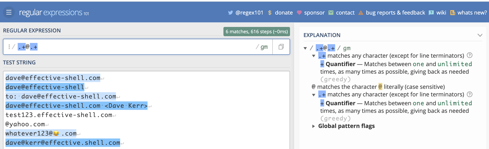
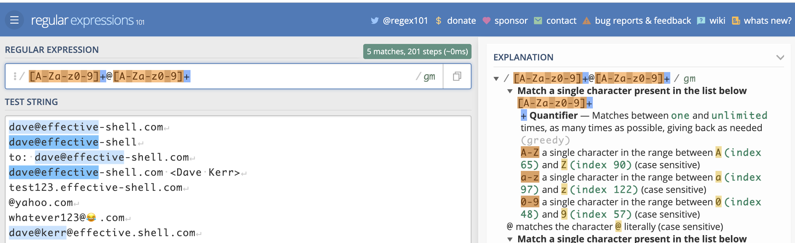
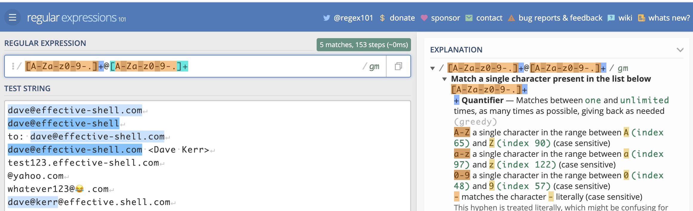
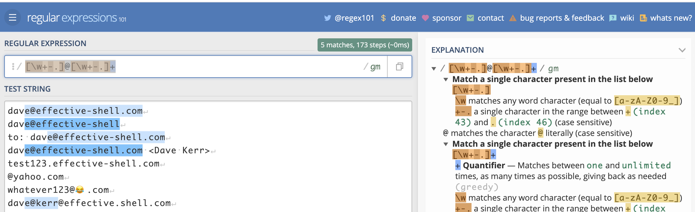
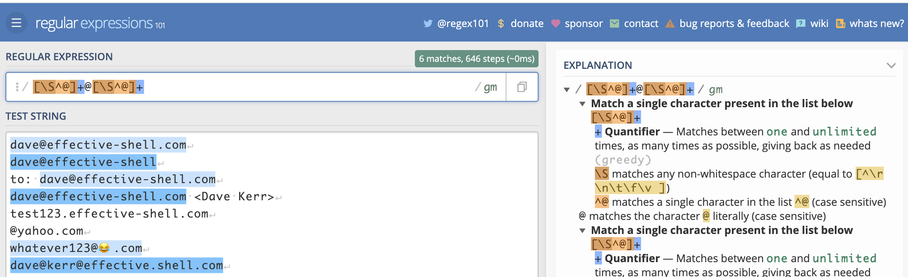
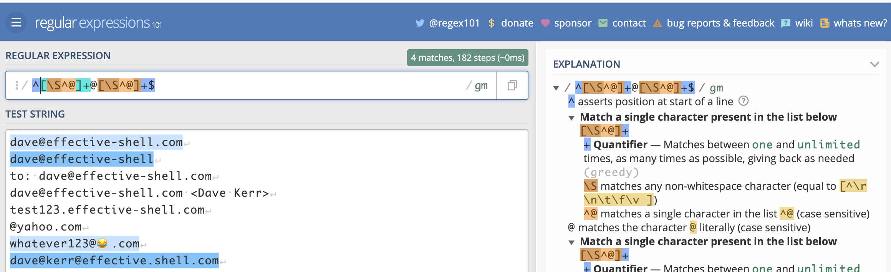
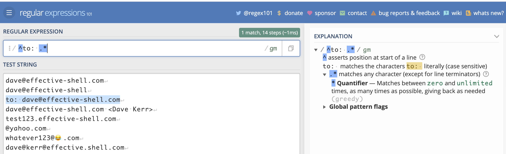

# Chapter 17 - Regexes and String Manipulation

Bash has some built-in capabilities which can be very useful when you are working with text. In this chapter we'll take a look at the built-in regular expression support in most Bash-like shells and also take a look at some nifty tricks for manipulating text in the shell.

# An Introduction to Regular Expressions

Regular Expressions (or _regexs_) are special 'patterns' which describe text. They are infamous (or even notorious) amongst technologists as being complex and opaque. For many years I avoided regular expressions as I found them overly complicated and hard to reason about. But over time I discovered that used carefully, they can be incredibly powerful and useful.

It is no surprise that regular expressions can be seen as opaque. Let's say we wanted to find a way to see whether an arbitrary string matches the structure of a valid email address. A quick search on the internet will find a regular expression such as this:

```
(?:[a-z0-9!#$%&'*+/=?^_`{|}~-]+(?:\.[a-z0-9!#$%&'*+/=?^_`{|}~-]+)*|"(?:[\x01-\x08
\x0b\x0c\x0e-\x1f\x21\x23-\x5b\x5d-\x7f]|\\[\x01-\x09\x0b\x0c\x0e-\x7f])*")@(?:(?
:[a-z0-9](?:[a-z0-9-]*[a-z0-9])?\.)+[a-z0-9](?:[a-z0-9-]*[a-z0-9])?|\[(?:(?:(2(5[
0-5]|[0-4][0-9])|1[0-9][0-9]|[1-9]?[0-9]))\.){3}(?:(2(5[0-5]|[0-4][0-9])|1[0-9][0
-9]|[1-9]?[0-9])|[a-z0-9-]*[a-z0-9]:(?:[\x01-\x08\x0b\x0c\x0e-\x1f\x21-\x5a\x53-\
x7f]|\\[\x01-\x09\x0b\x0c\x0e-\x7f])+)\])
```

Note that I have split the expression into multiple lines so that it fits on the page.

This is _horrendously_ complex. It is extremely long, almost impossible for even an experienced user to parse or reason about, and attempting to change or modify it would be very risky.

Many people see examples like the above and decide (probably quite sensibly) that regular expressions are something they just simply will not learn - they're too complex.

So should we learn regular expressions? Are they even valuable if they are as complex as the example above?

# Managing Complexity with Regular Expressions

Regular expressions do not have to be as complex as the example above. In fact, in most cases they shouldn't be. My general advice for regular expressions is _start simple_ and add complexity only if you need it.

We can build regular expressions using an 'iterative' process, starting with the basics, then adding more features as we need them. An invaluable tool I have used for this is the website [regex101.com](https://regex101.com). This website not only lets you test regular expressions, it also breaks down how they work so that you can reason about what is happening.

Let's take validating an email address as an example. The way I would build a regular expression to validate an email address would be to use the following steps:

1. Create a small list of valid email address
2. Add some items to the list which look 'kind of' valid but are not quite right
3. Build a regular expression which matches the correct email address
4. Refine the expression to eliminate the invalid addresses

In most cases this will be sufficient.

Let's start with the following set of addresses:

```
dave@effective-shell.com
dave@effective-shell
to: dave@effective-shell.com
dave@effective-shell.com <Dave Kerr>
test123.effective-shell.com
@yahoo.com
whatever123@😂.com
dave@kerr@effective.shell.com
```

Some are valid, some are not. Some you might not be sure about - for example, many people would assume that `dwmkerr@effective-shell` is invalid, as it doesn't have a _top level domain_ (or _TLD_) such as `.com` at the end. But in fact this _is_ valid and can be used sometimes for internal addresses on a corporate network.

What about the one with the emoji? Well, it's valid if someone sets up a mail server which can handle it, but probably not a good address to use as some mail programs or servers will reject it (Gmail for example, at time of writing, would allow you to send and receive from an email address like this, but not create an email address like this).

## Building Regexes - Start with the Basics

Here's how I would start building a regex for an email address:

1. Any set of characters
2. Followed by an `@` ampersand
3. Followed by any set of characters

That regex would look like this:


```
.*@.*
```

The first bit, `.*` means 'any character' (this is what the `.` dot symbol means), 'any number of times (this is what the `*` asterisk symbol means).

The second bit is just the literal `@` ampersand character.

The third bit is the same as the first - any characters any number of times.

Let's see how that would look in regex101:


Here we can see in blue the lines that the regex has matched. We can also see which part of each line corresponds to which part of the expression. But perhaps the most useful thing we see is the 'explanation' on the right which explains exactly what each character does.

Now that we have a basic pattern which matches the valid address, we can refine it to eliminate invalid addresses.

## Building Regexes - Quantifiers

The regular expression we have is very simple - `.*@.*`. The complexity in regular expressions tends to come from the fact that we need to handle 'edge cases' and be very explicit about what we can and cannot allow.

Let's see how we can refine this expression further to eliminate some of the invalid addresses. Let's start with `@yahoo.com`. It doesn't have anything before the ampersand.

This is being matched by our pattern because our pattern allows any characters before and after the ampersand _any number of times_ - including _zero times_.

Let's change number of characters before and after the ampersand to 'between one and many'. To do this we use a different _quantifier_ (and 'quantifier' is the part of a pattern which says 'how many occurrences of the characters do we expect).

Previously we used the `*` ampersand quantifier (which means 'any number of times'). Now we'll use the `+` plus quantifier (which means 'at least one time'). Let's see how it looks:



This is better - we've eliminated two invalid addresses, `@yahoo.com` and `dwmkerr@`.

This is a key concept - a _quantifier_ is part of a regular expression which says 'how many times can a character be matched?'.

There are a few different quantifiers, here is a quick reference:

| Quantifier | Meaning                                              |
|------------|------------------------------------------------------|
| `*`        | Any number of characters.                            |
| `+`        | At least one character.                              |
| `?`        | Between zero and one character.                      |
| `{10}`     | Exactly ten occurrences of the character.            |
| `{10,}`    | Ten or more occurrences of the character.            |
| `{10,20}`  | Between ten and twenty occurrences of the character. |

Now let's look at the character itself.

## Building Regexes - Character Sets and Metacharacters

When we are matching text, we match a set of characters a number of times. The set of characters we match can be a _character set_ (which is when we explicitly say what is allowed), or a _metacharacter_ (which is a predefined character set). This concept is far easier to explain with an example.

Let's look at the address `dave@kerr@effective.shell.com`. This is clearly invalid, it has two ampersands. We can use character sets or metacharacters to fix this.

The reason this address matches our expressions is that we are using the `.` dot _metacharacter_ before and after the ampersand. The dot metacharacter means 'any character' (except a newline). This _includes_ the ampersand character.

There are a few ways we would be more explicit. Let's look at each of them, as each one will show a character set or metacharacter in detail.

**Character Sets - Ranges**

A character set starts and ends with square brackets. We can use letters or numbers with a hyphen in-between to denote a range of characters for the character set. For example:

```
[A-Za-z0-9]
```

This character set matches any of the letters A to Z (uppercase) or a-z (lowercase) or the digits 0-9. Let's see how it looks with the pattern:

```
[A-Za-z0-9]+@[A-Za-z0-9]+
```



This fails to match the valid email address `dave@effective-shell.com` - because it has a hyphen after the ampersand, and the hyphen character is not in our character set. It also fails to match `d.w.m.kerr@effective.shell.com` for the same reason - we haven't got the 'dot' character in our character set.

Let's see how we can do better.

**Character Sets - Special Characters**

We can add more characters to our character set. To include the dot and the hyphen, we just add them directly to the set:

```
[A-Za-z0-9-.]
```

That's all there is to it! We can now see our pattern is more correct:

```
[A-Za-z0-9-.]+@[A-Za-z0-9-.]+
```


However, the expression is getting larger and larger. We can use a _metacharacter_ instead of the character range to make it easier to read:

```
\w+@\w+
```



The uses the 'word' metacharacter, `\w`. This is just a shorthand for `[a-zA-Z0-9_]`. But now our pattern fails again as the `\w` metacharacter doesn't include the hyphen or the dot. We can fix this easily - a *character set* can include metacharacters! So we can just combine `\w` and the hyphen and dot:

```
[\w+-.]@[\w+-.]+
```


**Character Sets - Negating Characters**

We can use the `^` circumflex symbol to _negate_ a character. This allows us to build a character set which _doesn't_ match a pattern. For example, we could rewrite our pattern like this:

```
[\S^@]+@[\S^@]+
```



We've used the character set `[\S^@]` which means 'any none-whitespace character' (this is the `\S` part) and 'not the ampersand character' (this is the `^@` part).

**Character Sets - Escaping Characters**

What do you do if you actually want to use the circumflex symbol in a character set? Just escape it! This means you put a slash first, the regex will then treat the character which follows the slash as a literal character. This is how we can match special characters like square brackets.

Here's an example:

```
[\[\]]+
```

This matches square brackets between one and many times.

```
[\^]\+
```

This matches the circumflex followed by the plus sign.

**Character Sets - Quick Reference**

We've seen quite a few character sets and metacharacters, here's a quick reference for some commonly used ones:

| Quantifier | Meaning                                              |
|------------|------------------------------------------------------|
| `TODO`        | Any number of characters.                            |

## Building Regexes - Anchors

At the moment, if we use the expression below:

```
[\S^@]+@[\S^@]+
```



Then we match any line which _contains_ an email address. But what if we only want to match complete email addresses? What if we need to exclude lines which have extra stuff at the beginning or end?

For this, we can use *anchors*. Anchors represent special parts of a string, such as the start or beginning of a line.

If we want to only match lines which contain a complete email address, we can use the `^` circumflex (start of line) anchor and `$` dollar (end of line) anchor:

```
^[\S^@]+@[\S^@]+$
```



This allows us to create expressions which match patterns of text at certain points - anchors. For example, if we want to match any line which _starts with_ the letters `to: ` we could just use this:

```
^to: .*
```



You will see the start of line and end of line anchors quite often.

## TODO: capture groups
