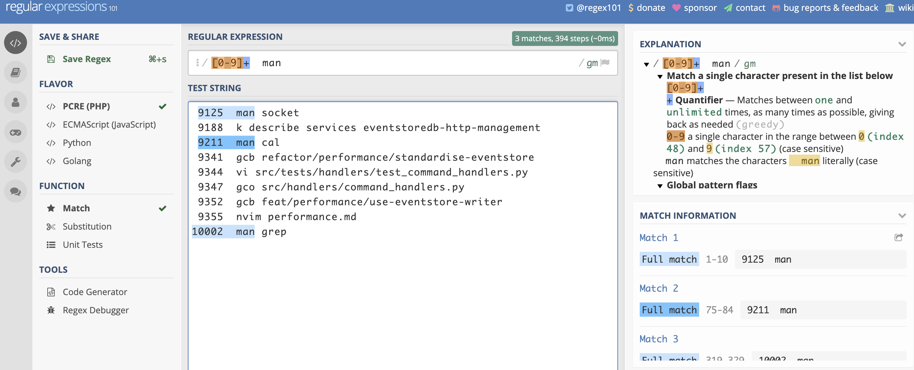

# Chapter 13 - Get to Grips with Grep

The `grep` tool is a real workhorse for shell users - once you've learned how to use it you will find yourself using it again and again. In this chapter we'll see how you can use `grep` for common tasks, and how to use it in combination with other tools.

As with the other tools we'll introduce in this chapter, we'll also look at when `grep` is the right tool for the job and when we should consider other options.

# What is Grep

A quick check of the manual page for `grep` gives an overview:

```
$ man grep

GREP(1)                   BSD General Commands Manual                  GREP(1)

NAME
     grep, egrep, fgrep, zgrep, zegrep, zfgrep -- file pattern searcher

SYNOPSIS
     grep [-abcdDEFGHhIiJLlmnOopqRSsUVvwxZ] [-A num] [-B num] [-C[num]] [-e pattern] [-f file]
          [--binary-files=value] [--color[=when]] [--colour[=when]] [--context[=num]] [--label]
          [--line-buffered] [--null] [pattern] [file ...]

DESCRIPTION
     The grep utility searches any given input files, selecting lines that match one or more
     patterns.  By default, a pattern matches an input line if the regular expression (RE) in
     the pattern matches the input line without its trailing newline.  An empty expression
     matches every line.  Each input line that matches at least one of the patterns is written
     to the standard output.
```

Wow. Lots of options for this command. And confusingly, lots of alternative forms as well (such as `egrep`, `zgrep` and so on). 

Maybe the `tldr` tool will provide a more concise overview?

```
$ tldr grep

  grep

  Matches patterns in input text.
  Supports simple patterns and regular expressions.
```

That is indeed a little more concise. By the way, if you are not familiar with how you can get help on commands, check out [Chapter 5 - Getting Help](). As the manual pages indicate, `grep` is used to match patterns in files. More advanced users will most likely know exactly what this means, but a more simple description is just:

> Grep lets you search for text or filter text.

That's it. You can search in files, but you are not _limited_ to searching in files. And you can search for _literal_ text, such as the word 'error', or you can search for _patterns_. _Patterns_ in this case means _regular expressions_ - expressions which allow you to be more specific in how you search (such as looking for a set of 16 numbers in a row, like a credit card number, or any text which looks like an email address). You can also do the opposite - filtering out parts of text.

We'll use `grep` to search through text. Let's get straight into it!

# Why Grep?

Why the odd name? Grep is such a commonly used tool that the name has become a verb amongst technologists (people will often suggest you _grep_ for something in files).

The name comes from a command which was used in the original `ed` text editor - the command:

```
g/re/p
```

This command ran on all lines (`g`, for _global_), applied a regular expression (`re`, for _regular expression_) and then printed (`p` for _print_) the results. A colleague of Ken Thompson, one of the early innovators and inventors in the Unix world, needed to edit a large file - a file which was too large to fit in `ed`. Ken wrote the `grep` program overnight to allow the file's text to be filtered - and the results passed to the `ed` editor!

You can read more about this story and some of the fascinating history of the early days of Unix in a [great interview with Brian Kerninghan](https://www.youtube.com/watch?v=NTfOnGZUZDk&feature=emb_title) from Computerphile[^1].

# Searching Through Text

If you've been working through this book, you've probably entered quite a few commands in the shell. Most shells keep a history of the commands you type. Under the hood, when you use the up and down keys to look through commands you entered earlier, or use the `Ctrl-R` shortcut to _search_ through earlier commands, your shell is looking through this file. If these tricks are not familiar, check [Chapter 9 - Fly on the Command Line]().

The file which keeps the history can vary from shell to shell. For example, on my system, my history for Bash is in the file `~/.bash_history`. But most 'Bash-like' shells provide a built-in environment variable which let's you find the path of the shell history. Let's at this file:

```
cat $HISTFILE

...
cat ~/.ssh/config
ssh bastion.cloudops
help echo
help cd
exit
```

This file will generally contain a list of the commands that the logged in user has entered in their shell. This file will likely be huge. Let's search through it using `grep`! Here's how we can use the `grep` command to search for lines which contain the text `man`:

<pre>
grep man $HISTFILE

...
<strong>man</strong> socket
k describe services eventstoredb-http-<strong>man</strong>agement
<strong>man</strong> cal
gcb refactor/perfor<strong>man</strong>ce/standardise-eventstore
vi src/tests/handlers/test_com<strong>man</strong>d_handlers.py
gco src/handlers/com<strong>man</strong>d_handlers.py
gcb feat/perfor<strong>man</strong>ce/use-eventstore-writer
nvim perfor<strong>man</strong>ce.md
<strong>man</strong> grep
</pre>

Here I can see all of the commands I have recently entered which have the text `man` in them. Note that the text which matches is highlighted and shown in bold.

Now what if you a different shell, or forget where the history file lives? A nice trick here is to use the `history` command. This command prints out the history, as well as the line number. The `history` command writes to `stdout`. If we don't give `grep` a source file, it will simply search through `stdin`. Just as we learnt in [Chapter 7 - Thinking in Pipelines]() this means we can just `grep` the output of the `history` command!

Here's how that would work:

<pre>
history | grep man

...
 9125  <strong>man</strong> socket
 9188  k describe services eventstoredb-http-<strong>man</strong>agement
 9211  <strong>man</strong> cal
 9341  gcb refactor/perfor<strong>man</strong>ce/standardise-eventstore
 9344  vi src/tests/handlers/test_com<strong>man</strong>d_handlers.py
 9347  gco src/handlers/com<strong>man</strong>d_handlers.py
 9352  gcb feat/perfor<strong>man</strong>ce/use-eventstore-writer
 9355  nvim perfor<strong>man</strong>ce.md
10002  <strong>man</strong> grep
</pre>

This is easier to remember! There's one more cool trick - if we just type in the exclamation point symbol followed by any line number shown above, we repeat the command! For example, typing in:

```
!9355
```

Would repeat line `9355` of the history (which is `nvim performance.md`).

# Using Patterns

Now as you can see from the output above, when we searched through my history, we didn't just find times I executed the `man` command - we found _any_ line which has the characters `man` in it. What about if we only wanted to find the lines which start with `man`?

To perform a search like this, we can use a _regular expression_. Here's how it would work:

<pre>
history | grep "[0-9]\+  man"

...
 <strong>9125  man</strong> socket
 <strong>9211  man</strong> cal
<strong>10002  man</strong> grep
</pre>

Let's break this down. In this search, we are using a _pattern_ to search for text. The pattern in this case is a _basic regular expression_. Regular expressions allow us to use some clever constructs to search for text. The expression we've used is made up of the following components:

- `[0-9]\+` At least one number - any character in the range zero to nine.
- `  man` The literal text written, i.e. two spaces and the letters `man`.

Now for anyone who is familiar with regular expressions, you might wonder why we have a slash before the `+` symbol, when the `+` symbol has a specific meaning in regular expressions (it means 'at least one of the previous characters). The reason we have a leading slash is that by default `grep` is using _basic regular expressions_. In general, this will be less familiar for users and will be different to what they are used to from different tools.

To make regular expressions more 'standard', we can use the `-E` flag to tell `grep` to use _Extended Regular Expressions_. We can also use the `egrep` tool, which assumes the pattern will be an extended regular expression. Using either approach will work, and allow you to re-write the pattern as below:

```
history | grep -E "[0-9]+  man"

# ...or...

history | egrep "[0-9]+  man"
```

This is just a little hint of the power of regular expressions. They can be daunting at first, and many people never become comfortable with them, but I would strongly encourage you to start exploring them.


**Getting Help on Regular Expressions**  
If you want to find out more about the difference between the slightly old-fashioned _basic_ regular expressions and modern regular expressions, you can use:


```
man re_format
```

This manpage gives lots of information on regular expressions, including the differences between basic and extended patterns.


If you ever want to see how a regular expression works, try using the website [regex101.com](https://regex101.com). It let's you test out regular expressions and also describes exactly how they work. For example, if I enter the regular expression we just used I'll see this:



We're going to see more about regular expressions as we go through the book.

# Finding Problems

If there's one command I use a lot, it's this:

```
grep -i err
```

The `-i` flag makes the search case-insensitive. This makes this a very quick way to scan through a file for any text which matches the letters `err` - making it a very quick way to find _errors_ in log files.

You can try this out by using some of the log files in the `logs` folder of the playground. Here's how you can try it out:

<pre>
grep -i err ~/effective-shell/logs/web-server-logs.txt

...
2020-11-29T12:50:30.594Z: info - Serving file '../../../website/public/docs/part-2-core-skills/7-thinking-in-pipelines/images/diagram-std<strong>err</strong>-redirect.png'...
2020-11-29T12:50:31.827Z: <strong>err</strong>or - Unhandled <strong>err</strong>or EACCES trying to read '../../../website/public/svg/calendar.svg', returning a 500
2020-11-29T12:50:31.827Z: <strong>err</strong>or - Unhandled <strong>err</strong>or EACCES trying to read '../../../website/public/svg/calendar.svg', returning a 500
2020-11-29T12:50:31.827Z: <strong>err</strong>or - Unhandled <strong>err</strong>or EACCES trying to read '../../../website/public/svg/calendar.svg', returning a 500
2020-11-29T12:50:31.848Z: <strong>err</strong>or - Unhandled <strong>err</strong>or EACCES trying to read '../../../website/public/svg/edit.svg', returning a 500
2020-11-29T12:50:31.849Z: <strong>err</strong>or - Unhandled <strong>err</strong>or EACCES trying to read '../../../website/public/svg/edit.svg', returning a 500
</pre>

This is a very useful trick. You could use this technique to search for warnings, problems, specific messages and so on.

# The ABC of Grep

There are three _really_ useful parameters for `grep`, which I used to struggle to remember, until I realised that they are simple - ABC!

Here's how they work:

<pre>
$ grep host -A 3 ./programs/web-server/web-server.js
  <strong>host</strong>: process.env.HOST || 'local<strong>host</strong>',
  port: process.env.PORT || getOptonalEnvInt('PORT', 8080),
  root: process.env.ROOT || process.cwd(),
  defaultPage: 'index.html',
--
  httpServer.listen({ <strong>host</strong>: config.<strong>host</strong>, port: config.port });
  log.info(`Server running on: ${config.<strong>host</strong>}:${config.port}`);
}
main();
</pre>

`A` stands for _after_. In this example we show the three lines after each occurrence of the work `host` in the `web-server.js` script. This is a quick way to see how something you search for might be used!

`B` stands for _before_ - we can use this to see what comes _before_ a match when we're searching. What can lead to us sending an error in our web server? Let's see:

<pre>
$ grep throw -B 5 ./programs/web-server/web-server.js

//  Helper to return an optional numeric environment variable or the default.
function getOptonalEnvInt(name, defaultValue) {
  const val = process.env[name];
  if (!val) return defaultValue;
  const intVal = parseInt(val, 10);
  if (isNaN(intVal)) <strong>throw</strong> new Error(`Unable to parse environment variable named '${name}' with value '${val}' into an integer`);
</pre>

And finally `C`, the most useful of them all. `C` stands for _context_, and lets you see a number of lines _before and after_ each match. What was I up to the last time I ran the `git init` command? Let's see!

<pre>
$ history | grep -C 5 'git init'
 5802  git push --follow-tags && git push origin
 5803  cd ../java-maven-standard-version-sample
 5804  rm -rg .git
 5805  rm -rf git
 5806  rm -rf .idea
 5807  <strong>git init</strong> -h
 5808  git remote add origin git@github.com:dwmkerr/java-maven-standard-version-sample.git
 5809  git push origin -u
 5810  git push -u origin
 5811  git push --set-upstream origin master
 5812  git rm --cached tpm
</pre>

Don't forget that these flags need to be capitalised! These three flags are _very_ useful - knowing how to find context of a match can be a lifesaver when quickly searching through text.

# Working with Multiple Files

What about if you have a bunch of files you want to search? One problem we have at the moment is that everything we search through has been a single file. But if we are searching through multiple files, how can we identify where the matches come from?

There's a useful pair of flags for this. `-H` stands for 'header', which shows the file name before each match. `-n` stands for 'number', which makes sure the line number is shown. Here's how we might use this command:

<pre>
$ grep -Hn ERROR ./logs/apm-logs/*.logs

...
./logs/apm-logs/apm02.logs:34893:2020-11-27T12:24:37.429Z       <strong>ERROR</strong>   [request]       middleware/log_middleware.go:95unauthorized     {"request_id": "53a41a98-ba12-454e-aadf-72c97dc40e96", "method": "POST", "URL": "/config/v1/agents", "content_length": 27, "remote_address": "127.0.0.1", "user-agent": "elasticapm-python/5.9.0", "response_code": 401, "error": "unauthorized"}
./logs/apm-logs/apm02.logs:34906:2020-11-27T12:25:11.415Z       <strong>ERROR</strong>   [request]       middleware/log_middleware.go:95unauthorized     {"request_id": "a49d5546-b8d2-4e50-9dd0-6cbf419a365e", "method": "POST", "URL": "/config/v1/agents", "content_length": 27, "remote_address": "127.0.0.1", "user-agent": "elasticapm-python/5.9.0", "response_code": 401, "error": "unauthorized"}
</pre>

Note that in this case we searched through many files - anything which matches the `*.logs` wildcard. To help us identify in _which_ file the match was found, we used the `-Hn` flags. The beginning of the lines now start with the path of the file and the line number, for example:

```
./logs/apm-logs/apm02.logs:34906
```

You can take this even further:

```
$ grep -R -Hn -i error ./logs
```

Adding the `-R` or _recursive_ flag tells `grep` to search recursively in folders if they are included in the search.

# V for Invert

As long as your remember that `-i` is the flag for _case insensitive_, it makes it a little easier to remember _v for invert_. This tells `grep` to _exclude_ lines which match the pattern. This works kind of like a filter.

Here's how I could look through my log files, excluding any messages with 'debug' in them:

```
$ grep -v debug ./logs/web-server.logs
```

Don't forget, you can always _pipe_ a series of `grep` commands together. Rather than trying to work out a perfect pattern which searches for exactly what you want, you could just pipe a a set of commands together:

```
$ grep -i error -R ./logs | grep -i -v memory | grep -i -v 'not found'
```

This set of small, simple, commands is chained together to make a more sophisticated operation:

- First we recursively search for any `error` text in the `./logs` folder
- Then we exclude anything which matches `memory`
- Then we exclude anything which matches `not found`

This is the essence of the Unix Philosophy - with a small number of simple tools, we can _compose_ a more complex workflow!

# Don't Forget Your Pipelines!

We've introduced a very powerful command in this chapter. For familiar users, `grep` becomes a _verb_ they use regularly - you `grep` the output of something, or might be _grepping_ to find something. Remember that `grep`, just like most of the tools in this section, works on `stdin` by default. So you can easily `grep` the output of almost anything!

Here are a few simple examples just to show you how easy it is to perform more complex tasks with grep.

```
ps -a | grep vim
```

Show all processes, then filter the list down to only `vim` processes.

```
grep -Hv -C 3 -R password ./k8s/**/*.yaml | less
```

Search through all of the `yaml` files in my `k8s` folder, for the text 'password', show three lines of context, as well as the file name and number, and put the output in my pager so that it is easy to search through.

```
ls -al /usr/bin /bin /usr/local/bin | grep zip
```

Search through all of my installed programs for programs which have `zip` in the name.

```
history | grep grep | tail -n 10
```

Show me the last ten `grep` commands I typed in my shell!

We'll see a lot more examples as we go through the book - just remember that `grep` is alwaays available to search or filter text!

# Alternatives to Grep

Grep is a very commonly used tool and has been around for a long time. It can vary a bit from system to system. Over the years a number of alternatives have been developed. Most of these alternatives are either designed to be _faster_, so that you can search through files much more quickly, or _easier_ so that you don't have to remember too many flags.

In general, I would advise _against_ using alternatives - until you genuinely find you are limited by `grep`. Every alternative is another tool to learn, which might not be present on other systems you use. It is also less likely to be available if you are writing scripts or instructions for others.

If you find yourself really struggling with performance - perhaps you often search huge folders of text or if you find yourself regularly struggling to find ways to craft your search patterns, then perhaps you can investigate some of the popular alternatives. But I would suggest that you master the core `grep` functionality first, before installing other tools.

If you _do_ decide you want to add some more text searching tools to your toolkit, I would suggest `ripgrep`, `ag` and `ack` as three potential options. Each of them offer performance improvements and additional functionality.

# Summary

Grep is a simple text-based search tool! If you need to _find_ text, or want to _filter_ text, then `grep` should be your go-to tool.

Here's a summary of what we've covered:

- `grep pattern file` searches `file` for the text `pattern`
- the `-E` flag lets you use _regular expressions_ for more sophisticated searches
- You can make the search case insensitive with the `-i` flag
- Remember the `ABC` flags - _after_, _before_ and _context_, which show lines after, before and around the matches
- Include the filename and line number with the `-Hn` flags
- V for invert! Use the `-v` flag to invert the search, or filter out matches
- `grep` works great in pipelines! Use it to search or filter when working with _other_ commands

---

**Footnotes**

[^1]: See the interview at: https://www.youtube.com/watch?v=NTfOnGZUZDk&feature=emb_title
