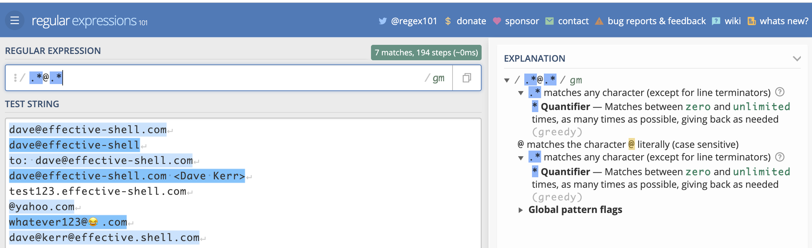

# Chapter 17 - Regex Essentials

Many of the tools we're working with support _regular expressions_ or regexes - a sophisticated language which allows us to describe different patterns of text.

Before we look at how to use regular expressions in the shell, it is important to understand some of the basic regular expression concepts and techniques. This chapter covers the essentials - if you are already familiar with regular expressions feel free to skip to the next chapter.

In this chapter we'll look at why regular expressions can be intimidating, how to manage complexity and not overwhelm yourself, some of the core concepts in regular expressions and a few things to watch out for. Once we've seen the theory we'll be able to apply it in practice in the following chapters!

# An Introduction to Regular Expressions

Regular Expressions (or _regexs_) are special 'patterns' which describe text. They are infamous (or even notorious) amongst technologists as being complex and opaque. For many years I avoided regular expressions as I found them overly complicated and hard to reason about. But over time I discovered that used carefully, they can be incredibly powerful and useful.

It is no surprise that regular expressions can be seen as opaque. Let's say we wanted to find a way to see whether an arbitrary string matches the structure of a valid email address. A quick search on the internet will find a regular expression such as this:

```
(?:[a-z0-9!#$%&'*+/=?^_`{|}~-]+(?:\.[a-z0-9!#$%&'*+/=?^_`{|}~-]+)*|"(?:[\x01-\x08
\x0b\x0c\x0e-\x1f\x21\x23-\x5b\x5d-\x7f]|\\[\x01-\x09\x0b\x0c\x0e-\x7f])*")@(?:(?
:[a-z0-9](?:[a-z0-9-]*[a-z0-9])?\.)+[a-z0-9](?:[a-z0-9-]*[a-z0-9])?|\[(?:(?:(2(5[
0-5]|[0-4][0-9])|1[0-9][0-9]|[1-9]?[0-9]))\.){3}(?:(2(5[0-5]|[0-4][0-9])|1[0-9][0
-9]|[1-9]?[0-9])|[a-z0-9-]*[a-z0-9]:(?:[\x01-\x08\x0b\x0c\x0e-\x1f\x21-\x5a\x53-\
x7f]|\\[\x01-\x09\x0b\x0c\x0e-\x7f])+)\])
```

Note that I have split the expression into multiple lines so that it fits on the page.

This is _horrendously_ complex. It is extremely long, almost impossible for even an experienced user to parse or reason about, and attempting to change or modify it would be very risky.

Many people see examples like the above and decide (probably quite sensibly) that regular expressions are something they just simply will not learn - they're too complex.

So should we learn regular expressions? Are they even valuable if they are as complex as the example above?

# Managing Complexity with Regular Expressions

Regular expressions do not have to be as complex as the example above. In fact, in most cases they shouldn't be. My general advice for regular expressions is _start simple_ and add complexity only if you need it.

We can build regular expressions using an 'iterative' process, starting with the basics, then adding more features as we need them. An invaluable tool I have used for this is the website [regex101.com](https://regex101.com). This website not only lets you test regular expressions, it also breaks down how they work so that you can reason about what is happening.

Let's take validating an email address as an example. The way I would build a regular expression to validate an email address would be to use the following steps:

1. Create a small list of valid email address
2. Add some items to the list which look 'kind of' valid but are not quite right
3. Build a regular expression which matches the correct email address
4. Refine the expression to eliminate the invalid addresses

In most cases this will be sufficient.

Let's start with the following set of addresses:

```
dave@effective-shell.com
dave@effective-shell
to: dave@effective-shell.com
dave@effective-shell.com <Dave Kerr>
test123.effective-shell.com
@yahoo.com
whatever123@😂.com
dave@kerr@effective.shell.com
```

Some are valid, some are not. Some you might not be sure about - such as the one with the emoji. This one is valid if someone sets up a mail server which can handle it, but probably not a good address to use as some mail programs or servers will reject it (Gmail for example, at time of writing, would allow you to send and receive from an email address like this, but not create an email address like this).

## Building Regexes - Start with the Basics

Here's how I would start building a regex for an email address:

1. Any set of characters
2. Followed by an `@` ampersand
3. Followed by any set of characters

That regex would look like this:

```
.*@.*
```

The first bit, `.*` means 'any character' (this is what the `.` dot symbol means), 'any number of times (this is what the `*` asterisk symbol means).

The second bit is just the literal `@` ampersand character.

The third bit is the same as the first - any characters any number of times.

Let's see how that would look in [regex101](https://regex101.com):



Here we can see in blue the lines that the regex has matched. We can also see which part of each line corresponds to which part of the expression. But perhaps the most useful thing we see is the 'explanation' on the right which explains exactly what each character does.

Now that we have a basic pattern which matches the valid address, we can refine it to eliminate invalid addresses.

Note that from this point onwards we'll not show screenshots of the results as you would see them in the regex101 website, instead we'll just highlight the matched part of the text in **bold**, this should make it easier to read. But to see a breakdown of how each part of the text is matched and what each part of the pattern means, feel free to run the examples in the regex101 website!

## Building Regexes - Quantifiers

The regular expression we have is very simple - `.*@.*`. The complexity in regular expressions tends to come from the fact that we need to handle 'edge cases' and be very explicit about what we can and cannot allow.

Let's see how we can refine this expression further to eliminate some of the invalid addresses. Let's start with `@yahoo.com`. It doesn't have anything before the ampersand.

This is being matched by our pattern because our pattern allows any characters before and after the ampersand _any number of times_ - including _zero times_.

Let's change number of characters before and after the ampersand to 'between one and many'. To do this we use a different _quantifier_ (and 'quantifier' is the part of a pattern which says 'how many occurrences of the characters do we expect).

Previously we used the `*` ampersand quantifier (which means 'any number of times'). Now we'll use the `+` plus quantifier (which means 'at least one time'). Let's see how it looks:

<pre>
.+@.+

<strong>dave@effective-shell.com</strong>
<strong>dave@effective-shell</strong>
<strong>to: dave@effective-shell.com</strong>
<strong>dave@effective-shell.com &lt;Dave Kerr&gt;</strong>
test123.effective-shell.com
@yahoo.com
dave@
<strong>whatever123@😂.com</strong>
<strong>dave@kerr@effective.shell.com</strong>
</pre>

This is better - we've eliminated some invalid addresses, _test123.effective-shell.com_, _@yahoo.com_ and _dave@_.

We have introduced a key concept - the _quantifier_. The quantifier we have used is the `+` plus symbol. This is the part of a regular expression which says 'how many times can a character be matched?'.

There are a few different quantifiers, here is a quick reference:

| Quantifier | Meaning                                              |
|------------|------------------------------------------------------|
| `*`        | Any number of characters.                            |
| `+`        | At least one character.                              |
| `?`        | Between zero and one character.                      |
| `{10}`     | Exactly ten occurrences of the character.            |
| `{10,}`    | Ten or more occurrences of the character.            |
| `{10,20}`  | Between ten and twenty occurrences of the character. |

Now let's look at the character itself.

## Building Regexes - Character Sets and Metacharacters

When we are matching text, we match a set of characters a number of times. The set of characters we match can be a _character set_ (which is when we explicitly say what is allowed), or a _metacharacter_ (which is a predefined character set). This concept is far easier to explain with an example.

Let's look at the address `dave@kerr@effective.shell.com`. This is clearly invalid, it has two ampersands. We can use character sets or metacharacters to fix this.

The reason this address matches our expressions is that we are using the `.` dot _metacharacter_ before and after the ampersand. The dot metacharacter means 'any character' (except a newline). This _includes_ the ampersand character.

There are a few ways we would be more explicit. Let's look at each of them, as each one will show a character set or metacharacter in detail.

**Character Sets - Ranges**

A character set starts and ends with square brackets. We can use letters or numbers with a hyphen in-between to denote a range of characters for the character set. For example:

```
[A-Za-z0-9]
```

This character set matches any of the letters A to Z (uppercase) or a-z (lowercase) or the digits 0-9. Let's see how it looks with the pattern:

<pre>
[A-Za-z0-9]+@[A-Za-z0-9]+

<strong>dave@effective</strong>-shell.com
<strong>dave@effective</strong>-shell
to: <strong>dave@effective-shell</strong>.com
<strong>dave@effective</strong>-shell.com &lt;Dave Kerr&gt;
test123.effective-shell.com
@yahoo.com
dave@
whatever123@😂.com
<strong>dave@kerr</strong>@effective.shell.com
</pre>

This fails to match the valid email address `dave@effective-shell.com` - because it has a hyphen after the ampersand, and the hyphen character is not in our character set. It also fails to match others for the same reason - we haven't got the 'dot' character in our character set.

Let's see how we can do better.

**Character Sets - Special Characters**

We can add more characters to our character set. To include the dot and the hyphen, we just add them directly to the set:

```
[A-Za-z0-9-.]
```

That's all there is to it! We can now see our pattern is more correct:

<pre>
[A-Za-z0-9-.]+@[A-Za-z0-9-.]+

<strong>dave@effective-shell.com</strong>
<strong>dave@effective-shell</strong>
to: <strong>dave@effective-shell.com</strong>
<strong>dave@effective-shell.com</strong> &lt;Dave Kerr&gt;
test123.effective-shell.com
@yahoo.com
dave@
whatever123@😂.com
<strong>dave@kerr</strong>@effective.shell.com
</pre>

However, the expression is getting larger and larger. We can use a _metacharacter_ instead of the character range to make it easier to read. A metacharacter is a special character which is use to represent a range of characters. For example:

```
\w+@\w+
```

<pre>
\w+@\w+

<strong>dave@effective</strong>-shell.com
<strong>dave@effective</strong>-shell
to: <strong>dave@effective-shell</strong>.com
<strong>dave@effective</strong>-shell.com &lt;Dave Kerr&gt;
test123.effective-shell.com
@yahoo.com
dave@
whatever123@😂.com
<strong>dave@kerr</strong>@effective.shell.com
</pre>

The uses the 'word' metacharacter, `\w`. This is just a shorthand for `[a-zA-Z0-9_]`. But now our pattern fails again as the `\w` metacharacter doesn't include the hyphen or the dot. We can fix this easily - a *character set* can include metacharacters! So we can just combine `\w` and the hyphen and dot:

<pre>
[\w+-.]+@[\w+-.]+

<strong>dave@effective-shell.com</strong>
<strong>dave@effective-shell</strong>
to: <strong>dave@effective-shell.com</strong>
<strong>dave@effective-shell.com</strong> &lt;Dave Kerr&gt;
test123.effective-shell.com
@yahoo.com
dave@
whatever123@😂.com
<strong>dave@kerr</strong>@effective.shell.com
</pre>

**Character Sets - Negating Characters**

We can use the `^` circumflex symbol to _negate_ a character. This allows us to build a character set which _doesn't_ match a pattern. For example, we could rewrite our pattern like this:

<pre>
[\S^@]+@[\S^@]+

<strong>dave@effective-shell.com</strong>
<strong>dave@effective-shell</strong>
to: <strong>dave@effective-shell.com</strong>
<strong>dave@effective-shell.com</strong> &lt;Dave Kerr&gt;
test123.effective-shell.com
@yahoo.com
dave@
<strong>whatever123@😂.com</strong>
<strong>dave@kerr@effective.shell.com</strong>
</pre>

We've used the character set `[\S^@]` which means 'any none-whitespace character' (this is the `\S` part) and 'not the ampersand character' (this is the `^@` part).

Notice that in this case we have more matches - because the set of characters we are using is larger than a set such as `\w`. This expression now covers the email address with the emoji, because the emoji is not a whitespace character or an ampersand.

**Character Sets - Escaping Characters**

What do you do if you actually want to use the circumflex symbol in a character set? Just escape it! This means you put a slash first, the regex will then treat the character which follows the slash as a literal character. This is how we can match special characters like square brackets.

Here's an example:

```
[\[\]]+
```

This matches square brackets between one and many times.

```
[\^]\+
```

This matches the circumflex followed by the plus sign. If there is every a point at which you need to use a special character in a regular expression as a _literal_ character, escape it by putting a slash in front of it.

**Character Sets - Quick Reference**

We've seen quite a few character sets and metacharacters, here's a quick reference for some commonly used ones:

| Quantifier | Meaning                                              |
|------------|------------------------------------------------------|
| `.` | Any character except for a line break. |
| `\w` | Any 'word' character, `[a-zA-Z0-9_]`. |
| `\W` | Any non 'word' character. |
| `\s` | Any 'whitespace' character (space, tab, etc). |
| `\S` | Any non 'whitespace' character. |
| `\d` | Any 'digit' character `[0-9]`. |
| `\D` | Any non 'digit' character. |

There are many other metacharacters, you can find more in the manpage `man re_pattern`

## Building Regexes - Anchors

At the moment, if we use the expression below:

<pre>
[\S^@]+@[\S^@]+

<strong>dave@effective-shell.com</strong>
<strong>dave@effective-shell</strong>
to: <strong>dave@effective-shell.com</strong>
<strong>dave@effective-shell.com</strong> &lt;Dave Kerr&gt;
test123.effective-shell.com
@yahoo.com
dave@
<strong>whatever123@😂.com</strong>
<strong>dave@kerr@effective.shell.com</strong>
</pre>

Then we match any line which _contains_ an email address. But what if we only want to match complete email addresses? What if we need to exclude lines which have extra stuff at the beginning or end?

For this, we can use *anchors*. Anchors represent special parts of a string, such as the start or beginning of a line.

If we want to only match lines which contain a complete email address, we can use the `^` circumflex (start of line) anchor and `$` dollar (end of line) anchor:

<pre>
^[\S^@]+@[\S^@]+$

<strong>dave@effective-shell.com</strong>
<strong>dave@effective-shell</strong>
to: dave@effective-shell.com
dave@effective-shell.com &lt;Dave Kerr&gt;
test123.effective-shell.com
@yahoo.com
dave@
<strong>whatever123@😂.com</strong>
<strong>dave@kerr@effective.shell.com</strong>
</pre>

This allows us to create expressions which match patterns of text at certain points - anchors. For example, if we want to match any line which _starts with_ the letters `to: ` we could just use this:

<pre>
^to: .*

dave@effective-shell.com
dave@effective-shell
<strong>to: dave@effective-shell.com</strong>
dave@effective-shell.com &lt;Dave Kerr&gt;
test123.effective-shell.com
@yahoo.com
dave@
<strong>whatever123@😂.com</strong>
<strong>dave@kerr@effective.shell.com</strong>
</pre>

You will see the start of line and end of line anchors quite often, they can be extremely useful when making a regular expression more specific.

## Building Regexes - Capture Groups

You can extract only _part_ of what you match in a regular expression using _capture groups_. A capture group lets you break up the expression into smaller parts and then operate on either the entire match, or only one of the groups.

Here's an example:

```
(.+)@(.+)

<strong>dave@effective-shell.com</strong>
```

Now the entire line matches, but everything surrounded by `()` parentheses is a capture group. This means that the regular expression has actually made _three_ matches:

1. `dave@effective-shell.com` - The first match in an expression is always the complete match
2. `dave` - This is the first capture group, everything before the ampersand
3. `effective-shell.com` - This is the second capture group, everything after the ampersand.

We're actually going to see how to use capture groups directly in the shell in the next chapter so we won't go into much more detail now.

## Building Regexes - Lazy and Greedy Expressions

Regular expressions can be _lazy_ or _greedy_. Whether an expression is lazy or greedy affects how it matches patterns - basically whether it _stops_ at the earliest point the pattern is matched, or _continues_ until the pattern no longer matches.

Regular expressions are _greedy_ by default. This means that if you are matching a pattern, the regular expression will capture as much as it possibly can - all the way to the last match. As an example, let's look at how we might capture the contents of an html tag:

<pre>
&lt;.+&gt;

This text is <strong>&lt;strong&gt;bold&lt;/strong&gt;</strong>.
</pre>

The regular expression `<.+>` matches an angled bracket, then at least one character, then a closing angled bracket. Because regular expressions are greedy by default, it captures all the way until the _last angled bracket on the line_ - i.e. everything up until the closing `</strong>` tag.

We can create a _lazy_ expression by using the `?` question mark symbol after the quantifier - this means that the expression will capture as few characters as possible until the end of the pattern is found:

<pre>
&lt;.+?&gt;

This text is <strong>&lt;strong&gt;</strong>bold<strong>&lt;/strong&gt;</strong>.
</pre>

In this example we have actually captured _two_ results - the contents of the opening and closing tag. Because the expression `<.+?>` is _lazy_ it matches only until the first closing brace it finds, meaning that the results are quite different.

To get the same results without using the lazy quantifier, we'd have to have an expression like this:

<pre>
&lt;[^&gt;]+?&gt;

This text is <strong>&lt;strong&gt;</strong>bold<strong>&lt;/strong&gt;</strong>.
</pre>

In this case we've changed the match to 'any character which is not a closing brace'. Whether this is easier for the reader to understand than the lazy quantifier is hard to say, but it is useful to understand the difference between lazy and greedy expressions.

# Avoiding Advanced Topics - Backtracking, Lookarounds and Atomic Grouping

I think that if you have the basics of quantifiers, character sets and metacharacters and capture groups, then you are probably well equipped to use regular expressions. Knowing how to make an expression lazy can also make working with regexes more straightforward.

However - you might come across a few terms when you are working with regular expressions which may be unfamiliar. These relate to perhaps more advanced topics. I'll give brief overview here, but if you have had your fill of regexes for now then you can safely skip to the next section!

I am not going to show examples of each of these concepts. I'll explain why after a brief summary of the concepts.

**Backtracking** - this refers to the process a regular expression engine goes through to try and identify a greedy match. In short, it is possible to inadvertently write a regular expression which has exponential processing complexity based on the length of the input string.

This has led to cases of what is called 'catastrophic backtracking' - where the processing involved to match a pattern can cause system failures or even lead to exploits[^1].

In short - very broad and greedy expressions such as `.+` (match _anything_ at least once) may be susceptible to this problem. Be careful when writing your expressions to test them with short and long strings to see if there's a noticeable performance difference. Regex101 and other tools can show you if your expression is time consuming. Avoid this by making expressions lazy when you can and matching more explicit characters.

**Lookarounds** are special constructs which allow you to essentially say 
"find me a pattern, but only if it comes before or after another pattern". A lookahead is used to say "find me a pattern, but only match it if it comes before another pattern", a lookbehind says "find me a pattern, but only match it if it comes after another pattern". There are 'negative' lookaheads and lookbehinds which essentially say "find me a pattern which is *not* preceded or followed by another pattern".

As an example, the expression `\d+(?=€)` matches digits (this is the `\d` metacharacter), at least one or more (this is the `+` plus symbol), but only if the digits are followed by a Euro symbol. In this case the `(?=€)` part of the pattern is a 'positive lookahead'.

I have not yet found a situation where I've really needed lookaround expressions. For example, I would simply write the above expression as:

```
(\d+)€
```

Which simply matches digits which precede a Euro symbol and puts them in a capture group.

**Atomic Groups** are a more advanced construct which can be used to avoid backtracking which is described above. Lookarounds are atomic. Essentially when an atomic group is matched all backtracking ceases, so can provide a 'get out' clause to avoid catastrophic backtracking.

This is somewhat opinionated, but in my years of engineering I am yet to find a situation which genuinely was made more simple with the use of lookarounds or atomic groups. I would instead advise that if your expression is highly complex, find a way to _break up the input_ first and then process it in multiple steps. That will likely lead to scripts and code which is easier for others to read and reason about.

# A Word of Warning

Different tools process regular expressions in different ways. There are subtle differences between how they are processed in Bash, JavaScript, Perl, Python, Golang and other languages. This can make them painful to work with.

In general most of the features we've seen in this chapter will work the same regardless of the tool you are using, but as you move into more sophisticated features, you may find that some tools have slightly different syntaxes for certain types of capture groups. However, this generally only affects the more advanced features such as named capture groups (which is a special syntax allowing you to give capture groups a descriptive name).

I would advise that you keep expressions simple if possible - if they are getting too complex then break up your input or break up the processing into smaller chunks of work!

Using a website like regex101 you can quickly check how a regex works with different tools. Wherever you might encounter these differences in content in this book I've tried to call it out!

# Summary

Hopefully this gives a basic grounding in the fundamentals of regular expressions. Knowing only a few concepts - types of characters, quantifiers and capture groups is plenty for most people. And the online tool regex101 is a superb way to _learn_ regular expressions.

Now we've learned the theory - in the next chapter we'll see some built-in ways to manipulate text in the shell, which include some clever regular expression features.

---

[^1]: There is a fascinating write up of how this led to a severe Cloudflare outage in 2019 available online at: https://blog.cloudflare.com/details-of-the-cloudflare-outage-on-july-2-2019/
