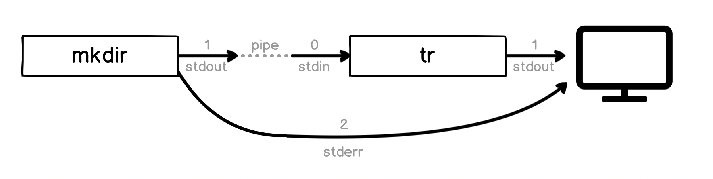
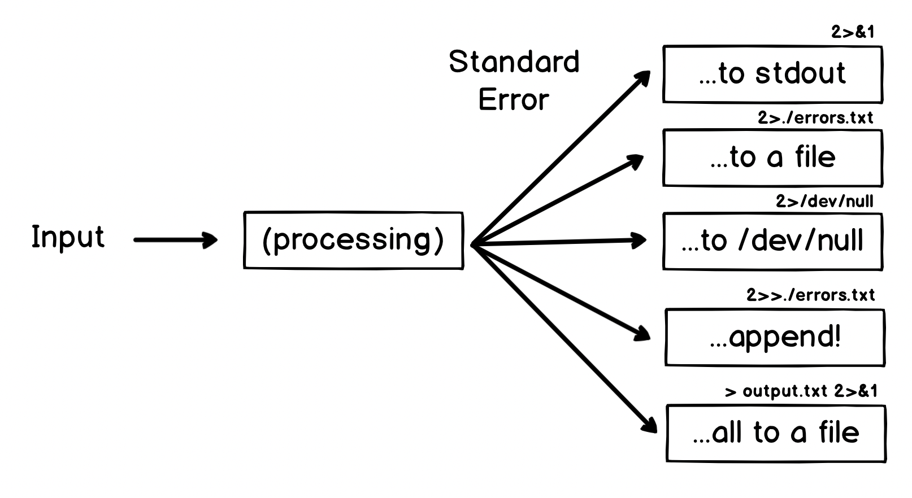
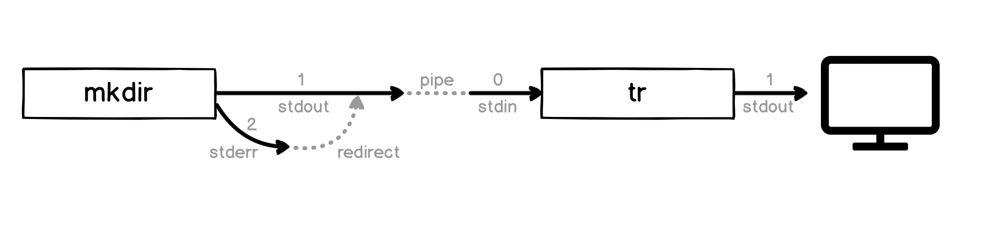

# Chapter 15 - Common Patterns of Standard In

Let's have a quick look at some of the common things we might see as sources of inputs for other programs. Each one illustrates an interesting point about how the shell or the standard input stream works.


This list is by no means exhaustive, in fact with a bit of tinkering you can make almost anything the input to anything else, but let's check each example.

These examples will use some new programs to transform the output - don't worry about the details of them, each will be described as we go through the book!

## The Shell

You might just use code in the shell as input, for example:

```
$ echo "I am in the $PWD folder" | sed 's/folder/directory/'
I am in the /Users/dwmkerr/repos/github/dwmkerr/effective-shell directory
```

Here we've just used `echo` to write out message including a variable and then used the `sed` (_stream editor_) program to replace the word `folder` with `directory`. We'll get a lot of practice with `sed` as we go through this book!

## Files

We've already seen a few examples of using `cat` to write a file to `stdout`.

A lot of the time we don't need to use `cat` many programs accept the path of a file as a parameter, meaning we can just tell the program to open the file directly. For example, we could count the number of lines in a file like this:

```
$ cat ~/effective-shell/text/simpsons-characters.txt | wc -l

      14
```

Or more simply, like this:

```
$ wc -l ~/effective-shell/text/simpsons-characters.txt
      14 /Users/dwmkerr/effective-shell/text/simpsons-characters.txt
```

In this case, we've passed the file path as an argument to the `wc` (_word, line, character and byte count_) program. But be aware - not all programs use the same convention or parameter names!

Now here's a cool trick. Type `rev < /dev/stdin`, then enter some text and hit `^D` or `^C` when done. You should see something like this:

```
$ rev < /dev/stdin
Red Rum
muR deR
```

What's going on here?  Remember we mentioned that `stdin` is a special stream which represents input and that it lives at `/dev/stdin`? This little trick uses _redirection_ to redirect the `stdin` file to the `rev` (_reverse_) command.

The `<` operator redirects the standard input of a program to come from the given file. We could also have written `cat /dev/stdin | rev`. Or just enter `rev` and type in the input we want to reverse!

## The Clipboard

In [Chapter 4 - Becoming a Clipboard Gymnast]() we saw a trick to remove formatting from text in the clipboard. Here's a similar trick to reverse the contents of the clipboard:

```
$ pbpaste | rev | pbcopy
```

This pipeline pastes the contents of the clipboard to `stdout`, which is piped to `rev` (reversing the text) and then pipes the output to `pbcopy`, which copies the results to the clipboard[^2].

## Filtered Input

This is a trick a friend shared with me. 
He works with data scientists and whenever he shows them this command they love it!

```
$ head -n 100 100GBFile.csv > 100linefile.csv
```

The `head` (_display first lines of a file_) command in this case just grabs the first 100 lines of a file and puts it straight into a smaller, more manageable file. We'll see what the `>` symbol (the _redirection_ symbol) means in the section lower down on Standard Output.

You can also use `tail` in the same way to get the _last_ lines from a file. And if you are a more advanced user, you might use something like this:

```
$ grep -C 5 error /var/log/mylogfile.txt | less
```

We'll see all of these commands as we go through the book, but this very cool trick uses the `grep` (_file pattern searcher_) command to search for the text `error` in the file `/var/log/mylogfile.txt`, shows five lines of _context_ (`-C 5`), which are the lines before and after the match, then puts the result into your pager! We'll see the pager just below. We'll do a lot of `grep`-ing as we go through the book so don't worry if this looks a little confusing for now.

## Many More!

We've only scratched the surface - almost any program will write to the standard output, meaning it can be the input for any pipeline you can imagine!

# Standard Error

We haven't actually seen `stderr` in action yet. Let's see how it works.

```
$ mkdir ~/effective-shell/new-folder
$ mkdir ~/effective-shell/new-folder
mkdir: /home/dwmkerr/effective-shell/new-folder: File exists
```

In the first call to `mkdir`, the folder is created successfully. In the second call, we get an error. Now let's try and use this output and make it louder - making all of the text uppercase.

There are lots of ways to make text uppercase in the shell, let's use the `tr` (_translate characters_) program. Here's an example of how it works:

```
$ echo 'Be quiet, this is a library!' | tr '[:lower:]' '[:upper:]'
BE QUIET, THIS IS A LIBRARY!
```

Now let's use it to shout out our error message:

```
$ mkdir ~/effective-shell/new-folder | tr '[:lower:]' '[:upper:]'
mkdir: /home/dwmkerr/effective-shell/new-folder: File exists
```

In this case the output has not been made uppercase. What's going on?

To understand, let's quickly review the three streams:


When we are in the shell, the shell automatically writes the `stderr` stream to the screen. But the shell's _pipe_ operator pipes `stdout` only - it is _not_ piping our error output. And the `mkdir` command is writing this error message to `stderr`.

The command we ran before:

```
mkdir ~/effective-shell/new-folder | tr '[:lower:]' '[:upper:]'
```

Actually looks like this:



The pipe _has_ piped the standard output to the `tr` program. But there is no standard output - the error message was written to _standard error_ instead. The shell has still written it to the screen for us, but has not piped it to the `tr` program.

So how do we deal with `stderr`? Here are some common options:



Now this might be the **ah-ha!** moment if you have done some shell scripting before - some of these obscure sequences like `2>&1` might look familiar (even if it is just the thing you know you you always have to Google to get right!).

Let's take a quick look at some of these options.

## To Standard Output

If we want to be able to pipe the error message to another command, we can use another redirection trick - we can redirect `stderr` to `stdout`.

The characters `2>&1` look really obscure - let's break it down:

- Take the file with descriptor `2` - which is _standard error_
- Redirect it with the redirect symbol `>` - we saw this in the earlier section
- Redirect it into the file with descriptor (`&`) `1` - which is _standard output_

Remember, there are three 'magic' files each process has access to:

- `stdin`, the standard input, which has the file descriptor `0`
- `stdout`, the standard output, which has the file descriptor `1`
- `stderr`, the standard error, which has the file descriptor `2`

File descriptors are just numbers the operating system uses to keep track of files. When a program opens a 'normal' file, it'll get a new file descriptor. Here's a little example:

```sh
python <<EOF
import os
for r in range(3): print(os.open('/dev/random', os.O_RDONLY))
EOF
```

This code uses redirection (see how useful it is?) to pipe a small Python script into the Python program, which writes the results to `stdout`. You will probably see the following output:

```
3
4
5
```

It doesn't really matter whether you know Python or not (and there weird looking `EOF` is a _heredoc_ which we have a whole chapter on later). The script is just a way of showing the file descriptors that the operating system gives me when I try to open three files (each time I open the same file, the magic `/dev/random` file which just contains random data).

The interesting thing is that the descriptors in my program start from `3` and go upwards - that's because `0`, `1` and `2` are already in use, for `stdin`, `stdout` and `stderr`!

So to make our error message go through the `tr` command, we can redirect `stderr` to `stdout`, which means the error message will go to `stdout` and then be piped to `tr`:

```
$ mkdir ~/effective-shell/new-folder 2>&1 | tr '[:lower:]' '[:upper:]'
MKDIR: /HOME/DWMKERR/PLAYGROUND/NEW-FOLDER: FILE EXISTS
```

Visually, what is happening is this:



If you can wrap your head around this, the other options we showed for `stderr` might start to make a little more sense.

A nice trick to remember the slightly obscure ampersand `&` which references a file descriptor - if you were to write this:

```sh
cat some-file-that-might-not-exist 2>1
```

What would happen is that the shell would write `stderr` to a _new file_ with the name `1`! Why don't we need an ampersand _before_ the `>` symbol, only for the file descriptor afterwards? This is just because the shell only supports redirecting file descriptors, so an additional ampersand would be superfluous. 

## To a File

Before, we redirected to `&2`, which is 'the file with descriptor `2`. We can also use a similar trick to redirect to any arbitrary file:

```sh
mkdir ~/effective-shell/new-folder 2>./errors.txt
```

This command just redirects all of the errors (remember, `2` is `stderr`) to a file called `./errors.txt`.

This is quite a common trick - run the program, but log the errors to a file for later review.

## Append

Yes! Just like we did with `stdout`, there's nothing stopping us _appending_ to a file:

```
mkdir ~/effective-shell/new-folder 2>>./all-errors.log
```

Just like before, we use `>>` which means _append_ (rather than _overwrite or create_).

**All to a File**

This is a really important subtlety. If you want to write _both_ `stdout` and `stderr` to a file, you might try this:

```sh
ls /usr/bin /nothing 2>&1 > all-output.txt
```

If you run this command, you'll get `stdout` written to `all-output.txt`, but the error message `cannot access  '/nothing'` is written to the screen, not the file. Why is this?

Bash (and most bash-like shells) process redirections from _left to right_, and when we redirect we _duplicate_ the source. So breaking this down:

- `2>&1` - duplicate file descriptor `2` (`stderr`) and write it to `1` - which is _currently the terminal_!
- `> all-output.txt` - duplicate file descriptor `1` (`stdout`) and write it to a file called `all-output.txt`

To write _everything_ to the file, try do this:

```sh
ls /usr/bin /nothing > all-output.txt 2>&1
```

This will work. Breaking it down:

- Redirect `stdout` to the file `all-output.txt`
- Now redirect `stderr` to `stdout` - which by this point _has already been redirected to a file_

This can be tough to remember so it's worth trying it out[^4]. There are many variations you can play with and we'll see more as we go through the book.

You can put any text content into your pager - try this:

```sh
ls -al /usr/bin | less
```

This lists the contents of the `/usr/bin` folder, piping the output to `less` so we can easily scroll through it.

# Summary

We'll see pipelines again and again. The standard streams, redirection, pipelines and all of the tricks we've introduced in this chapter are fundamental not only to using the shell effectively, but really understanding how computer programs work.

Don't be worried if this feels like a lot to take in - we'll see more and more examples in later chapters which will help reinforce these concepts. If you find yourself struggling later you might want to quickly review this chapter, because we introduced a lot!

In this chapter we looked at:

- How each program has access to three 'standard' streams - one for input, one for output and one for reporting errors
- The standard input stream is available as a file at `/dev/stdin`, is often called `stdin` in programming languages, and always has the special file descriptor `0`
- The standard output stream is available as a file at `/dev/stdout`, is often called `stdout` in programming languages, and always has the special file descriptor `1`
- The standard error stream is available as a file at `/dev/stderr`, is often called `stderr` in programming languages, and always has the special file descriptor `2`
- The `Ctrl+D` sequence means 'end of transmission' - we can use it to signal that we have completed putting our input into `stdin`...
- ...but the `Ctrl+C` sequence means 'interrupt' and is normally used to force a program to close
- We can _pipe_ the output of one program to the input of another with the pipe `|` symbol 
- We can _redirect_ a file to the standard input of a program with the `<` operator
- We can _redirect_ the standard output of a program to create or overwrite a file with the `>` operator
- We can _redirect_ the standard output of a program to create or append to a file with the `>>` operator
- We can redirect the standard error of a program to its standard output with `2>&1`
- We can redirect the standard error of a program to another file (such as the 'null' file) with `2>/dev/null`
- We can redirect the standard error of a program to create or append to a file, just like with standard output, using the `>>` operator

We also briefly saw some commands:

- `sort` sorts text
- `sed` can replace content in text
- `tr` can replace parts of text
- `wc` can count words or lines of text
- `tee` takes the input stream and sends it straight to the output, but also to a file (like a T-pipe in plumbing)
- `grep` can filter lines


These programs can do a lot more and are workhorses we'll see in more detail through the book.

There are a few chapters which are planned to come later which go into detail on some of the concepts we only briefly touched on:

- Writing Good Programs - How to write programs which use `stdin`, `stdout` and `stderr` sensibly
- The Unix Philosophy - Why we have so many small simple programs which we can pipe together
- Streams in Detail - How streams like `stdin` actually work, especially with things like line endings, command sequences like `^D` and so on
- Signals - A little more on Signals (such as `^C` and `^D`)

When these chapters are published I'll update the links here. If you want to be updated when new chapters are published, you can [Join the Mailing Lits on the Homepage](https://effective-shell.com).

**Footnotes**

[^1]: Technically there is another layer here, which is the `tty`. You can see this by running `tty` in the shell. We'll more about this in the [Interlude - What is a Shell](#TODO) section.
[^2]: Check [Chapter 4 - Becoming a Clipboard Gymnast]() for how to do this on a Linux or Windows machine.
[^3]: Although always use tricks like this with caution! If we had a _different_ error, perhaps one we really do want to know about, we would lose the message in this case.
[^4]: There is a very detailed explanation of this behaviour at https://linuxnewbieguide.org/21-and-understanding-other-shell-scripts-idioms/.
[^5]: With the correct options, `sed` could likely do this in a single operation, but I'd probably spend a lot longer Googling the right options for it!
