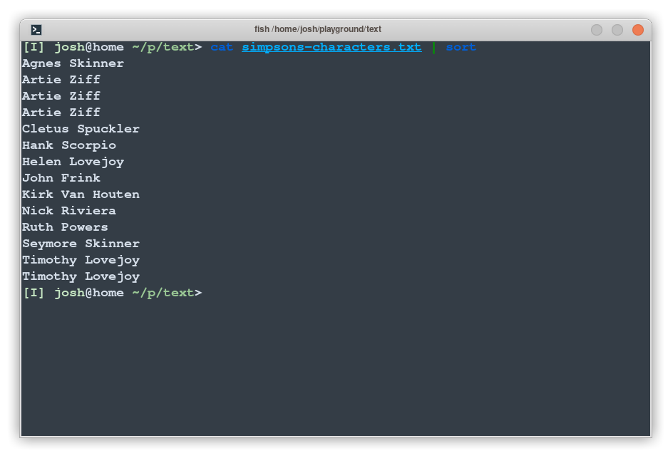
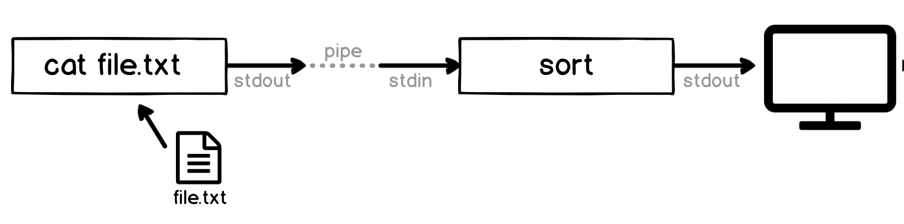
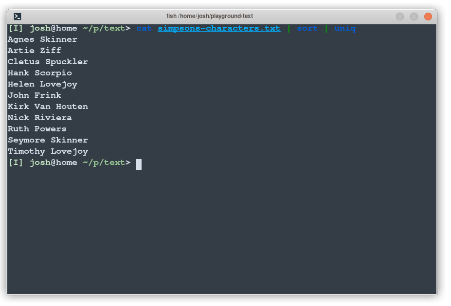
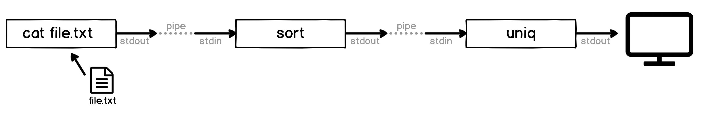

# Chapter XX - Pipelines in Action

Do you remember the `cat` command? It's the one which writes the contents of a file to the screen. For example:

```
$ cat ~/playground/text/simpsons-characters.txt
Artie Ziff
Kirk Van Houten
Timothy Lovejoy
Artie Ziff
Nick Riviera
Seymore Skinner
Hank Scorpio
Timothy Lovejoy
John Frink
Cletus Spuckler
Ruth Powers
Artie Ziff
Agnes Skinner
Helen Lovejoy
```

Indeed, all `cat` is doing is writing the contents of the given file to its `stdout`, which happens to be our terminal screen.
We're free to change that, though, and send its output elsewhere.
For fun, let's send it to the `sort` command, and see what happens:



The `sort` command alphabetizes its input, reading from `stdin` by default, and prints to its `stdout`, which is again our terminal screen.
The **pipe** operator (which is the vertical pipe symbol or `|`) has a very specific meaning in the shell - it attaches the `stdout` of the first program to the `stdin` of the second. This means we can now visualise the entire pipeline and see exactly what is going on:



That's it! 
The pipe operator just connects the output of one program to the input of another. 
A pipeline is just a set of connected programs. 
Easy!

We're free to pipe the output of `sort`, as well.
Let's remove the repeated entries with `uniq`:



We can visualize this pipeline as:



We could do the same thing by writing the output of each step as a file, then reading that file with the next step, but that would mean we'd have a lot of intermediate files to clean up (and if we're processing a _big_ file, it also uses a lot of space). 
Pipelines let us create complex sequences of operations which work well even on very large files.

## Thinking in Pipelines

Once you get comfortable with pipelines, a whole world of possibilities open up.

Just the day before I wrote this chapter, I had to find out how many unique data points were in a data file, which also included empty lines and comments, it took less than a minute to quickly build this:

```sh
cat data.dat | sort | uniq | grep -v '^#' | wc -l
```

I didn't have to find a special program which does exactly what I needed[^5] - I just incrementally built a pipeline. Each section I added one by one, writing to the screen each time, until I had it working. The thought process was:

- `cat data.dat` - OK, first I need to write out the file
- `sort` - now I can sort it, that'll put all the blank lines together
- `uniq` - this'll remove all of those _duplicate_ blank lines, although it still leaves one blank one at the top!
- `grep -v '^#'` - this should get rid of all the lines which start with `#`
- `wc -l` - this'll count the number of lines I'm left with

Now there's probably better ways, and this has an oddity which is that if there are blank lines it'll remove all but one of them (although that would be quick to fix), but it gave me my answer in less than a minute.

Of course, as things get more complex you might want to build scripts, or use a programming language, or other methods, but this _Unix Philosophy_ (which we'll talk about more as we continue) of having lots of small, simple programs which we can chain together can be immensely powerful.

# Summary

We'll see pipelines again and again. The standard streams, redirection, pipelines and all of the tricks we've introduced in this chapter are fundamental not only to using the shell effectively, but really understanding how computer programs work.

Don't be worried if this feels like a lot to take in - we'll see more and more examples in later chapters which will help reinforce these concepts. If you find yourself struggling later you might want to quickly review this chapter, because we introduced a lot!

In this chapter we looked at:

- We can _pipe_ the output of one program to the input of another with the pipe `|` symbol 

We also briefly saw some commands:

- `sort` sorts text
- `uniq` removes duplicated lines
