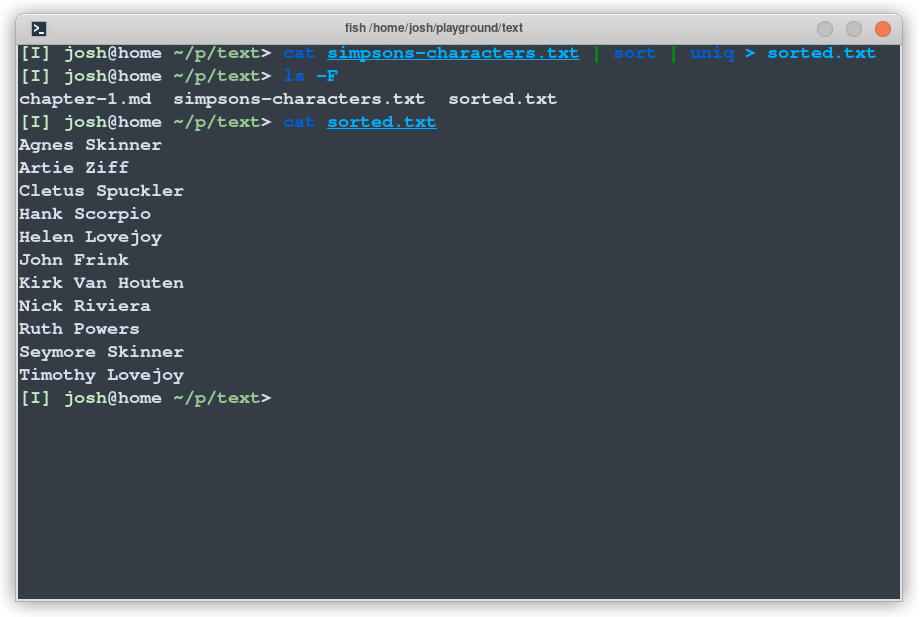

# Chapter 16 - Redirecting Standard Out

Just like we can send the output of a program to another program, we can also send output to a file, in effect saving it for later.

```sh
$ cat simpsons-characters.txt | sort | uniq > sorted.txt
```

This time, instead of printing text to screen, it is sent to the file `sorted.txt`:



The `>` redirection operator creates the file if it does not exist, but will overwrite (truncate) a file if it's already present. Think of this as capturing the "true" output of a given program.

**Append**

What if you don't want to overwrite a file, but instead just add a new line? 
This is what the `>>` or _append redirection_ operator does:


This example writes each line in turn to the `diary.txt` file, appending the text to the end of the file (and creating it if it doesn't already exist).
Appending to a file is extremely useful for circumstances where you might want to build or update a log of events over time.

## Piping into `less`

What about if you have a _lot_ of output? It can be quite inconvenient to have to scroll through the terminal (or impossible, depending on the system you are on). 
In this case, just pipe the output to `less`!

Try this out as an example:

```sh
ls /usr/bin /usr/local/bin /usr/sbin | less
```

You'll see something like this:


This long list of files would be hard to search through if it was printed directly to the shell, but in the pager we can use the `d` and `u` keys to go _down_ and _up_, or the `/` and `?` keys to search forwards or backwards.

Piping into your pager is a really useful trick.
You can pipe any text into your pager.

## Discarding Output

What if we just don't want to see the output at all? 
Well there's a special file called `/dev/null` which we can use for this. 
When we write to this file, the operating system just discards whatever is written. 
In fact, it exists for just this kind of purpose!

```
echo Hello World > /dev/null
```

This just redirects all output to the black hole of `/dev/null` - we won't see them on the screen or anywhere else. 
This is a common way to 'silence' errors in shell commands.

## One Last Trick - The T Pipe

This is a long chapter, but I can't talk about pipelines without briefly mentioning the T pipe. Check out this command:

```sh
cat simpsons-characters.txt | sort | tee sorted.txt | uniq | grep '^A'
```

This command sorts the list of Simpsons characters, removes duplicates and filters down to ones which start with the letter `A`. And it has the `tee` command in the middle. What does this do?

Well the `tee` command is like a T-pipe in plumbing - it lets the stream of data go in two directions! The `sorted.txt` file contains the sets of characters _after_ the sort operation, but before the unique and filter operation. Visually, it does this:


As soon as you visualise a T-pipe it's easy to remember this useful command! You might use it in more complex pipelines or other scenarios to write things to a file which would otherwise go straight to another program or just the display.

# Summary

In this chapter we looked at the redirection operators:

- `>` creates or overwrites a file with the standard output of a program 
- `>>` creates or appends a given file with the the standard output of a program
- Piping into `less` is a useful trick to page through lots of output 
- The `tee` command inserts a T into a pipeline
