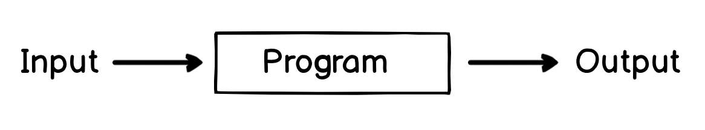
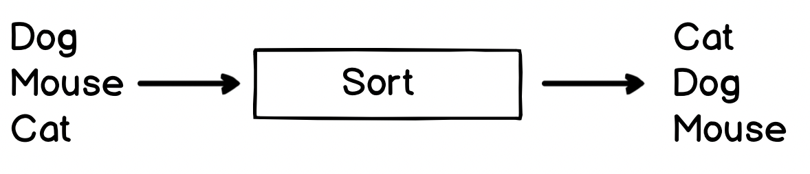
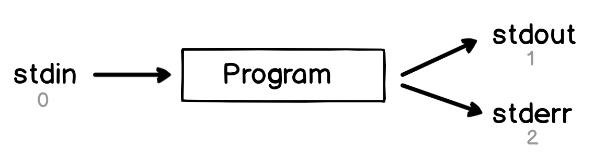
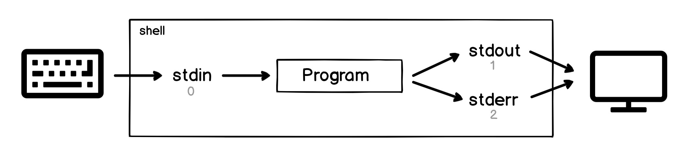

# Chapter 14 - The Standard File Descriptors 

Many of the programs we have seen so far follow a very similar pattern:

<center> Program -> Output" width="480px" /></center>

In fact, when you get down to the details, there are very few programs which _don't_ do something like this! As a more concrete example, we can look at the `sort` program, which sorts its input into alphabetic order:

<center></center>

Many other programs merely print information for us, like `ls`, `date` and `cal`.

## Standard Input, Output and Error

Upon invocation, every program has access to three files, referred to as `stdin`, `stdout` and `stderr`:

<center></center>

- `stdin` is short for 'standard input'&mdash; Programs can read input from here. 
- `stdout` is short for 'standard output' - Programs can write output to this file 
- `stderr` is short for 'standard error' - Programs can write here, too

Each of these files has a number assigned to it (shown in grey in the diagram). These are known as _file descriptors_ and we'll see them again later on. 
Each of these files also has a special location in the system which you can access directly&mdash; you can see these files by running `ls -al /dev/std*`:

```
$ ls -al /dev/std*
lr-xr-xr-x 1 root wheel 0 Jan  1  1970 /dev/stderr -> fd/2
lr-xr-xr-x 1 root wheel 0 Jan  1  1970 /dev/stdin -> fd/0
lr-xr-xr-x 1 root wheel 0 Jan  1  1970 /dev/stdout -> fd/1
```

When you are running programs in a shell, the shell attaches your keyboard to the program's standard input, and attaches the standard output and standard error to the terminal display, like so:

<center></center>

This means when we're in a shell, we can type on the keyboard, which goes to the input of the program and then as the program outputs information and errors they show up on the screen.

We can already see the beginnings of a **pipeline** here. There's a clear flow of data from the keyboard, through the `stdin` file, through the program, then through the output files, then to the display.

Looking at some real programs in action will hopefully make this clearer!


# Summary
In this chapter we looked at:

- How each program has access to three 'standard' streams - one for input, one for output and one for reporting errors
- The standard input stream is available as a file at `/dev/stdin`, is often called `stdin` in programming languages, and always has the special file descriptor `0`
- The standard output stream is available as a file at `/dev/stdout`, is often called `stdout` in programming languages, and always has the special file descriptor `1`
- The standard error stream is available as a file at `/dev/stderr`, is often called `stderr` in programming languages, and always has the special file descriptor `2`
- The `Ctrl+D` sequence means 'end of transmission' - we can use it to signal that we have completed putting our input into `stdin`

