# Chapter 28 - Controlling Changes with Git

Git is an extremely popular and very powerful version control tool. You can use Git to track changes to text, code, or any type of files you might be working with. Many popular projects use Git as a tool to manage changes to their projects over time, allow others to contribute and collaborate, and to publish their projects.

In this chapter we'll look at the most common operations for Git, and how to use things like interactive commands to allow us to quickly and easily work with Git repositories. We'll learn Git on the command line by taking our 'dotfiles' folder and showing how we can track and manage changes.

Being able to use Git from the command line can be a hugely powerful technique to help you be an effective shell user. In this chapter we'll look at setting up a local Git repository - in the next chapter we'll see how to share it online with the popular GitHub website.

# What is Git

Any files or folders that we work with over time, such as our 'dotfiles' (i.e. our personal configuration files) will change. Sometimes new files get added, old files get deleted, files get changed, things get moved around and so on.

Git is a _version control system_ that allows you to track changes to files and folders. This means that you can maintain a history of all of the changes that have been made, when they were made, who made them and why. You can also maintain multiple 'branches' of your files and folders - these branches can be used as working environments where you can make changes, without affecting the current 'main' set of files.

Git was written by Linus Torvalds (the creator of Linux) in 2006. "Git" is slang for an annoying person - Linus joked that he always names projects after himself, first Linux and now Git. There were many version control systems around before Git, such as _CVS_ (Concurrent Version System) and _SVN_ (Subversion, an system similar to CVS but with some improvements). There were also a number of proprietary and commercial solutions. However, in recent years Git has become without a doubt the most popular version control system globally, and many highly popular software collaboration systems such as GitHub, GitLab and BitBucket use Git as their underlying version control system, adding additional features on top.

# Creating a Git Repository

All of the information about a set of files or folders that you are tracking the changes for is stored in a _Git repository_. We can create a Git repository by running the _git init_ (_initialise Git repository_)<!--index--> command.

Let's see this in action be creating a Git repository to track changes to our 'dotfiles' folder. To get this folder first make sure you have installed the samples.


**Downloading the Samples**

Run the following command in your shell to download the samples:

```sh
curl effective.sh | sh
```


If you have installed the samples, you can copy the _~/effective-shell/dotfiles_ folder to your home directory - this is where we will create our Git repository and start using the Git commands:

```
$ cp -r ~/effective-shell/dotfiles ~/dotfiles
$ cd ~/dotfiles
```

We have created the _~/dotfiles_ folder in our home directory from the samples and moved into it.

We're now going to use the `git init` (_initialise a Git repository_) command<!--index--> with the `-b` (_branch name_) flag to initialise a new Git repository:

```sh
$ git init -b main
Initialized empty Git repository in /home/dwmkerr/dotfiles/.git/
```

If you get an error check the box below.


**Error 'unknown switch 'b'**

If you see the error message _error: unknown switch 'b'_ then this means that you are using a version of Git that does not have the `-b` (_initial branch name_) flag (any version of Git lower than 2.2).

We can get around this by initialising the repository and then setting the branch name afterwards with the `git checkout -b` command:

```sh
git init
git checkout -b main
```

You can also upgrade the version of Git installed on your machine to a more recent version. The meanings of these commands will be explained throughout the chapter.


# Adding and Resetting Changes to the Index

We now have an empty Git repository. We can use the `git status` (_show the working tree status_) command<!--index--> to show some information on the files in the folder:

```
$ git status
On branch main

No commits yet

Untracked files:
  (use "git add <file>..." to include in what will be committed)
        install.sh
        shell.d/
        shell.sh

nothing added to commit but untracked files present (use "git add" to track)
```

The first thing that `git status` tells us is the name of the _branch_ we are on. We'll look at branches in detail shortly. The next thing we see is that there are no _commits_ - we'll see these next. Finally, git is telling us that there are three files that are 'untracked'. These are the _install.sh_ and _shell.sh_ files as well as the _shell.d_ folder.

If we are going to use Git to track changes to these file, we need to add them to the repository. We can do that with the _git add_ (_add file contents to index_) command<!--index-->:

```
$ git add .
```

The `git add` command takes a list of file paths. We have used the special _dot_ folder to represent the entire current directory. Let's take a look at the status again:

```
$ git status
On branch main

No commits yet

Changes to be committed:
  (use "git rm --cached <file>..." to unstage)
        new file:   install.sh
        new file:   shell.d/set_ps1.sh
        new file:   shell.sh
```

Git is now telling us that we have three new files which are ready to be _committed_. At the moment these files are 'staged' in the 'index'. The index, or staging area, is the set of changes that we are preparing to commit. We could add more files to the index before we actually save them to the repository in a commit.

If we were to visualise what we've done so far, it would look like this:

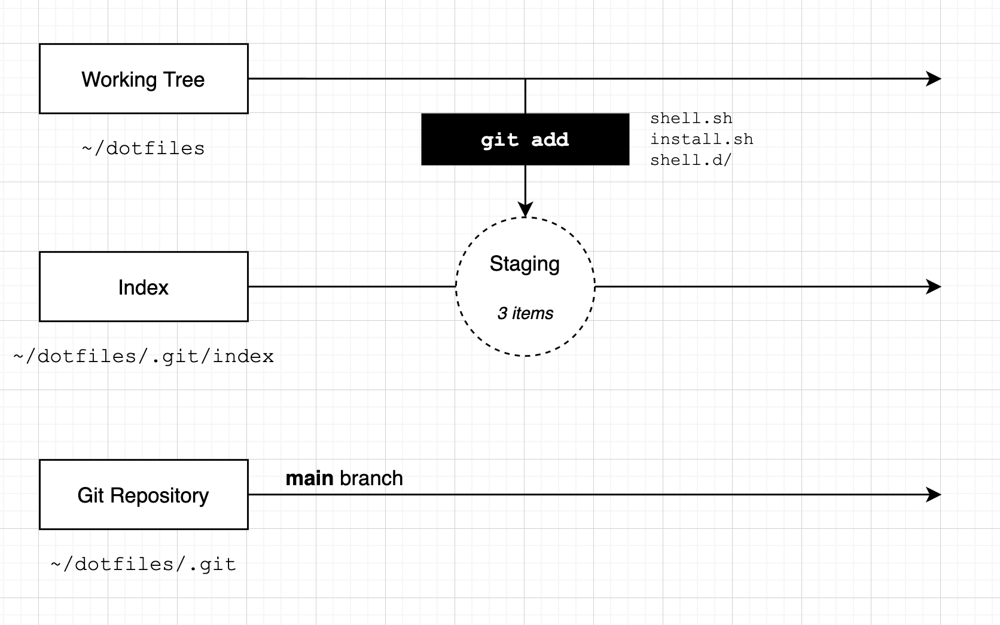

Our _working tree_ is the folder associated with our Git repository, this is the _~/dotfiles_ folder. Our _index_ is initially empty. When we run the `git add` command, we have told Git we want to add three files to the repository. Our 'staging area' has three files in it.

What if we realised that we don't want to add one of these files just yet? To remove a file from the index we can use the `git reset` (_reset changes_) command. Let's reset the _~/dotfiles/shell.d/set_ps1.sh_ file and check the status:

```
$ git reset shell.d/set_ps1.sh
$ git status
On branch main

No commits yet

Changes to be committed:
  (use "git rm --cached <file>..." to unstage)
        new file:   install.sh
        new file:   shell.sh

Untracked files:
  (use "git add <file>..." to include in what will be committed)
        shell.d/
```

The `git reset` command has reset the change we made to the index - telling Git that we don't want to 'stage' one of the files. Git now tells us there are two files in the index and one that is not tracked.

Here's how we can visualise the changes we've made:

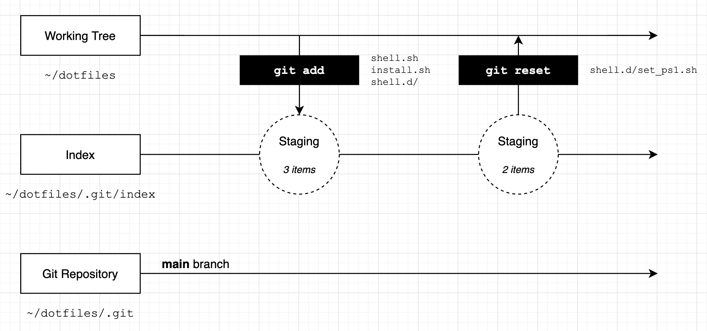

You can also reset changes by using the `git rm --cached` (_remove changes from index_) command. However, I think this is a little harder to work with as you have to remember to use the `--cached` flag to tell Git that you are removing from the index and not the repository. We'll see the `git rm` command a little later in the chapter.

Remember - at this stage we have not changed a single file! Nothing we have done has changed the content of any of the files in the working tree, and the only thing that has changed in the Git repository is the 'index' - the current set of files that we are 'staging'.

Now let's look at how we can commit our changes with the `git commit` command.

# Committing Changes

Once we are happy with the set of changes in the index, we can use the `git commit` (_record changes to the repository_) command<!--index-->.

When you run the `git commit` command, your shell editor will open up:

```
$ git commit 


  GNU nano 2.0.6 File: ...tfiles/.git/COMMIT_EDITMSG
add the 'install' and shell' scripts

# Please enter the commit message for your changes. Lines star$
# with '#' will be ignored, and an empty message aborts the co$
#
# On branch main
#
# Initial commit
#
# Changes to be committed:
#       new file:   install.sh
#       new file:   shell.sh
#
# Untracked files:
#       shell.d/
#
                       [ Read 15 lines ]
^G Get Hel^O WriteOu^R Read Fi^Y Prev Pa^K Cut Tex^C Cur Pos
^X Exit   ^J Justify^W Where I^V Next Pa^U UnCut T^T To Spell
```

The reason you shell editor opens is that the `git commit` command would like you to provide a message describing your changes. Type a short description - in the example above I have used the text _add the 'install' and 'shell' scripts_.

Note that below the cursor there is some information that starts with the `#` hash symbol. This is provided as a convenience - Git is telling you the status of the index.

Save the file by pressing Ctrl+W and close the editor with Ctrl+X (these are the commands for the `nano` editor, if you are using a different editor use whatever commands are needed to save and close).

When the editor closes you'll see a confirmation below the `git commit` command:

```
$ git commit
[main (root-commit) 01e7a10] add the 'install' and 'shell' scripts
 2 files changed, 90 insertions(+)
 create mode 100755 install.sh
 create mode 100644 shell.sh
```

This message tells us that two files have changed and 90 lines have been added. It also lists the files we have added. At this point we have created our first commit. We can visualise the process we have gone through like this:

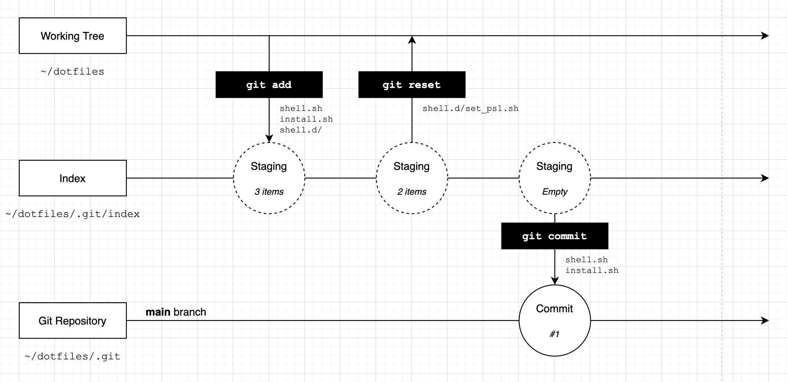

We 'staged' a set of changes and then 'committed' these changes. We now have a single commit in our repository. Our files are _still_ unchanged, but our Git repository now has a single commit in it that tracks the two files we added.

Let's run `git status` again:

```
$ git status
On branch main
Untracked files:
  (use "git add <file>..." to include in what will be committed)
        shell.d/

nothing added to commit but untracked files present (use "git add" to track)
```

The `git status` command tells us we're still on the 'main' branch, and that there is one file which is not tracked. Let's create a second commit by adding this file. When you run the `git commit` command below, enter a message to describe the commit:

```
$ git add .
$ git commit
[main d7e1bb9] add the 'shell.d' folder
 1 file changed, 228 insertions(+)
 create mode 100644 shell.d/set_ps1.sh
```

We have now created a second commit - our timeline will look like this:

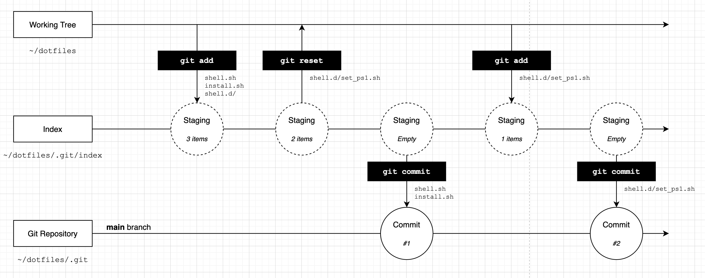

If we run the `git status` command one last time we will see that everything in the working tree is tracked in Git:

```
$ git status
On branch main
nothing to commit, working tree clean
```

The concepts of the 'index', the 'working tree' and the Git repository itself can take a bit of getting used to! If you have not used Git before and this seems like a lot to take on board, don't worry, people often find Git quite hard at first. As you use it more this will all become familiar and make more sense.

Now let's take a look at how we can work on changes to our files with _branches_.

# Creating Branches

The commits that we have made so far have been on a 'branch' named 'main'. We can create new 'branches' and put commits on them to allow us to make a series of changes that are isolated from each other.

We can create branches using the `git branch` (_list, create or delete branches_) or `git checkout` (_switch branches or restore working tree_) command<!--index-->. To show these features in action, we'll create a new branch called _aliases_ and add some files to it:

```
$ git checkout -b aliases
Switched to a new branch 'aliases'
$ git status
On branch aliases
nothing to commit, working tree clean
```

We have used the `git checkout` command to 'switch' to another branch. The `-b` (_new branch_) option tells Git that we want to create a new branch. The `git status` command now shows the new branch name when we run it.

Let's create a new file which includes an alias for the `git status` command, then let's see what `git status` tells us about the status of the working tree:

```
$ echo 'alias gs="git status"' >> ./shell.d/git_aliases.sh
$ git status
On branch aliases
Untracked files:
  (use "git add <file>..." to include in what will be committed)
        shell.d/git_aliases.sh

nothing added to commit but untracked files present (use "git add" to track)
```

Excellent - we have a new file and Git knows that it is not currently tracked. Let's stage this file and then commit it:

```
$ git add .
$ git commit -m "add alias 'gs' for 'git status'"

[aliases f61369d] add alias 'gs' for 'git status'
 1 file changed, 1 insertion(+)
 create mode 100644 shell.d/git_aliases.sh
```

In the example above I used the `-m` (_commit message_) parameter for the `git commit` command.

We now have a series of commits that looks like this:

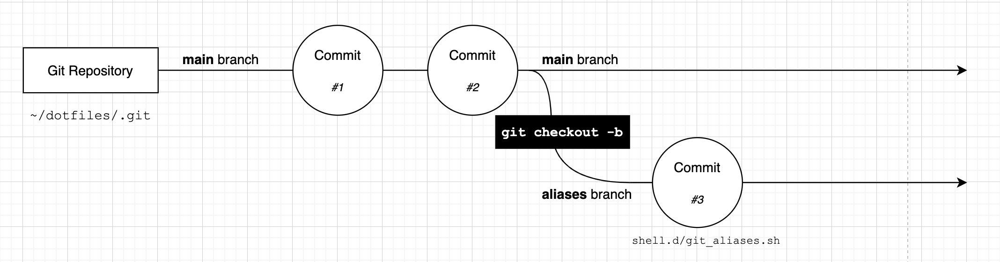

Our new _~/dotfiles/shell.d/git_aliases.sh_ file has been committed to the _aliases_ branch.

We can switch back to the _main_ branch at any time with `git checkout`:

```
$ git checkout main
Switched to branch 'main'
$ tree
.
├── install.sh
├── shell.d
│   └── set_ps1.sh
└── shell.sh
```

This is very cool - by passing the name of the branch we want to switch to as the parameter to the `git checkout` command we can switch branches. If we are on the _main_ branch we don't see the _git_aliases.sh_ file, because the commit that added is was not on the _main_ branch. To go back to the _aliases_ branch we can just checkout again:

```
$ git checkout aliases
Switched to branch 'aliases'
$ tree
.
├── install.sh
├── shell.d
│   ├── git_aliases.sh
│   └── set_ps1.sh
└── shell.sh
```

As a nice little tip, you can always go back to the _last_ branch you were on by running `git checkout -` - this is just like using `cd -` to change to the last directory you visited!

Let's add another alias to the file and create another commit:

```
$ echo 'alias gcm="git checkout main"' >> ./shell.d/git_aliases.sh
$ git add .
$ git commit -m "add alias 'gcm' for 'git checkout main'"
[aliases b9ae0ad] add alias 'gcm' for 'git checkout main'
 1 file changed, 1 insertion(+)
```

Our branches will now look like this:

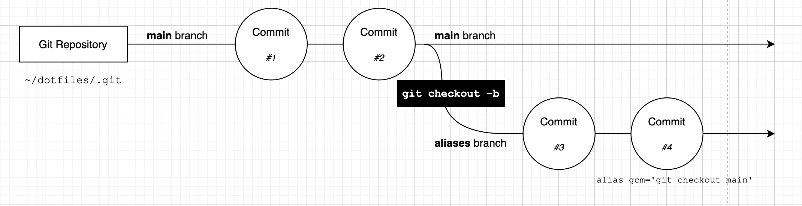

You can create as many branches as you like - just remember that when you run `git checkout -b`, you branch from the _current_ branch (and in fact, the current _HEAD_, which we will see a little later).

If you want to create a branch, but don't want to switch to it, you can run `git branch <new_branch_name>`. This command will create a branch from your current position, but will not move to it.

# Merging

You can use the `git merge` (_join two or more branches_) command<!--index--> to take the changes from one branch and bring them into another.

We can merge the changes from our _aliases_ branch into the _main_ branch of the repository by first checking out the branch we want to merge into, and then running `git merge`:

```
$ git checkout main
$ git merge aliases
Updating d7e1bb9..b9ae0ad
Fast-forward
 shell.d/git_aliases.sh | 2 ++
 1 file changed, 2 insertions(+)
 create mode 100644 shell.d/git_aliases.sh
```

When we run the `git merge` command Git tells us what _type_ of merge it has performed. In this case we have a _fast forward_ <!--index-->merge, which is the most simple type of merge. When Git tries to merge the two branches, it sees that each of the commits on the _aliases_ branch can be applied sequentially to the _main_ branch:

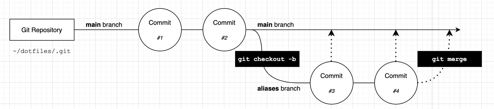

One the merge is complete, our branches look like this:

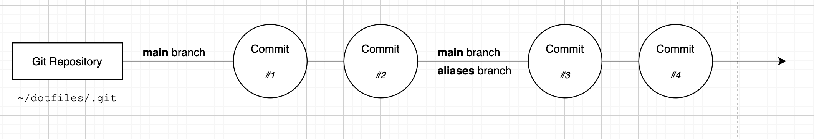

The _main_ branch and _aliases_ branch contain the exact same set of commits.

Let's look at a more common merge scenario - merging branches that have diverged.

## Merging Diverged Branches

Let's create set of commits that show a case where we our branches have _diverged_ - the branches both have their own new commits:

```
$ git checkout -b more_aliases
$ touch ./shell.d/bash_aliases.sh
$ git add .
$ git commit -m "add a file to store 'bash' aliases"
$ touch ./shell.d/zsh_aliases.sh
$ git add .
$ git commit -m "add a file to store 'zsh' aliases"
```

This snippet checks out a new branch called _more_aliases_ and adds two new empty files, as two separate commits. Now we'll go back to our _main_ branch and change a file:

```
$ git checkout main
$ echo 'alias gm="git merge"' >> ./shell.d/git_aliases.sh
$ git commit -a -m "add the 'gm' alias for 'git merge'"
```

I have added a new alias to the _shell.d/git_aliases.sh_ file. By adding the `-a` (_all changes_) flag to the `git commit` command I was able to add the changes to the index and commit them with a single command.

Our branches now look like this:

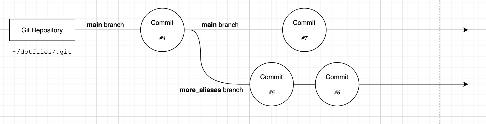

Let's merge the _more_aliases_ branch into the _main_ branch:

```
$ git merge more_aliases
```

Our editor opens up with a request for a commit message:

```
  GNU nano 2.0.6 File: ...rr/dotfiles/.git/MERGE_MSG

Merge branch 'more_aliases'
# Please enter a commit message to explain why this merge is n$
# especially if it merges an updated upstream into a topic bra$
#
# Lines starting with '#' will be ignored, and an empty messag$
# the commit.


                       [ Read 6 lines ]
^G Get Hel^O WriteOu^R Read Fi^Y Prev Pa^K Cut Tex^C Cur Pos
^X Exit   ^J Justify^W Where I^V Next Pa^U UnCut T^T To Spell
```

Git is going to create a new commit on the _main_ branch that brings in the changes from the _bash_aliases_ branch. Because a new commit is going to be created, Git asks us to provide a message. The default message simply explains that this commit merges the branch named _more_aliases_.

You can change the message or leave it as is. Save the file when you have entered the message and the output below will be shown:

```
$ git merge more_aliases
Merge made by the 'recursive' strategy.
 shell.d/bash_aliases.sh | 0
 shell.d/zsh_aliases.sh  | 0
 2 files changed, 0 insertions(+), 0 deletions(-)
 create mode 100644 shell.d/bash_aliases.sh
 create mode 100644 shell.d/zsh_aliases.sh
```

Git now tells us that we have made a _recursive_ merge and our branches will look like this:

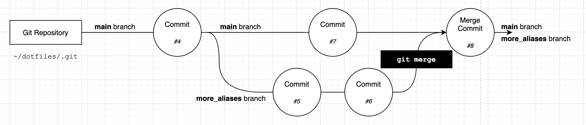

At this stage both the _main_ branch and the _more_aliases_ branch have the full set of changes that we made to _both_ of the branches. Git merged the two branches together and created a new commit that joins them.

## The Git Log

In the diagrams we've shown we've given each commit a number. Now in reality Git doesn't use a number for commits. Git uses a _SHA_, which is a hash. This is large sequence of letters and numbers that uniquely identify each commit.

You can use the `git log` (_show commit logs_) command<!--index--> to see the log of commits and their SHAs:

```
$ git log
commit 138b40418d5658bc64421e7bcf2680c8339f8350 (HEAD)
Merge: a95bd90 a51ae1a
Author: Dave Kerr <dwmkerr@gmail.com>
Date:   Tue Jun 15 21:00:28 2021 +0800

    Merge branch 'more_aliases'

commit a95bd90e3656b2e55b8708193d387c80c282a6ad
Author: Dave Kerr <dwmkerr@gmail.com>
Date:   Tue Jun 15 21:00:22 2021 +0800

    add the 'gm' alias for 'git merge'

commit a51ae1aa42432c2f391ca782c1c20b3793c232ab (more_aliases)
Author: Dave Kerr <dwmkerr@gmail.com>
Date:   Tue Jun 15 20:53:01 2021 +0800

    add a file to store 'zsh' aliases
```

You can see that the log shows each of the commits, the branch the commit was on, the message, the date and so on.

If you want to see a more compact log you can use the `--oneline` (_show one line per commit_) flag:

```
$ git log --oneline
138b404 (HEAD) Merge branch 'more_aliases'
a95bd90 add the 'gm' alias for 'git merge'
a51ae1a (more_aliases) add a file to store 'zsh' aliases
63ea74f add a file to store 'bash' aliases
b9ae0ad (aliases) add alias 'gcm' for 'git checkout main'
f61369d add alias 'gs' for 'git status'
d7e1bb9 add the 'shell.d' folder
01e7a10 add the 'install' and 'shell' scripts
```

When you run this command yourself it will be a little easier to read as the output uses different colours for the SHAs and the branch names.

We can even see a 'graph' view, showing the branches we have made and when they branched off and were merged back. To do this, pass the `--graph` (_show commit graph_) flag:

```
$ git log --oneline --graph
*   138b404 (HEAD) Merge branch 'more_aliases'
| \
| * a51ae1a (more_aliases) add a file to store 'zsh' aliases
| * 63ea74f add a file to store 'bash' aliases
* | a95bd90 add the 'gm' alias for 'git merge'
|/
* b9ae0ad (aliases) add alias 'gcm' for 'git checkout main'
* f61369d add alias 'gs' for 'git status'
* d7e1bb9 add the 'shell.d' folder
* 01e7a10 add the 'install' and 'shell' scripts
```

Each commit is shown with an `*` asterisk symbol - we can also see when we created the _more_aliases_ branch and when we merged it back in.

The Git log is very useful to help you understand the changes that have happened in the repository.

## Merge Conflicts

One of the most important features of any version control system is the ability to manage _conflicts_. Conflicts occur when a set of changes are made that cannot be merged without some kind of manual intervention to decide _which_ of the changes are correct.

Here are a few common scenarios that might lead to merge conflicts:

- In one branch a file is deleted and in another branch the file is changed - when we merge should we delete the file or keep the version with the changes?
- In one branch a file is edited and in another branch the _same_ part of the file is edited in a different way - which edit should we keep? Should we keep both?
- In one branch we add content to the end of a file and in another branch we add different content - which of these changes should come first?

A lot of the time you can avoid conflicts by making sure that you don't keep branches for too long - if other people are merging changes into the _main_ branch while you are working on another branch, you are _drifting_ from the main branch. You should either regularly update your branch with the changes in _main_ or merge your changes into _main_.

There are many different ways for version control systems to manage conflicts. Let's see how Git does it by creating a conflict.

First, we will create a branch that adds a new alias to the _git_aliases.sh_ file:

```
$ git checkout -b glog_alias
$ echo 'alias glog="git log --graph --oneline"' >> ./shell.d/git_aliases.sh
$ git commit -a -m "add the 'glog' alias"
```

Now we'll go back to the _main_ branch and add another alias:

```
$ git checkout main
$ echo 'alias glog="git log"' >> ./shell.d/git_aliases.sh
$ git commit -a -m "add the 'glog' alias"
```

We've changed the same file in two branches - if we try to merge we will get a conflict:

```
$ git merge glog_alias

Auto-merging shell.d/git_aliases.sh
CONFLICT (content): Merge conflict in shell.d/git_aliases.sh
Automatic merge failed; fix conflicts and then commit the result.
```

When Git cannot automatically consolidate the changes into a single merge commit, it aborts the merge process. No new commits have been made - the conflicted files with their changes and in the _index_. We have to now manually fix these files.

Let's see what the status shows:

```
$ git status
On branch main
You have unmerged paths.
  (fix conflicts and run "git commit")
  (use "git merge --abort" to abort the merge)

Unmerged paths:
  (use "git add <file>..." to mark resolution)
        both modified:   shell.d/git_aliases.sh

no changes added to commit (use "git add" and/or "git commit -a")
```

Git is telling us that we are currently in the process of trying to fix a merge conflict. It is telling us that we need to fix the _shell.d/git_aliases.sh_ file, then use `git add` to stage the changes and commit the result.

To resolve the conflict, we need to edit the file. If you open the file in an editor it will look like this:

```
alias gs="git status"
alias gcm="git checkout main"
alias gm="git merge"
<<<<<<< HEAD
alias glog="git log"
=======
alias glog="git log --graph --oneline"
>>>>>>> glog_alias
```

Many modern editors will immediately recognise the sequence of symbols that Git uses to indicate conflicts and highlight them. The `<<<<<< HEAD` line indicates the changes in the current branch, the `=======` is a separator, and the `>>>>>> glog_alias` line indicates that everything since the `=======` line is the changes in the _glog_alias_ branch.

We can see why Git has not been able to merge these changes - each branch has a new line and Git doesn't know which one is correct. So rather than make an assumption (such as the most recent change should 'win'), Git is asking us to choose.

In your editor, update the file to look like this:

```
alias gs="git status"
alias gcm="git checkout main"
alias gm="git merge"
alias glog="git log --graph --oneline"
```

We have chosen the version of the `glog` alias that was in the _glog_alias_ branch. But you could choose either - or replace the content with a new line. You can make any changes you like - just be sure to remove the lines that start with `<<<`, `===` and `>>>`.

We can now use `git add` to mark the file as resolved, and run `git commit`:

```
$ git add shell.d/git_aliases.sh
```

The editor will open showing a sensible commit message:

```
  GNU nano 2.0.6 File: ...tfiles/.git/COMMIT_EDITMSG

Merge branch 'glog_alias'

# Conflicts:
#       shell.d/git_aliases.sh
#
# It looks like you may be committing a merge.
# If this is not correct, please run
#       git update-ref -d MERGE_HEAD
# and try again.


# Please enter the commit message for your changes. Lines star$
# with '#' will be ignored, and an empty message aborts the co$
#
# On branch main
                       [ Read 20 lines ]
^G Get Hel^O WriteOu^R Read Fi^Y Prev Pa^K Cut Tex^C Cur Pos
^X Exit   ^J Justify^W Where I^V Next Pa^U UnCut T^T To Spell
```

The message is just like the earlier merge commit message, but the comments show a little more information (the files that were conflicted). Save the file and close the editor to complete the commit.

Our Git log will now show this new merge commit:

```
$ git log --graph --oneline
*   2532277 (HEAD -> main) Merge branch 'glog_alias'
|\
| * a8cbb15 (glog_alias) add the 'glog' alias
* | 31548e4 add the 'glog' alias
|/
*   138b404 Merge branch 'more_aliases'
|\
| * a51ae1a (more_aliases) add a file to store 'zsh' aliases
| * 63ea74f add a file to store 'bash' aliases
* | a95bd90 add the 'gm' alias for 'git merge'
|/
* b9ae0ad (aliases) add alias 'gcm' for 'git checkout main'
* f61369d add alias 'gs' for 'git status'
* d7e1bb9 add the 'shell.d' folder
* 01e7a10 add the 'install' and 'shell' scripts
```

Dealing with conflicts can be extremely complicated. We have only scratched the surface here, but there is a wealth of information online if you'd like to go deeper.

## Other Merge Strategies

Git has a number of merge strategies that can be used to combine the changes across branches. Going into them is beyond the scope of this book. However, it is useful to know that you have a lot of functionality to control how branches are merged available to you if you want to explore further.

There are merge strategies that allow you to try and create a single, coherent history between two branches, rather than creating a merge commit, the are options to 'squash' all of the commits from one branch into another and more.

I would suggest that as you become more familiar with the basics of how Git works, you get a little deeper on this topic - searching online for "Git Merge Strategies" will bring up many articles going into detail.

# Deleting and Renaming Files

It is quite simple to remove files from your Git Repository. You can either ask Git to remove the file for you, or just delete the file yourself and then tell Git that you have removed it.

Let's see both ways in action. First we'll use the `git rm` (_remove files from the working tree and index_) command<!--index-->:

```
$ git rm install.sh
rm 'install.sh'
```

The `git rm` command removes the file from your working tree and stages the deletion. We can see that the file is staged for deletion if we run `git status`:

```
$ git status
On branch main
Changes to be committed:
  (use "git restore --staged <file>..." to unstage)
        deleted:    install.sh
```

The deletion is only in the _index_ at this stage - we need to run `git commit` to commit the deletion.

If we want to restore the file, we can use `git checkout` to get the file back from Git:

```
$ git checkout HEAD install.sh
```

We use `HEAD` to tell Git what commit we want to checkout the file from - head means the current commit we are on (which is the most recent commit on _main_).

Another common way to delete a file is to simply remove it from the file-system:

```
$ rm install.sh
$ git status
On branch main
Changes not staged for commit:
  (use "git add/rm <file>..." to update what will be committed)
  (use "git restore <file>..." to discard changes in working directory)
        deleted:    install.sh
```

At this point Git knows the file is missing, but the deletion is not yet _staged_ - because we haven't explicitly told Git that we want to remove this file as part of the commit we are creating. To confirm that we want to remove the file we can use:

```
$ git rm install.sh
```

We could also run `git add install.sh` - think of this like saying 'stage my change to _index.sh_' - we are _adding_ a change to the _index_. I often just run `git add .` to add all of my changes (including deletions) to the stage. At this point we can make any other changes we like, stage them, and then commit.

Let's restore the file:

```
$ git reset .
Unstaged changes after reset:
D       install.sh
$ git checkout .
Updated 1 path from the index
```

This is another way to restore the file - first we reset all of the changes to the index with `git reset .`, then we checkout all of the files in the current commit with `git checkout .`. But be careful with this method - it will also reset any other changes you have made. I prefer the `git checkout HEAD <file_path>` method as it is more explicit and only restores one file.

What about if we rename a file? Let's rename the install file and see what the status is:

```
$ mv install.sh install_dotfiles.sh
Changes not staged for commit:
  (use "git add/rm <file>..." to update what will be committed)
  (use "git restore <file>..." to discard changes in working directory)
        deleted:    install.sh

Untracked files:
  (use "git add <file>..." to include in what will be committed)
        install_dotfiles.sh

no changes added to commit (use "git add" and/or "git commit -a")
```

We've renamed the file, but when we run `git status` it is telling us that the file is missing, and there is a new untracked file. But Git is smart enough to know when we move a file - if we run `git add .` to add all changes in the working tree to the index, Git will recognise that we have not deleted and added a file, but instead renamed it:

```
$ git add .
$ git status
On branch main
Changes to be committed:
  (use "git restore --staged <file>..." to unstage)
        renamed:    install.sh -> install_dotfiles.sh
```

Let's restore the file by renaming it back to what it was and adding these changes:

```
$ mv install_dotfiles.sh install.sh
$ git add .
$ git status
On branch main
nothing to commit, working tree clean
```

We can also use the `git mv` (_move or rename a file_) command<!--index--> to move or rename a file and stage the changes in one go:

```
$ git mv install.sh install_dotfiles.sh
Changes to be committed:
  (use "git restore --staged <file>..." to unstage)
        renamed:    install.sh -> install_dotfiles.sh
```

We can also restore the changes by using `git mv`:

```
$ git mv install_dotfiles.sh install.sh
$ git status
On branch main
nothing to commit, working tree clean
```

These commands work equally well with folders, or lists of files and folders.

# Restoring Your Working Tree

We've already seen how the `git checkout` command can be used to switch branches. We can also use the `git checkout` command to restore our working tree to a certain point in our commit history. This is extremely useful if you want to see how your files looked at an earlier point in time, or restore your files to a previous state.

Let's take a quick look at our Git log so far.

```
$ git log --graph --oneline
*   2532277 (HEAD -> main) Merge branch 'glog_alias'
|\
| * a8cbb15 (glog_alias) add the 'glog' alias
* | 31548e4 add the 'glog' alias
|/
*   138b404 Merge branch 'more_aliases'
|\
| * a51ae1a (more_aliases) add a file to store 'zsh' aliases
| * 63ea74f add a file to store 'bash' aliases
* | a95bd90 add the 'gm' alias for 'git merge'
|/
* b9ae0ad (aliases) add alias 'gcm' for 'git checkout main'
* f61369d add alias 'gs' for 'git status'
* d7e1bb9 add the 'shell.d' folder
* 01e7a10 add the 'install' and 'shell' scripts
```

The Git log is showing the first six digits of the SHA for each commit. We can checkout any commit by providing its SHA. We don't need to provide the entire SHA (which is good, because they are normally quite long), we only need to provide enough letters to uniquely identify the commit, so normally six digits is plenty.

Notice that the most recent commit is marked with the text `HEAD`. The _HEAD_ is where Git is currently 'pointing' to - we will see how to move the head shortly (the term _HEAD_ also refers to the most recent commit of a branch).

At the moment we can visualise our Git log, with the commits, branches and HEAD like so:

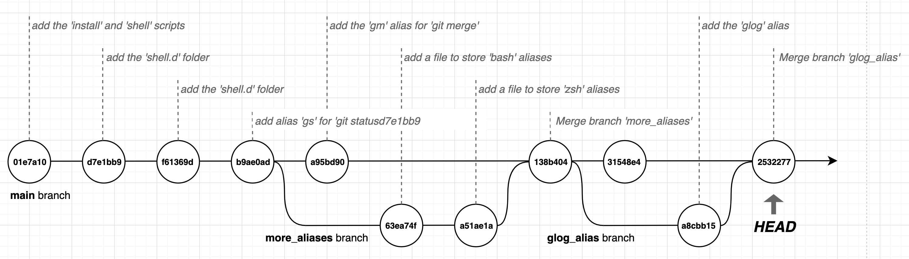

We can restore the working tree to the state of any of the commits by running `git checkout <commit_sha>`:

```
$ git checkout f61369d
Note: switching to 'f61369d'.

You are in 'detached HEAD' state. You can look around, make experimental
changes and commit them, and you can discard any commits you make in this
state without impacting any branches by switching back to a branch.
```

This snippet moved our HEAD to the third commit in our repository. If you look at the files in your working tree you'll see that they are in exact state that they were when we made our third commit. Visually, we have moved the HEAD as shown below:

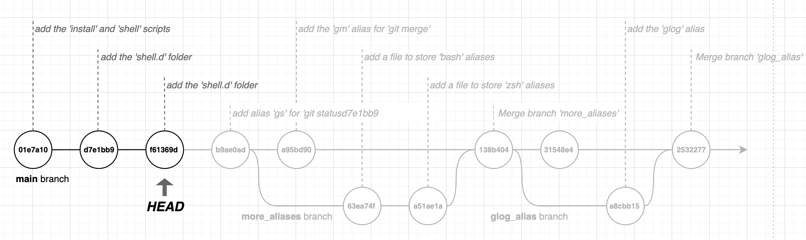

The warning that says we are in a 'detached HEAD' state is telling us that our current position in the history is not at the 'tip' of a branch - this means we cannot create a new commit without first starting a new branch.

If we want to move back to the 'tip' of our main branch (or any other branch), we can use `git checkout <branch_name>`:

```
$ git checkout main
```

This moves us back to the 'tip' of the main branch.

Git has a very convenient syntax we can use to move backwards. We can specify a branch name, a SHA or 'HEAD', use a `~` tilde character, and then provide the number of commits we want to move 'backwards':

```
$ git checkout HEAD~1
```

This command moves the 'head' backwards one commit. This is extremely useful if you realise you have made a mistake with your commit or recent commits and want to go backwards.

# Summary

Manual pages:

- `man git-init`
- `man git-status`
- `man git-add`
- `man git-reset`
- `man git-commit`
