# Chapter 29 - Managing Remote Git Repositories and Sharing Your Dotfiles

In this chapter we'll take a look at how to take a local Git repository, like the one created in the previous chapter, and upload it to a remote repository.

We'll use the popular "GitHub" site to host our repository. We'll see how we can manage remote changes and use GitHub to share our dotfiles, so that we can quickly setup any machine with our personal configuration.

If you want to follow along with the code, copy the version of the 'dotfiles' folder from the previous chapter to your home directory:

```
cp -r ~/effective-shell/repositories/chapter-27-dotfiles ~/dotfiles
```

This folder contains the Git repository with the exact set of changes made in Chapter 27.


**Downloading the Samples**

Run the following command in your shell to download the samples:

```sh
curl effective.sh | sh
```



# Git Remotes

So far all of the changes we have made are stored in a _local_ Git repository. The repository's files are stored on your local machine in a folder named _.git_ in the location where you initialised the repository. A _remote_ is a repository that is on another machine.

You can push and pull your changes to and from a remote repository as a way to back-up your repository. You can share this remote with other people so that they can collaborate on it, or download it to other machines you work on.

There are a number of services you can use that allow you to host public repositories (which can be seen by anyone) and private repositories (which have more restricted access).

To see how remotes work I will show how to create a repository using the popular _GitHub_ service. GitHub is free for individuals and is an extremely popular Git provider and online collaboration platform.

To create a remote, you will first need to sign-up for a GitHub account. When you have done that you will be offered the option to create a repository:


Choose the 'Create a repository' option. You will then be asked to provide a name for your repository. I'm going to use this repository to host my dotfiles, so I have chosen "dotfiles":

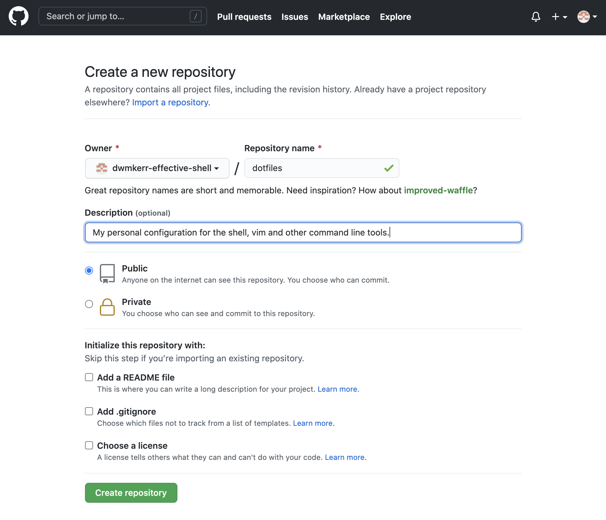

If you don't want members of the public to be able to see your repository, choose the 'private' option.

If you already have a local repository then _don't_ check any of the boxes under "Initialise this repository with" - we want to create an empty repository which we will then 'push' our changes to.

Once you have chosen the "Create Repository" option you will be shown some commands that you can use to configure your local repository to point to this newly created remote repository:

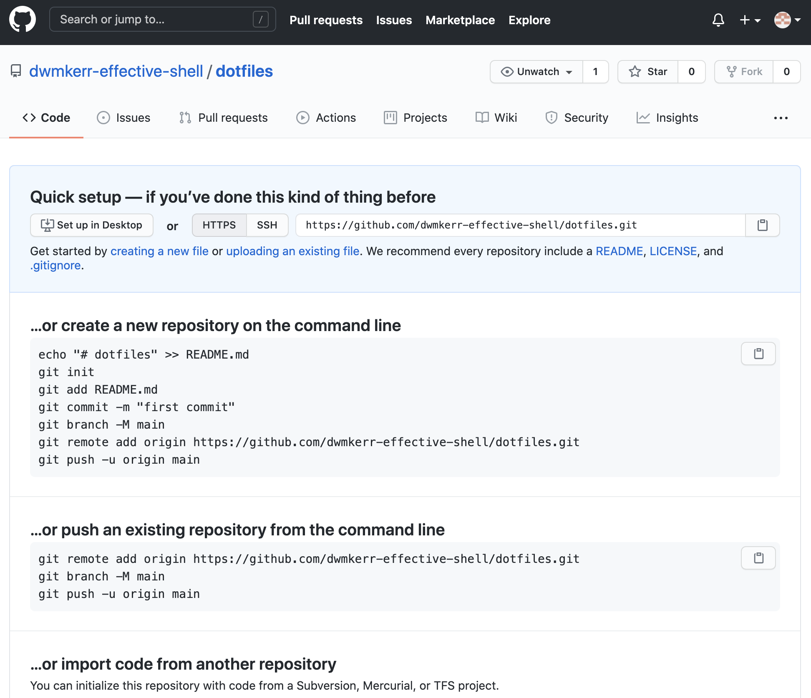

We already have a repository, so we will follow the instructions in the section "...or push an existing repository from the command line". Copy the commands (there is a button that copies the command text to the clipboard) and run them in your shell, from the _~/dotfiles_ folder:

```
$ git remote add origin https://github.com/dwmkerr-effective-shell/dotfiles.git
$ git branch -M main
$ git push -u origin main

Username for 'https://github.com': dwmkerr+effective-shell@gmail.com
Password for 'https://dwmkerr+effective-shell@gmail.com@github.com':
Enumerating objects: 39, done.
Counting objects: 100% (39/39), done.
Delta compression using up to 16 threads
Compressing objects: 100% (36/36), done.
Writing objects: 100% (39/39), 12.83 KiB | 1.83 MiB/s, done.
Total 39 (delta 7), reused 0 (delta 0), pack-reused 0
remote: Resolving deltas: 100% (7/7), done.
To https://github.com/dwmkerr-effective-shell/dotfiles.git
 * [new branch]      main -> main
Branch 'main' set up to track remote branch 'main' from 'origin'.
```

When you run the third command (the one that starts with `git push`) you will be asked for your username and password. Once you enter them your local changes will be 'pushed' to the remote repository.


**Avoid Using Passwords**

To keep this example simple I have authenticated with a username and password. However, I would strongly recommend that as soon as possible you set up an SSH key to authenticate with GitHub. SSH keys are far more secure than usernames and passwords.

GitHub have an excellent guide on how to setup SSH keys at:

https://docs.github.com/en/github/authenticating-to-github/connecting-to-github-with-ssh

I also describe how to setup SSH keys in the chapter [The Secure Shell]().


Let's look at each command in detail.

- `git remote add origin https://github.com/dwmkerr-effective-shell/dotfiles.git` first we tell Git that we would like to add a new 'remote' called _origin_ and we provide its address. The remote in this case is the repository we created in GitHub.
- `git branch -M main` now we rename our current branch to _main_ - because our current branch is already called _main_ this shows no output as nothing has changed.
- `git push -u origin main` finally, we 'push' our _main_ branch to the _remote_ named _origin_. The `-u` flag is used to track changes - we'll see what this means shortly.

At this stage if you refresh your browser you'll see your _dotfiles_ repository, with all of our changes we've made so far!

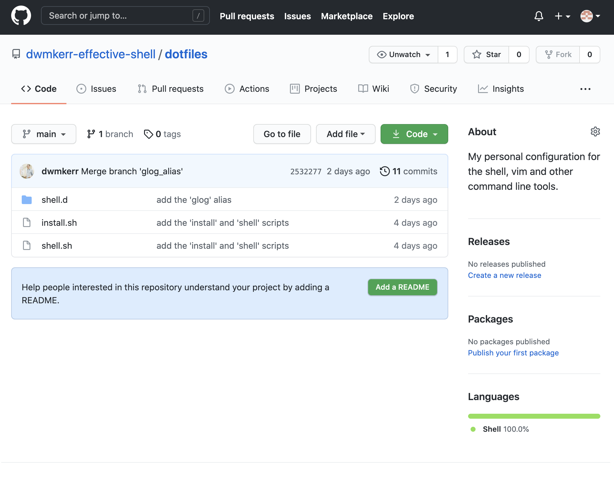

Each of the files and folders we have created is shown, we can view any of the files, look at the commit history, see the log messages and more.

Before you make too many changes, we'll cover three important commands you need to be aware of when working with remotes - `git push`, `git fetch` and `git pull`.

## The Git Push Command and Remotes

We've already used the `git push` command once. This command pushes the changes we have made locally to a remote. It is a common convention to call the primary remote that you work with _origin_ - but you can use any name you want. You can also have multiple remotes. For example, you could sign up with _GitLab_, another Git services provider, create a repository with their service and add that as a remote and call it _gitlab_.

You can show your remotes with the `git remote` (_managed remote repositories_) command<!--index-->. If we run the command with the `-v` (_verbose_) parameter each remote will be shown, along with the address used when we push changes, as well as the address used when we 'fetch' changes (which we'll look at next):

```
$ git remote -v
origin  https://github.com/dwmkerr-effective-shell/dotfiles.git (fetch)
origin  https://github.com/dwmkerr-effective-shell/dotfiles.git (push)
```

The command we used to push our changes was:

```
$ git push -u origin main
```

The `-u` (_set upstream_) option tells Git that we want to associate our local _main_ branch with the remote _main_ branch. This means that we don't need to specify the remote name for each subsequent `git push` command - Git knows that our 'upstream' branch that we push to is called _main_ and is in the _origin_ remote.

## The Git Fetch Command

The `git fetch` (_get remote changes_) command<!--index--> downloads all of the information about the changes that have been made to the remote.

This command does _not_ download the actual changes to your working tree! All it does is download the information about the changes. To see what I mean, let's run the fetch command:

```
$ git fetch
```

There will be no output - the remote has not changed. Let's make a change to the remote so we can see how fetch works. Open the repository in the GitHub website. There's a message saying that we should add a 'README' file:


Press the "Add a README" button and add a description of your project. By convention, the file named `README.md` in a repository is shown on the home page of the project online and typically should include instructions on how to use the repository. This is a plain text file, you can use a plain text styling language called "Markdown" to show headings, bullets, code samples and so on (search for "GitHub Flavored Markdown" to find out about the syntax):

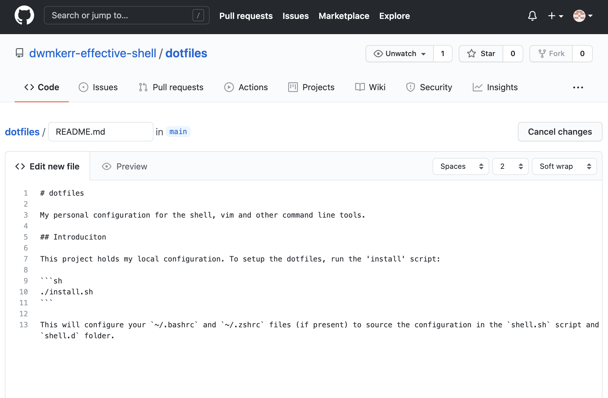

Once you are happy with the content (you can choose 'Preview' to see how it will look) scroll down to the "Commit" button. Provide a commit message:

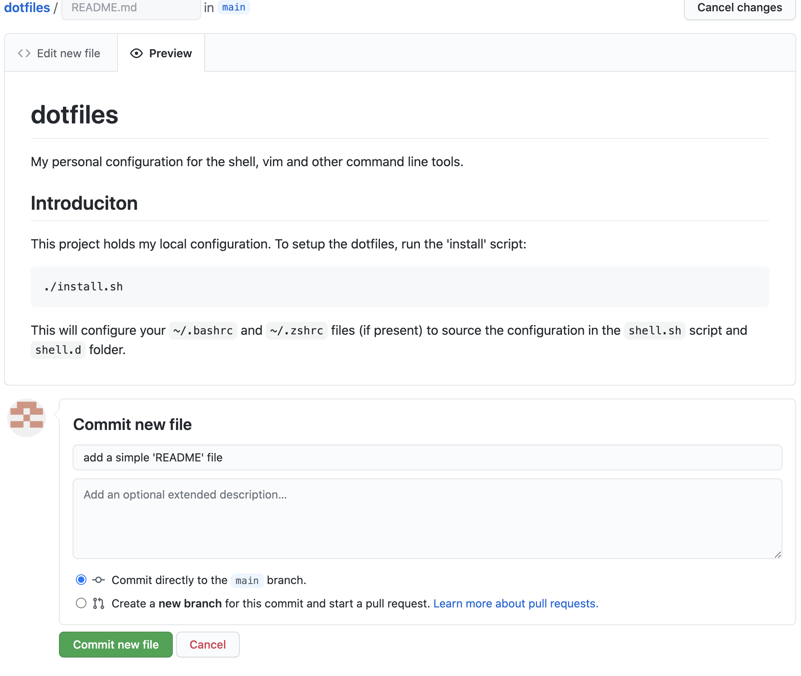

Once you have pressed "Commit New File" you will be taken back to the repository page. The contents of the _README.md_ file will be shown:

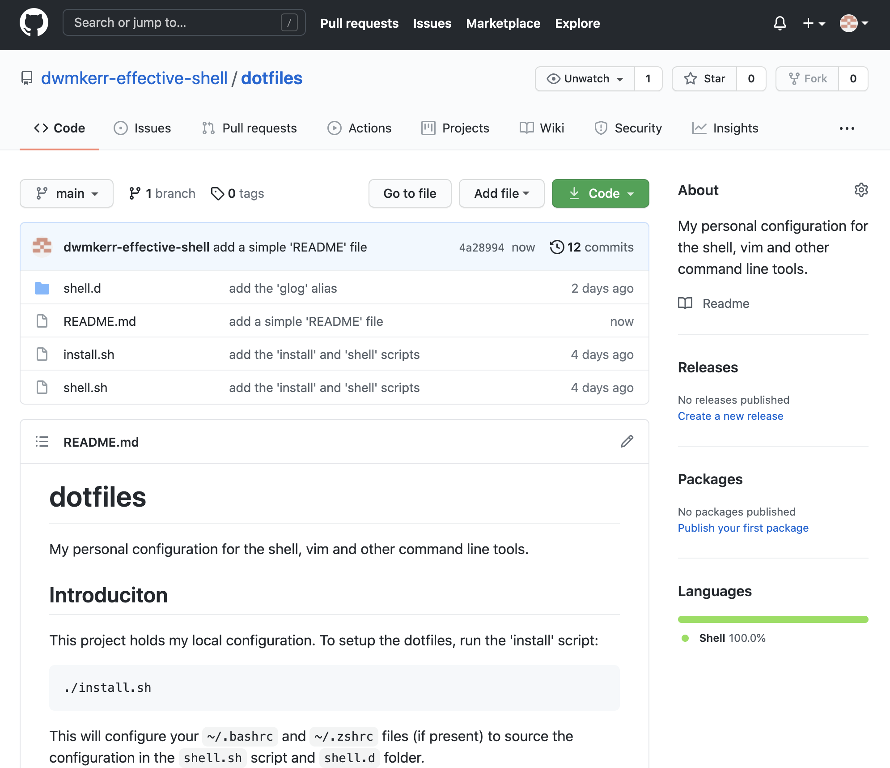

We have now created a commit on the _origin_ remote. Now when we run `git fetch` we will see that the remote has changed:

```
$ git fetch
remote: Enumerating objects: 4, done.
remote: Counting objects: 100% (4/4), done.
remote: Compressing objects: 100% (3/3), done.
remote: Total 3 (delta 0), reused 0 (delta 0), pack-reused 0
Unpacking objects: 100% (3/3), 962 bytes | 240.00 KiB/s, done.
From https://github.com/dwmkerr-effective-shell/dotfiles
   2532277..4a28994  main       -> origin/main
```

When we run `git fetch`, Git looks at the _upstream_ associated with the current branch and checks to see if there are any changes. The information about any changes is downloaded - but the changes themselves are not yet downloaded. If you run `git log` you will _not_ see the new commit that includes the _README.md_ file - we have not checked out this commit yet.

At the moment, our repository looks like this:

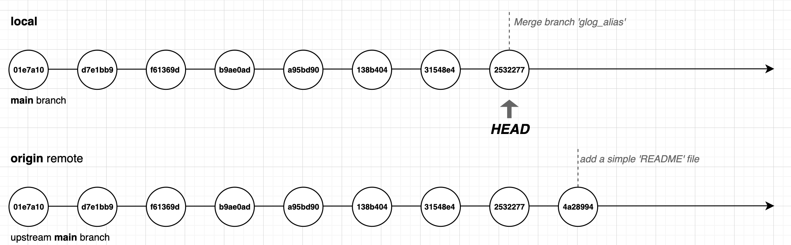

- The local branch HEAD is exactly where it was before we ran `git fetch`
- Because we have run `git fetch`, Git knows that our _upstream_ has changed - in fact it even told us what the changes are, the message includes the text `2532277..4a28994  main       -> origin/main` which means 'new commits from `2532277` to `4a28994` have been fetched for `main` which tracks `origin/main`

To actually download this (and any other) new commit we will need to run the `git pull` command.

## The Git Pull Command

The `git pull` (_download from remote_) command<!--index--> integrates the changes from a remote into the current branch. Because we've already told Git what the 'upstream' for the _main_ branch is, we can just run the `git pull` command to move to the latest commit:

```
$ git pull
Updating 2532277..4a28994
Fast-forward
 README.md | 13 +++++++++++++
 1 file changed, 13 insertions(+)
 create mode 100644 README.md
```

The `git pull` command tells us what commit we have moved from and to, and gives a summary of the files that have changed. We can see that a file named `README` has been created - if you look at your local files you'll see _README.md_ is now present:

```
$ ls
README.md  install.sh  shell.d  shell.sh
```

Finally, if we run `git log --graph --oneline` we can see that our _HEAD_ is at the tip of the `main` branch, and that this is also the tip of the `origin` remote's _main_ branch:

```
$ git log --graph --oneline
* 4a28994 (HEAD -> main, origin/main) add a simple 'README' file
*   2532277 Merge branch 'glog_alias'
|\
| * a8cbb15 (glog_alias) add the 'glog' alias
* | 31548e4 add the 'glog' alias
|/
*   138b404 Merge branch 'more_aliases'
|\
| * a51ae1a (more_aliases) add a file to store 'zsh' aliases
| * 63ea74f add a file to store 'bash' aliases
* | a95bd90 add the 'gm' alias for 'git merge'
|/
* b9ae0ad (aliases) add alias 'gcm' for 'git checkout main'
* f61369d (more_changes) add alias 'gs' for 'git status'
* d7e1bb9 add the 'shell.d' folder
* 01e7a10 add the 'install' and 'shell' scripts
```

Congratulations - you have now created a local repository, staged and unstaged changes to and from the index, created commits, created branches, handled merging and merge conflicts and even learnt how to setup a remote and push and pull changes from it!

You can pull any branch into your current branch - just provide the name of a remote and the name of a branch:

```
git pull <remote_name> <branch_name>
```

If you don't provide any parameters to `git pull` it will pull from the 'upstream' branch. But you can also use Git pull to merge other branches into your current branch.

# Sharing Your Dotfiles

If you have been following through with these examples, you will now have a 'dotfiles' repository available on your GitHub account. You can make this repository public and allow people to copy your code or propose changes.

If you want to clone your 'dotfiles' repository onto another machine, you can do so with this one-line command:

```
git clone git://github.com/<your_user_name>/dotfiles.git
```

The `git clone` (_download a repository_) command downloads the repository into the current folder. If your repository is private you will have to authenticate to be able to do this, but if your repository is public then you (or anyone else) can download your dotfiles.

Hosting your dotfiles on GitHub is a very convenient way of making your dotfiles accessible anywhere. With a single command you can download them to any machine, and then run the _install.sh_ script from the dotfiles folder to setup the shell startup files.

If you search online for 'dotfiles', you will find many articles and users who have shared their dotfiles online, you can look over these for inspiration!

# Forking and Pull Requests

Forking and Pull Requests are features offered by popular Git hosting services like GitHub, BitBucket and GitLab. They are not actually Git features, but have become so widely used that you are likely to come across the terminology when working with online Git repositories.

A _fork_ is a copy of a Git repository. Typically you will fork a repository if you want to take a copy of someone else's code and work on it yourself.

I have created a simple dotfiles repository on GitHub that you can use as a starting point for your own dotfile configuration. Let's use this to see how forking works.

First, we open up the GitHub project that we'd like to fork, which in this case is at [www.github.com/effective-shell/dotfiles](https://github.com/effective-shell/dotfiles). Notice that there is a 'Fork' option on the top-right of the screen:

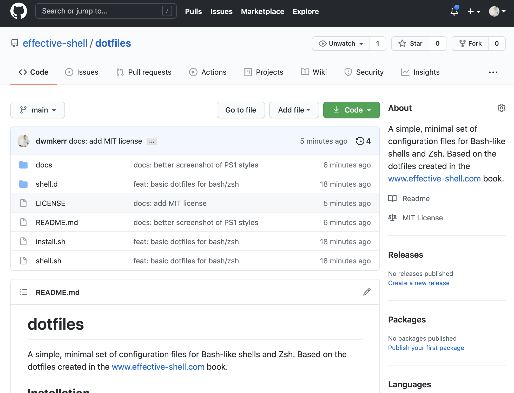

Choose the 'fork' option and GitHub will create a copy of the repository in your own account. You can now clone this repository, make changes and work on it as if it was your own. The original repository is tracked by GitHub, meaning that you can update from it at any time.

If you have made changes to a fork, you can then open a _Pull Request_. A pull request is a request to merge a set of changes from one branch into another, or from one fork into the original repository. So if you were to improve upon the dotfiles that you forked, and wanted to share your changes back, you could open a pull request to do so.

Typically when a pull request is opened, the project maintainer will then review the changes, make suggestions or discuss the proposal, and then either merge the pull request or reject it. In the screenshot below I am opening a pull request from my clone of the dorfile repository to the original dotfiles repository, this pull requests adds an uninstall script to the repository. A maintainer of the target repository will then review the changes:

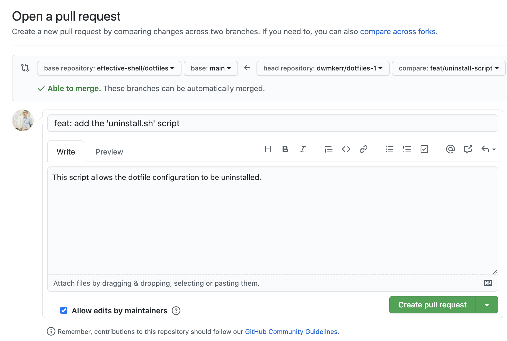

This model of forking and pull requests is really just a nice user interface on top of the underlying capabilities Git has to track remotes and manage branches. Services like GitHub offer functionality to discuss changes, run arbitrary pipelines project maintainers might create to test the code and so on.

GitHub has become a remarkably popular site for people to collaborate on projects together. At the time of writing the `microsoft/vscode` repository, which is the popular Visual Studio Code open-source editor, has had contributions from more than 19,000 individual contributors!

# A Script to Open a Pull Request

When you push a branch to a remote on GitHub, GitLab, BitBucket and a number of other Git services providers, a message is shown in the command prompt with a link to open a Pull Request:

```
$ git push -u origin fix/fix-shell-configuration
...
remote:
remote: Create a pull request for 'fix/fix-shell-configuration' on GitHub by visiting:
remote:      https://github.com/dwmkerr/dotfiles/pull/new/fix/fix-shell-configuration
...
```

We can write a shell function that runs the `git push` command, reads its output, and then if it finds a web address, open it in a browser. In fact, the dotfiles repository at [github.com/effective-shell/dotfiles](https://github.com/effective-shell/dotfiles) has exactly this function - just run the command `gpr` to open a pull request!

This function is actually quite straightforward - the code for it is below (with some of the comments and code to colour the output removed for legibility):

```sh
gpr() {
    # Get the current branch name, or use 'HEAD' if we cannot get it.
    branch=$(git symbolic-ref -q HEAD)
    branch=${branch##refs/heads/}
    branch=${branch:-HEAD}

    # Pushing take a little while, so let the user know we're working.
    printf "Opening pull request for ${branch}...\n"

    # Push to origin, grabbing the output but then echoing it back.
    push_output=`git push origin -u ${branch} 2>&1`
    printf "\n${push_output}"

    # If there's anything which starts with http, it's a good guess it'll be a
    # link to GitHub/GitLab/Whatever. So open the first link found.
    link=$(echo ${push_output} | grep -o 'http.*' | head -n1 | sed -e 's/[[:space:]]*$//')
    if [ ${link} ]; then
        printf "\nOpening: ${GREEN}${link}${RESET}..."
        python -mwebbrowser ${link}
    fi
}
```

This snippet first gets the name of the current branch, or `HEAD` if we cannot work the name out. When then run the `git push origin` command, and record the output of the command into a variable.

Once the push command has completed, we write its output to the screen, and search for the first hyperlink, using `grep` and `sed`, then use `python` to open the link in a browser.

I use the `gpr` function many times per day and it has been a real time-saver!

# Showing Git Information in the Command Prompt

In [Chapter 26 - Customising Your Command Prompt]() we saw how to customise the command prompt by setting the `PS1` variable. As you start using Git more you might find it convenient to show some information about the repository in your prompt.

As an example, while I am writing this chapter, my command prompt looks like this:

```
github/dwmkerr/effective-shell feat/managing-git-remotes ! 1 in stash
$
```

This is easier to see in the screenshot below as it shows the colour:

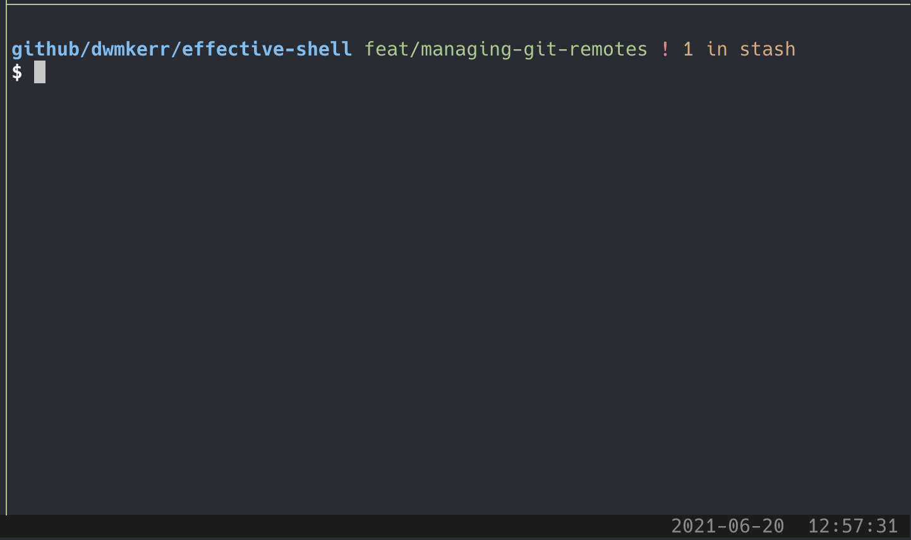

I spread my prompt over two lines and leave the prompt indicator as the only thing on the line where I type. This means my cursor does not become too indented. My command prompt shows the following information:

| Content                          | Description                                                      |
|----------------------------------|------------------------------------------------------------------|
| `github/dwmkerr/effective-shell` | My current folder, and up to two parent folders.                  |
| `feat/managing-git-remotes`      | My current Git branch, if I am in a Git repository.              |
| `!`                              | A red exclamation mark is shown if I have uncommitted changes.   |
| `1 in stash`                     | If I have anything in my Git stash, a message is shown in amber. |

You can try out this style of command prompt by calling the `set_ps1` function:

```sh
source ~/dotfiles/shell.d/set_ps1.sh
set_ps1 dwmkerr
```

If you want to change back to your previous prompt, just run `set_ps1` again without any parameters.

If you are interested in showing Git information in your command prompt you can take a look at the `set_ps1.sh` file to see the full details. We'll take a look at a snippet as it is interesting to see how to get this Git information.

```sh
_git_info() {
    # Don't write anything if we're not in a folder tracked by git.
    if ! [ "$(git rev-parse --is-inside-work-tree 2>/dev/null)" == "true" ]
    then
        return
    fi

    # Get the branch name, changes, and number of stashes.
    local git_branch_name="$(git branch --show-current)"
    local git_any_local_changes="$(git status --porcelain=v1 2>/dev/null)"
    local git_stash_count="$(git rev-list --walk-reflogs --count \
        refs/stash -- 2>/dev/null)" # Ignore error when no stashes
    local git_info=""
    if [ "${git_branch_name}" = "main" ]; then
        git_info="${fg_green}${start_underline}${git_branch_name}${reset}"
    else
        git_info="${fg_green}${git_branch_name}${reset}"
    fi
    if ! [ -z "${git_any_local_changes}" ]; then
        # Note that we have to be careful to put the exclamation mark
        # in single quotes so that it is not expanded to the last command!
        git_info="${git_info} ${fg_red}"'!'"${reset}"
    fi
    if [ "${git_stash_count:-0}" -gt 0 ]; then
        git_info="${git_info} ${fg_yellow}${git_stash_count} in stash${reset}"
    fi
    printf "${git_info}"
}
```

This script does the following:

- The `git rev-parse` is used to check whether we are in a folder that is part of a Git working tree. If we are not in a Git working tree, we don't show anything.
- Get the current branch name with `git branch --show-current`).
- Check to see if there are any changes by looking at `git status`. The `--porcelain=v1` line ensures that the status is machine-readable (this is easier to work with when scripting).
- Check the number of 'stash' revisions. Don't worry about stashes for now or the `git rev-list` command - these are more advanced features.

The rest of the script is formatting only - underlining the branch name if it is the _main_ branch, showing the exclamation mark if we have changes and so on.

You can take the script as a starting point for your own customisations for the command prompt if you will be using Git a lot!

# Scratching the Surface

We have only seen the absolute basics of Git in this chapter. Git is an amazingly powerful tool, I cannot recommend enough that you take the time to really learn how the commands work.

Many users will use a graphical tool to work with Git - this is perfectly fine if it works for you. But to be an _effective shell_ user you should really spend the time getting familiar with the core Git commands using the command-line.

Git can sometimes seem overwhelming to people and has a reputation for being complex. This is somewhat unfair - version control of files is itself an inherently complex topic. No matter what tool you use, there will always be the challenges of managing changes across environments, dealing with conflicts, integrating work and so on. The basic Git functionality is _incredibly_ good at making 99% of this work simple and straightforward, and Git gives you the tools to make the other 1% at least manageable.

Spend some time getting familiar with the core Git commands that we have introduced in this chapter. As you find yourself becoming more familiar, here are the next set of topics I would recommend learning about:

- The `gitignore` file: this special file can be used to tell Git not to track changes for certain files.
- The `.gitconfig` file: this is Git's own dotfile and can be used to fine-tune Git configuration.
- Tags: these are labels you can add to commits, which are ideal for tracking releases for projects or other metadata.
- Diffs: knowing how to use `git diff` to see changes between branches, commits, the index and working tree and more will certainly help you as you use Git more.
- Stashes: If you want to save your changes, but they are currently not ready to be committed (perhaps because they are only partially complete), you can use the `git stash` command to store working tree changes. This lets you store the changes away, then checkout other branches, then restore the changes later when you are ready.
- Git Clean: The `git clean` command is very useful to help you remove unneeded files from your working tree.
- Interactive Staging: You can interactively stage files, parts of files (called 'hunks') or even individual lines directly from the shell, this can be invaluable when making sure that exactly the right changes are going into the index.
- Patch staging or checkout: I probably use the `git add -p` command to 'patch' changes dozens of times a day, this is my preferred mechanism of reviewing my changes as I stage them.
- Merge Strategies: Understanding how 'squashing' works (and its drawbacks) can be very useful when working with branches. Merge strategies are a useful topic to go deeper on.
- Rebasing: Rebasing can be used as a merge strategy but can also help in other scenarios, I would definitely recommend learning about rebasing if you have multiple people working on a repository, it can save a lot of trouble when integrating complex changes.
- Commit and Tag signing: Great for security sensitive users, you can use special keys to 'sign' your commits and improve the security of your repositories.
- [GitHub Flow](https://guides.github.com/introduction/flow/): A common workflow used with GitHub projects.

There are numerous articles and online books on Git - I also recommend the excellent book "Pro Git" by Scott Chacon and Ben Straub.

# An Overview of the Git Commands

Before we finish the chapter, let's do a quick review of the key commands for working with Git. You can refer to the illustration below:

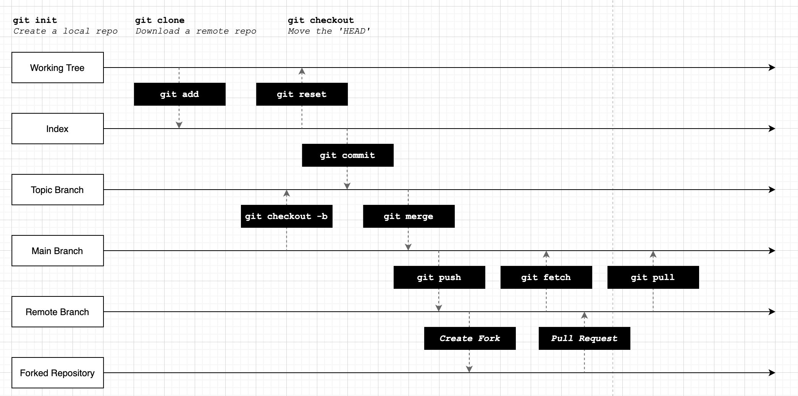

As a reminder, the core concepts are:

| Concept           | Description                                                                         |
|-------------------|-------------------------------------------------------------------------------------|
| The Working Tree  | The folder you are working in and tracking change to.                               |
| The Index         | The 'staging' area for building commits.                                            |
| The Repository    | The full set of all commits, branches and metadata.                                 |
| A Fork            | A copy of an entire repository, including its history and all branches.             |
| A Pull Request    | A proposal to merge one branch into another, or a branch in a fork to the upstream. |
| `git init`        | Creates a local repository.                                                         |
| `git clone`       | Downloads a remote repository.                                                      |
| `git add`         | Stage a change from the working tree to the index.                                  |
| `git reset`       | Unstage a change from the index.                                                    |
| `git commit`      | Create a new commit.                                                                |
| `git checkout -b` | Create a new branch.                                                                |
| `git merge`       | Merge a branch into the current branch.                                             |
| `git checkout`    | Move the current HEAD to a new branch or commit.                                    |
| `git push`        | Push changes to an upstream branch.                                                 |
| `git fetch`       | Retrieve information about changes to a remote.                                     |
| `git pull`        | Download and merge changes from a remote.                                           |

# Summary

In this chapter we learned how to use GitHub to host a remote repository, how to push, fetch and pull changes, and how remotes work. We also looked at pull requests, forks, how to show Git information on the command line, and some of the more advanced topics that you might want to explore as you use Git more.

Although we've only scratched the surface of what Git can do, you should now have the tools to work with repositories, share content like your dotfiles, collaborate with others and manage your own changes.

In the next part of the book we will look at some advanced techniques that can help you as a shell user.
