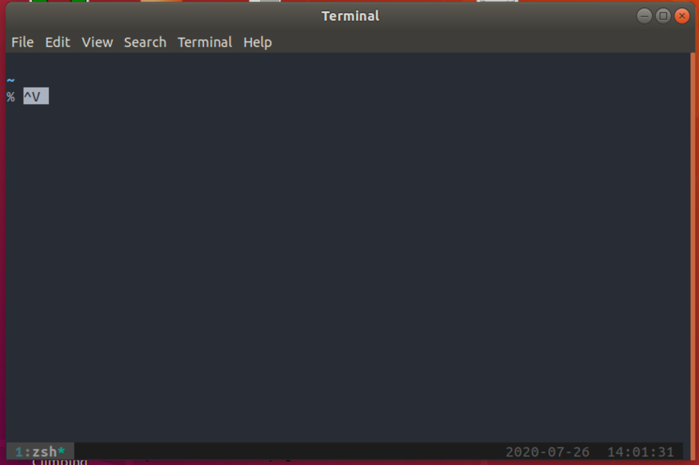
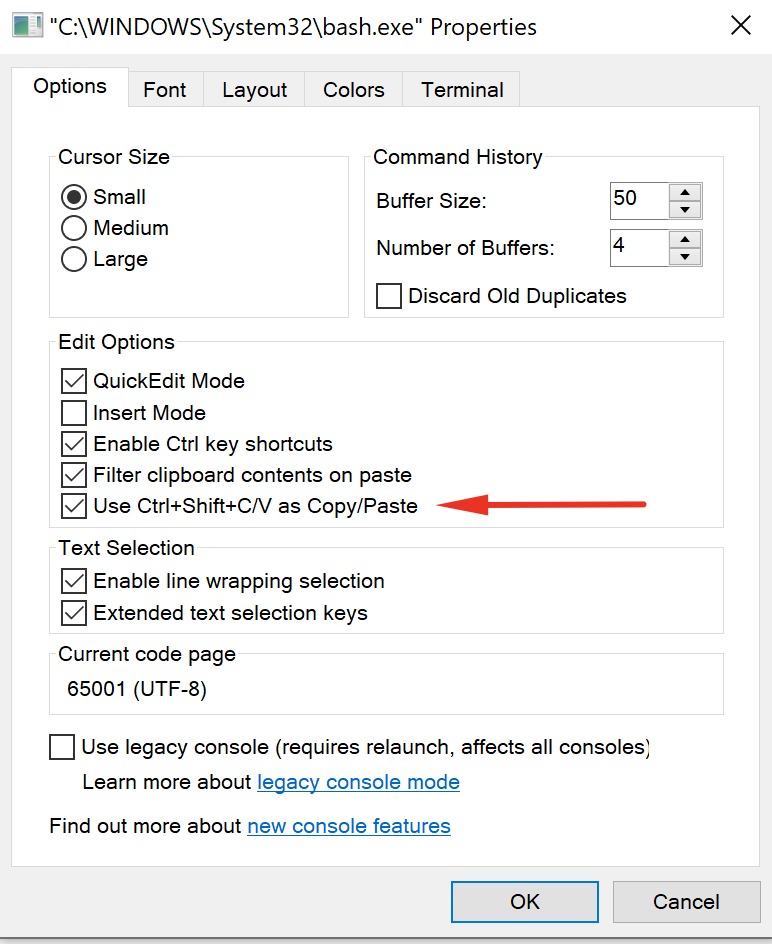
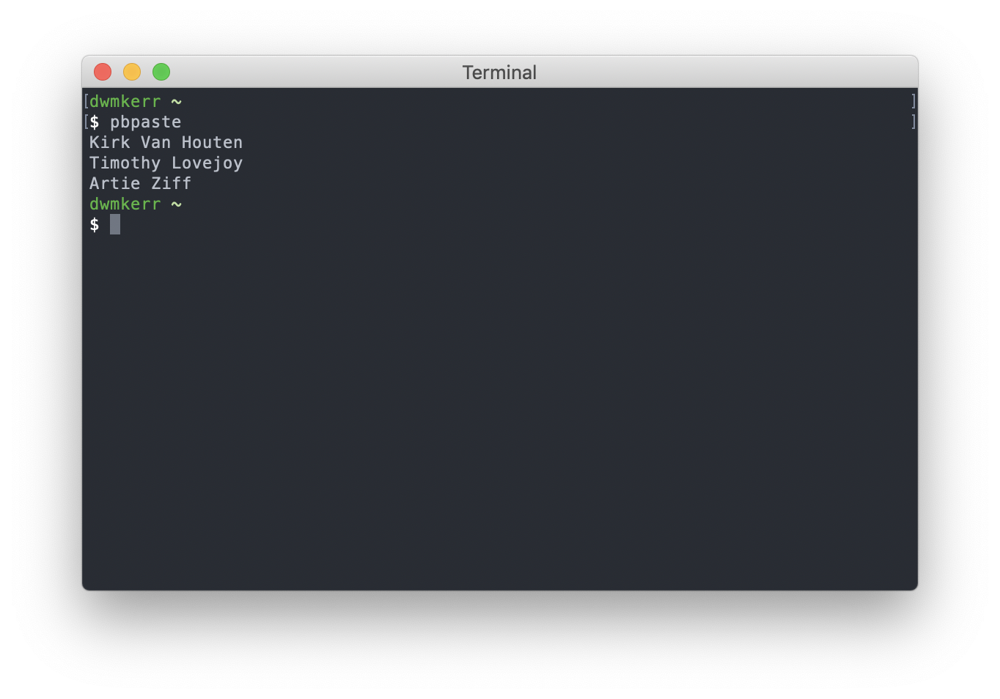
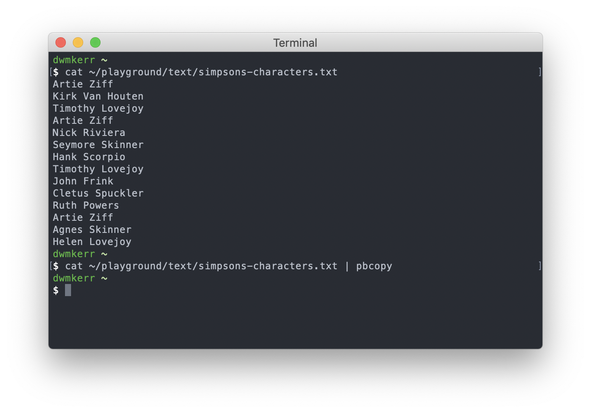
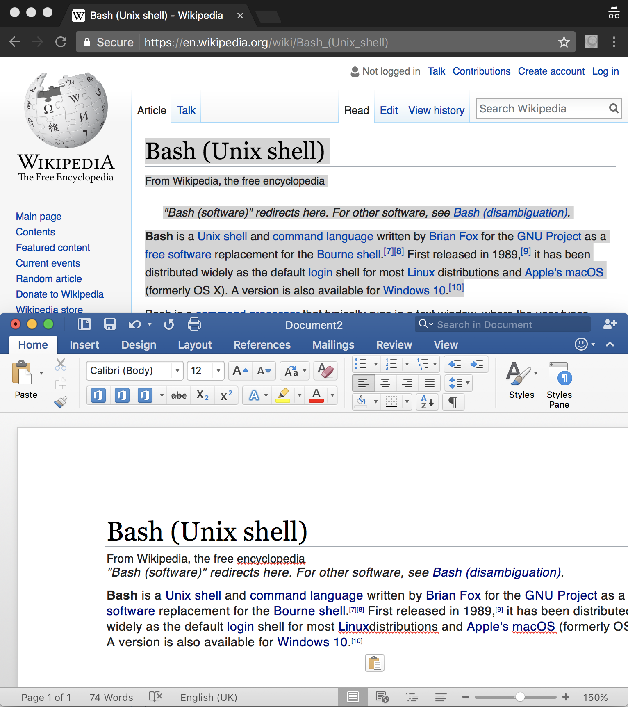
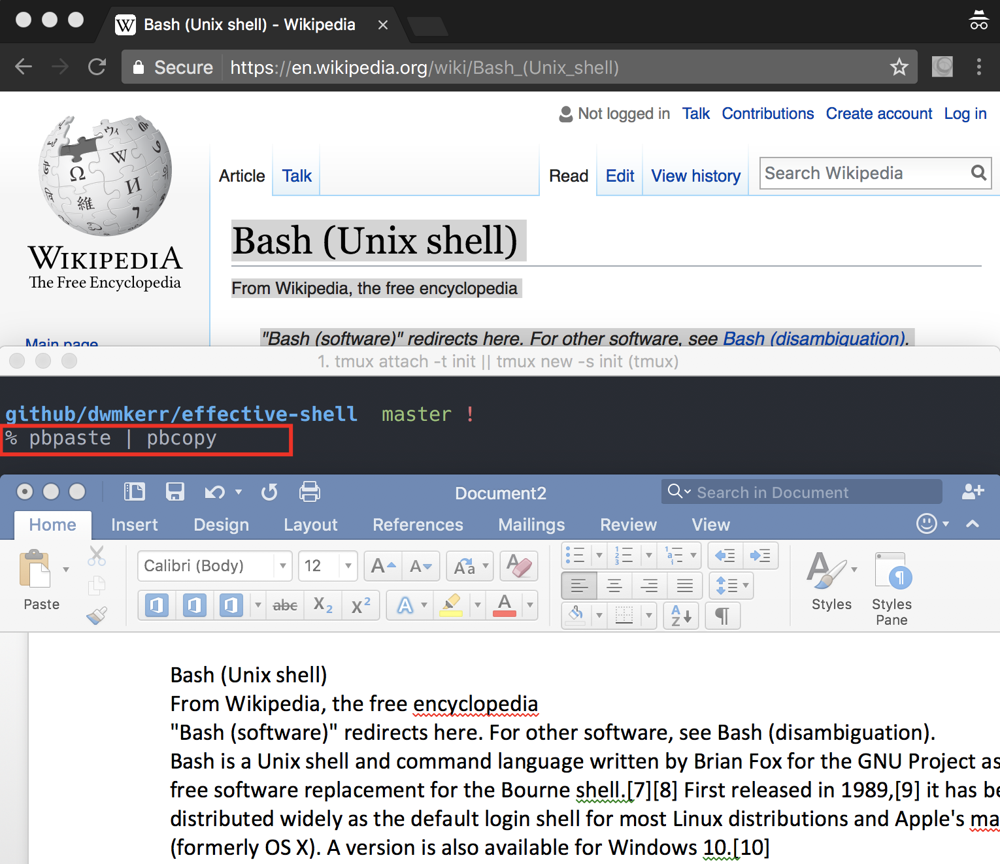

# Chapter 4 - Becoming a Clipboard Gymnast

For those who are new to the shell, we've covered a lot. In this chapter we'll slow down the pace of new commands a bit and instead focus on a core skill which you will already be familiar with from Graphical User Interfaces - using the clipboard.

You have probably already been using the clipboard with the shell, copying and pasting commands and their outputs. However, there's a lot more we can do with the clipboard. Now we'll look at how to take this to the next level.

We'll also briefly introduce introduce _aliases_ and _pipelines_, which will be covered in a lot more detail in later chapters.

# The Clipboard Essentials

I wouldn't be surprised if the keyboard shortcuts to access the clipboard are already firmly locked into muscle memory for almost all readers, but just in case, here's a reminder of the shortcuts across different systems:

| Command | Windows Shortcut | Linux Shortcut | MacOS Shortcut |
|---------|------------------|----------------|----------------|
| Cut     | `Ctrl` + `X`     | `Ctrl` + `X`   | `⌘` + `X`      |
| Copy    | `Ctrl` + `C`     | `Ctrl` + `C`   | `⌘` + `C`      |
| Paste   | `Ctrl` + `V`     | `Ctrl` + `V`   | `⌘` + `V`      |

In the shell, you may find that these commands don't run as expected. For example, in the screenshot below I have tried to use `Ctrl` + `V` a few times to paste into terminal on Ubuntu:



Instead of the contents of the clipboard being dropped into the shell, we see the text `^V`. Why is this?

Well, some of this is historical (the shell has been around for a long time so we'll see this answer a lot!). The reason the `Ctrl` key is _called_ the _Control Key_ is that it is used to send _control sequences_ to the computer. When we're using the Control Key, the characters we send are not plain text, they're used to perform actions. This is something that is probably pretty familiar. For example, `Ctrl` + `P` is almost universally used as a shortcut for the 'Print' command.

We tend to think of these commands as _shortcuts_ to save us from finding the appropriate command in a menu or on a toolbar.  But of course most shells and command-line interfaces pre-date graphical user interfaces. They needed a way to differentiate between a user entering plain old text, and a user wanting to execute a certain command.

Even modern shells tend to follow the conventions around control sequences which were established by earlier ones to ensure a consistent experience for users who are used to working with shells. Shells have a whole bunch of control sequences which actually pre-date the graphical user interface, the clipboard itself, and even screens!

Some of the control sequences used in the shell you might already be familiar with. For example, if you have a program running and want to cancel it, you might be used to using `Ctrl` + `C`. This actually sends a _signal_ to the program and typically the program responds by closing. We'll see signals again and again as we go through the book.

The `Ctrl` + `C` combination terminates the current program. What about `Ctrl` + `V`? This is the grand-sounding "_Verbatim Insert_" command. It tells the shell to write out the _next_ keystroke you give it. This allows you to write out 'special' characters like the escape key, left or right keys, or even the `Ctrl` + `V` combination itself.

So if you type `Ctrl` + `V` twice, the shell writes out the text `^V`. The hat symbol `^` represents `Ctrl`. The first command tells the shell to write out the following command, the second is then written out directly. You can try writing out some different sequences. You'll see various odd looking symbols drawn, which represent things like the `Alt` key and other special keys.

So why do we need to care? Well the shell already has a command for `Ctrl` + `C` and `Ctrl` + `V`, so we're going to need to work around this to use our familiar 'copy' and 'paste' commands.

How this works varies across platforms. Follow the instructions below for the platform you are using.

**Windows**

If you are using a _Command Prompt_, then the usual shortcuts will work fine. However, most of the time we will be using Bash. In this case the shortcuts will _not_ work. Instead, select the _Use Ctrl+Shift+C/V as Copy/Paste_ option from the properties menu:



You can now use `Ctrl+Shift+C` for copy and `Ctrl+Shift+V` for paste. You can also copy text by just dragging the cursor over it with the right mouse button.

**Linux**

On most Linux systems you'll be using the Gnome terminal, which means that you can use `Ctrl+Shift+C` for copy and `Ctrl+Shift+V` for paste. You can also right click on text with the cursor to select it.

**MacOS**

Mac users can just use `⌘ + C` for copy and `⌘ + V` for paste. The shell doesn't use the special Mac Command character `⌘`, which means the default keyboard mappings on MacOS work fine in a shell as they do not clash with anything.

Now that we've got the basics out of the way, and learnt far more than we probably wanted to about control keys, we can look at more ways to use the clipboard.

# Preparing the Clipboard Commands

Copying and pasting text to and from the clipboard is useful, but there's a lot more we can do. With a couple of basic commands we can hugely expand what we can do with the shell and make a whole set of everyday tasks far easier to accomplish.

There is one small complexity we'll need to work through before we continue. The complexity is that the clipboard is accessed in different ways on Windows, Linux and MacOS. I'll first show you how to deal with this, just follow the instructions for the platform you are working on.

To make things easier for the reader I'm going to assume you have created the `pbcopy` and `pbpaste` commands by following the instructions below. I am creating these commands so that regardless of the platform you are using the tutorials will work in the same way!

**Windows**

Assuming you are using WSL, you will need to run the following two commands. By the time this book is published there _may_ be a cleaner way, but for now this is a workaround for some limitations on the WSL system:

```sh
alias pbcopy='clip.exe'
alias pbpaste="powershell.exe -command 'Get-Clipboard' | tr -d '\r' | head -n -1"
```

Don't worry about how these commands work - by the time you've gone through the book it should make perfect sense. For now you just need to know we're adding two new commands to our toolkit - `pbcopy` and `pbpaste`, which will work in Bash on Windows.

**Linux**

Hopefully if you are Linux user the commands below will seem familiar. They install the `xclip` program and create shortcuts to copy and paste. You absolutely don't need to do this if you prefer to call `xclip` directly, these commands are just setup so that across all platforms the tutorial looks the same.

```sh
sudo apt install -y xclip
alias pbcopy="xclip -selection c"
alias pbpaste="xclip -selection c -o"
```

**MacOS**

Nothing is required on MacOS - `pbcopy` and `pbpaste` are built in.

**Making these changes permanent**

We've used the `alias` command to create `pbcopy` and `pbpaste`. In Bash (and most shells) an `alias` is something you can configure as a shortcut to avoid having to type longer commands. There's a whole chapter on commands in Section 2.

These instructions will need to be repeated when you re-open your terminal. In a later chapter we'll see how to make permanent customisations to our shells so that we don't have to repeat this setup.

We'll also see later on how to create configuration which works across many different platforms, so that you can use the same configuration regardless of what platform you are working on. This is very useful if you work across multiple machines or operating systems!

# Copy and Paste Basics

Now that we've created these commands, we can use them to access the clipboard. For example, if I copy the following text:

```
Kirk Van Houten
Timothy Lovejoy
Artie Ziff
```

Then I can paste it into the shell with the following command:

```sh
pbpaste
```

And we'll see something like this:



Copying is just as straightforward. If you have downloaded the Effective Shell 'samples' folder you can see we have a list of characters from "The Simpsons" in the file `effective-shell/text/simpsons-characters.txt`. Now we _could_ use the `cat` command to show the contents of the file, and then manually select the text and copy it. Even easier though is to just _pipe_ the contents of the file to the `pbcopy` command:

```sh
cat ~/effective-shell/text/simpsons-characters.txt | pbcopy
```

The output will look similar to the below (I've included the output of `cat` for reference as well):



The vertical bar `|` is the _pipe_ operator. It tells the shell to take the output from the command on the left and send it straight to the _input_ of the program on the right. We're going to see a _lot_ more of the pipeline operator as we continue. For now it's enough to know you can use it to 'chain' commands together.

This might not seem super useful so far - but if the text file was a lot larger then it would be much harder to `cat` it out, use the mouse to select all of the text (scrolling up through the window) and then copy it. And if you didn't have a mouse, it would be even more tricky. We're aiming to be as effective as possible when using the shell so being able to use the keyboard quickly for common tasks is critical.

Now we can see some real world examples of how these commands can be useful in daily tasks!

# Removing Formatting

Don't you hate it when you have to copy formatted text and don't have an easy way to paste it as *unformatted* text? Here's an example, I want to copy this Wikipedia page on 'bash', and paste it into a Word document:



Many programs have a shortcut to paste the contents of the clipboard  (such as 'command + shift + v') but if you are like me you might find yourself pasting *into* a plain text editor just to copy *out* the plain text.

If you just run the command `pbpaste | pbcopy`, you can easily strip the formatting:



We're just piping out the clipboard (which ends up as plain text, cause we're in a terminal!) and then piping that plain text *back into the clipboard*, replacing the formatted text which was there before.

This little trick can be very useful. But we can use the same pattern to quickly manipulate the contents of the clipboard in more sophisticated ways.

# Sorting Text

Because we can _pipe_ the contents of the clipboard to other programs, that means we can easily use the huge number of tools available to us to work with text.

Let's take another look at the list of characters we have in the `~/plaground/text/simpsons-characters.txt` file:

```sh
$ cat ~/effective-shell/text/simpsons-characters.txt
Artie Ziff
Kirk Van Houten
Timothy Lovejoy
Artie Ziff
Nick Riviera
Seymore Skinner
Hank Scorpio
Timothy Lovejoy
John Frink
Cletus Spuckler
Ruth Powers
Artie Ziff
Agnes Skinner
Helen Lovejoy
```

We can easily take this text, sort it and then directly copy the results:

```sh
$ cat ~/effective-shell/text/simpsons-characters.txt | sort | pbcopy
```

The contents of the clipboard will now contain:

```sh
Agnes Skinner
Artie Ziff
Artie Ziff
Artie Ziff
Cletus Spuckler
Hank Scorpio
Helen Lovejoy
John Frink
Kirk Van Houten
Nick Riviera
Ruth Powers
Seymore Skinner
Timothy Lovejoy
Timothy Lovejoy
```

The `sort` command has lots of different options but the defaults work fine for this case. We can see we've got quite a few duplicates - now we can move onto how we'd handle that.

# Manipulating Text

Let's say someone has emailed me a list of people I need to invite to an event:


The problem is:

1. The list is in Excel and is formatted
1. The list has duplicates
2. I need to turn each name into an email address like 'Artie_Ziff@simpsons.com'

I want to email get the email addresses on my clipboard ready to paste into my email client quickly. We can quickly handle this task without leaving the shell.

If you want to try out the same commands and follow along you can copy the raw text below (don't worry if the commands are unfamiliar, we'll be seeing them again and again and breaking down each one in later chapters):

```
Artie Ziff
Kirk Van Houten
Timothy Lovejoy
Artie Ziff
Nick Riviera
Seymore Skinner
Hank Scorpio
Timothy Lovejoy
John Frink
Cletus Spuckler
Ruth Powers
Artie Ziff
Agnes Skinner
Helen Lovejoy
```

First, we copy the text to the clipboard.

Now we can paste and sort:

```
$ pbpaste | sort
Agnes Skinner
Artie Ziff
Artie Ziff
Artie Ziff
Cletus Spuckler
Hank Scorpio
Helen Lovejoy
John Frink
Kirk Van Houten
Nick Riviera
Ruth Powers
Seymore Skinner
Timothy Lovejoy
Timothy Lovejoy
```

Then remove the duplicates:

```
$ pbpaste | sort | uniq
Agnes Skinner
Artie Ziff
Cletus Spuckler
Hank Scorpio
Helen Lovejoy
John Frink
Kirk Van Houten
Nick Riviera
Ruth Powers
Seymore Skinner
Timothy Lovejoy
```

Replace the space with an underscore:

```
$ pbpaste | sort | uniq | tr " " "_"
Agnes_Skinner
Artie_Ziff
Cletus_Spuckler
Hank_Scorpio
Helen_Lovejoy
John_Frink
Kirk_Van_Houten
Nick_Riviera
Ruth_Powers
Seymore_Skinner
Timothy_Lovejoy
```

Then add the final part of the email address:

```
$ pbpaste | sort | uniq | tr " " "_" | sed 's/$/@simpsons.com/'
Agnes_Skinner@simpsons.com
Artie_Ziff@simpsons.com
Cletus_Spuckler@simpsons.com
Hank_Scorpio@simpsons.com
Helen_Lovejoy@simpsons.com
John_Frink@simpsons.com
Kirk_Van_Houten@simpsons.com
Nick_Riviera@simpsons.com
Ruth_Powers@simpsons.com
Seymore_Skinner@simpsons.com
Timothy_Lovejoy@simpsons.com
```

This looks perfect! We can now put the transformed text back onto the clipboard:

```
$ pbpaste | sort | uniq | tr ' ' '_' | sed 's/$/@simpsons.com' | pbcopy
```

All in all we have the following pipeline:

1. `pbpaste` - output the clipboard
2. `sort` - order the output
3. `uniq` - deduplicate the rows
4. `tr ' ' '_'` - replace spaces with underscores
5. `sed /$/@simpsons.com` - add the email domain to the end of the row

Now you don't need to remember all of these commands. We'll be going into them in detail as the book continues, and in the next chapter we'll be looking into how you can get help directly in the shell to discover how commands work. The key concept is that you can treat the clipboard just like a file - reading from it, manipulating it, and writing back to it, without ever leaving the shell.

In fact - if you are on a Linux system, try running:

```sh
cat /dev/clipboard
```

You'll see the contents of the clipboard written out. In Linux almost everything can be represented as a file - the clipboard included! Like a lot of the other topics this is something we'll visit again in detail later.

We're also going to spend a lot of time later on looking at _pipelines_ in detail, so don't worry too much if this seems overwhelming at this stage!

As you go through the book you'll be able to apply every technique you learn to the clipboard itself - hopefully you'll find this can save you a lot of time and make you even faster with your day to day work.


# Summary

In this chapter we learnt: 

- You can copy and paste into the shell with keyboard commands which are the same, or at least very similar, to the commands you normally use.
- Different operating systems access the clipboard in different ways, but we can work around this by creating an `alias` command (which we'll see in detail later)
- We can use `pbcopy` to copy and `pbpaste` to paste.
- We can 'chain' commands together with the `|` (pipe) operator.
- We can turn formatted text on the clipboard into plain text by just running `pbpaste | pbcopy`.
- We can sort lines of text with the `sort` command.
- There is clearly a lot more we can do with text as we save hints of with the `uniq`, `tr` and `sed` commands - which we'll introduce in detail later.
- You can treat the clipboard a bit like a file in the shell.
- On Linux, lots of things can be represented as files - including the clipboard (which is accessed via the `/dev/clipboard` file).

