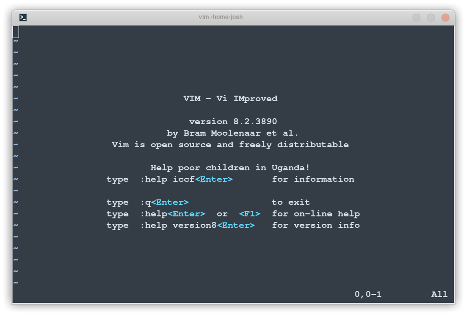
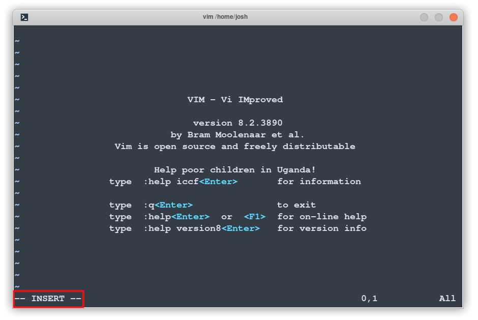
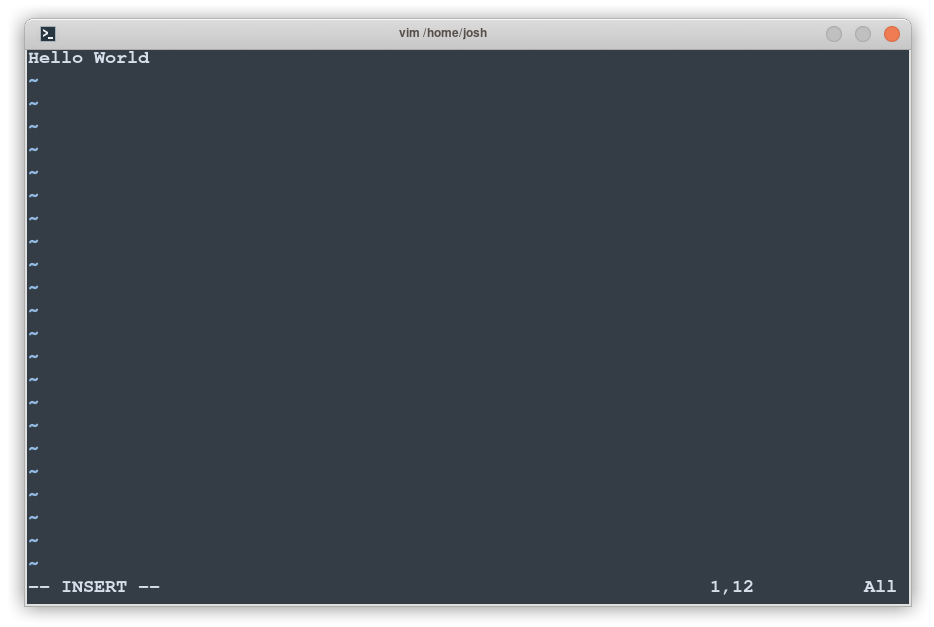
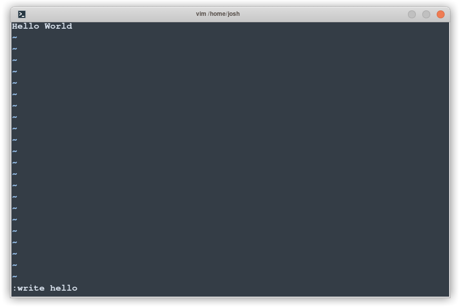
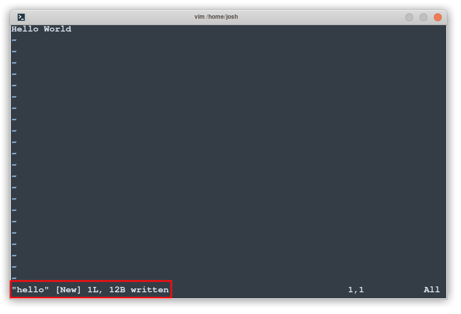

# Chapter 15 - Editing Text with Vim

A key part of how Linux and Unix systems work is that almost everything is represented as a text file in the system, and almost everything can be *configured* with simple text file.
In this chapter, we'll bring you up to speed on editing text files through the command-line alone.

There are several terminal-based text editors available, including `ed`, `vi`, `vim`, `neovim` and `emacs`. 
The most popular of these are descendants of `vi`, and among them, Vi IMproved (`vim`) is perhaps the most ubiquitous.

## Starting and Quitting

Without any arguments, entering the command `vim` will launch the program with a new, blank text file:



To quit, type `:quit` or just `:q`.
Your terminal should be restored to its previous state.

## Entering Text
Vim is a modal text editor: Within the `vim` program, there are multiple modes, each interpreting keypresses differently.
The default mode is *Normal* mode; this is the mode that allows one to move the cursor around the file, and to quit the `vim` program.
You can always get to Normal mode by pressing the escape key.

Let's try writing.
From normal mode, press `i` to enter *insert* mode. 
You should see the text `--INSERT--` in the lower left of `vim`:



Now our keypresses will be written to the buffer (`vim`'s internal representation of the file).
Try typing *Hello world*:



To save the file, we press Escape to return to Normal mode, then type
`:write hello`:



Aaand that's that! When you presses enter, the file is saved as `hello` (in the current directory):



## Basic Controls 

The basic controls of `vim` aren't too tough, and are similar to `less`.
Let's open a junk file and play around with it;

```
$ vim playground/text/simpsons-characters.txt
```
