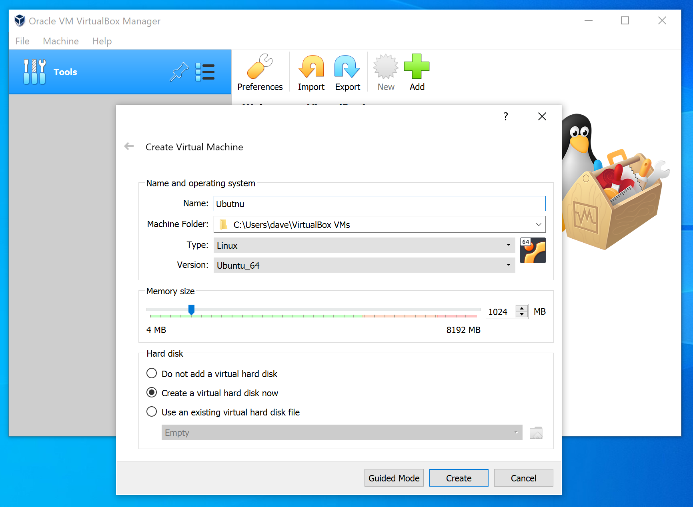
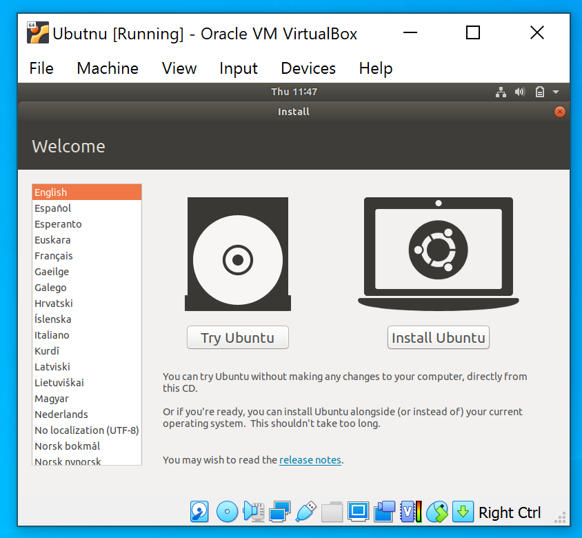
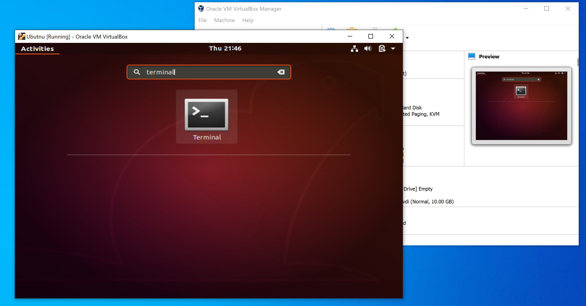

# Configuring the Shell

Shells can vary enormously between different systems. In general, Linux systems tend to use the "Bash" shell and require little configuration. Apple's MacOS operating system is actually based on BSD Unix, and under the hood is somewhat different to most Linux systems. Microsoft Windows is a completely unrelated operating system to either Linux or Unix and operates in a fundamentally different way both of them.

In this book, we assume that you are using a "Linux-like" system, something which operates like a modern Linux distribution. This is a deliberate choice. If you become comfortable using a Linux-like shell, you can generally apply the techniques we'll show to MacOS with no difficulties. For Windows, the techniques are not necessarily transferable immediately, but still valuable to know. Windows is actually being updated at the time of writing to provide a Linux-like shell interface as part of the core operating system (this is known as the [Windows Subsystem Linux](https://docs.microsoft.com/en-us/windows/wsl). As time progresses it will be easier to run commands using the techniques in this book natively, but for now we'll have to tweak a few things.

In this section we'll make sure that we are running with a setup which is close to Linux, and aim to set the latest version of our shell to the popular "Bash" program. If you are familiar with Bash but prefer to use another shell, that is fine, most of the book will work with any modern shell. However, if you are not sure what shell you should be using, I would recommend you follow the guides below to setup the most popular shell at its latest version.

Once this is done then we are ready to get into the book properly!

## Microsoft Windows

Windows is not anything like Linux under the hood. So to get a shell working, we have three options:

1. Use a tool which provides common Linux tools which have been written to work with Windows
2. Use a "virtual machine" running Linux
3. Use the Windows Subsystem Linux

The first option is the best if you want to actually be able to work with the files on your computer quickly and easily day to day.

The second option is best if you want to be able to experiment with the shell, but keep it completely separate from your main computer and its files.

The final option is best if you are a power user or expert who wants to use the latest WSL features and build the skills with the platform as soon as possible.

We'll go through all options here.

### Option 1: Install Linux Tools

This is probably the easiest option and the one I would recommend for most user. It will let you run something like a Linux shell when you choose to, but not get in your way during day-to-day usage of your computer.

To get a Linux-like experience on a Windows machine, we'll install [Cygwin](https://www.cygwin.com/). Cygwin provides a large set of programs which are generally available on Linux systems, which are designed to work on Windows.

Download the Cygwin installer and start the installation process. You should see something like this:


Start the installation and tell it to install from the internet (the default option):


Install for all users in the default location. It is also fine to change the options if you prefer:


Cygwin will ask you where to install downloaded packages, whether a proxy is needed, and what download sites to use. Leave these options at their default unless you know what you are doing and why you'd need to change them. It will then start downloading. Once it has downloaded the list of available packages to install, it will ask which packages you want. Choose the default option "All":


The installer will now start downloading and installing the programs:


Once Cygwin has finished installing, you will have a link to open Cygwin available on the desktop and start menu.

You can use this link to start using the "Bash" shell, or if you prefer you can open the "Command Prompt" as described in [Opening the Shell](../3-opening-the-shell/_index.md) and run the `bash` program:


Note that you shouldn't use the `--norc` option. I have used it in the screenshot above just so that my Bash looks like it would after a clean install, without my own customisations added.

At this point you have a ready-to-go bash environment and can continue on to the [Summary](../5-summary/_index.md) and [Next Section](../../section1/1-navigating-the-command-line/_index).

### Option 2: Use a Virtual Machine

We can run a virtual machine on Windows which will give us a complete Linux environment. This is an ideal way to create a safe sandbox for experimentation, without changing how the rest of the system is setup.

There are many ways to run a virtual machine on Windows. For this example we'll use the free 'Oracle VirtualBox' tool. VirtualBox will run a virtual machine, and on that virtual machine we will install the popular [Ubuntu](https://ubuntu.com/) distribution of Linux.

First, start downloading Ubuntu, which might take some time as the download is quite large. You will want to install the latest Desktop Edition (which at the time of writing is version 18):


While the Ubuntu software downloads, we can install VirtualBox. Go to the [VirtualBox Website](https://www.virtualbox.org) and download the VirtualBox installer. You will need the installer for 'Windows Hosts'.

Once the installer has downloaded, run it to start the installation:


Next you will be asked to configure the installation options. The defaults will be fine for most users:


Then the installation will start:


Once the installation is complete and the Ubuntu installer has downloaded we can move onto the next step.

Open VirtualBox and choose 'New' to create a new Virtual Machine. Ensure "Expert Mode" is selected. Provide a name for the machine and choose "Linux" as the type and "Ubuntu_64" as the version type. Everything else can be left as the default, unless you want to tweak the machine settings:



You will be asked to setup a virtual hard disk. I would recommend the default options for most users:


Once the machine has been created it will be shown in the main VirtualBox window. Select the machine and choose "Start":


When the machine starts up it will ask you for a "Startup Disk". This is the disk which will be used to setup the operating system. Press the "browse" icon, then choose "open" and select the Ubuntu file which you downloaded, which should end in `.iso`:


If this step fails, you may need to disable "Hyper-V" and "Windows Sandbox" by going to "Add or Remove Windows features":


After a short while you will see the Ubuntu installer start up. Choose the "Install Ubuntu" option:



You can specify language settings, what components are installed and more. These options can be left at the default. On the final page, choose the "Erase disk and install Ubuntu" option:


The final step will be to choose a name for the computer, and a username and password to log in with. You can use any values you like here, just don't forget them!


After this the installation will proceed. It might take a little while. After the installation is complete, you will need to restart. If you get an error saying "Please remove installation medium" just power off the machine and restart it. After restarting you can log into the machine with the credentials you specified earlier.

When you have logged in, press the applications icon on the bottom-left of the screen and search for the "Terminal" application:



You are now running the "Bash" shell in the terminal. You can run the `whoami` command to show the current user, or `bash --version` to see the version of Bash which is installed:


That's it! You now have a virtual machine running Ubuntu and Bash which you can use to learn about the shell.

### Option 3: Setup Windows Subsystem Linux

At the time of writing, WSL is still fairly new. I would only recommend this option for advanced users who are keen to learn how to use this new feature of Windows. Given that the installation process may change quite a bit as the platform evolves, I won't document it here. The best guide for setting up WSL is at:

[Windows Subsystem for Linux Installation Guide for Windows 10](https://docs.microsoft.com/en-us/windows/wsl/install-win10)

After installation ensure that you are running the latest available version of Bash.

## MacOS

If you are running a Mac, then you can probably run the standard Terminal program and follow the material in this book without making any changes. However, the version of _Bash_ which comes installed by default on MacOS is version 3, which is a little out of date. I would strongly suggest that you upgrade the default installation. On MacOS Catalina, the default shell has changed to _Z Shell_ - this should work fine for all of the examples in this book, but you might want to switch it to Bash to be on the safe side (you can always change back later).

To install the right software, we'll use a tool called _Homebrew_. Homebrew is a 'package manager', a tool used to install software on your computer, from the shell. It's kind of like the App Store but for shell users!

First, follow the instructions online to install [Homebrew](https://brew.sh/):


In most cases, this will require opening the terminal programming and running a snippet which looks like this:

```sh
/usr/bin/ruby -e "$(curl -fsSL https://raw.githubusercontent.com/Homebrew/install/master/install)"
```

However, this might have changed since the time of writing so do [check the website](https://brew.sh/) to see what the latest instructions are. You don't actually need to know what is going on with this command (but by the time you've worked through a bit more of this book it will make sense!), but in a nutshell it runs a basic installation script, using the _Ruby_ programming language (which comes pre-installed on MacOS).

Once this has installed, install Bash by running the following command in the shell:

```sh
brew install bash
```

This uses the `brew` command, which we have just installed, to install the `bash` program.

Finally, update the Terminal preferences to use the version of Bash you have just installed, rather than the default, by setting the shell location to `/usr/local/bin/bash`:


Again, why we make these changes is not essential to know for now, we'll go into more details in a later section. Once you've made this change, whenever you open a new `terminal` window, it will run the latest version of Bash, which you can confirm by running `echo $BASH_VERSION`:


There is actually a more sophisticated way to change what shell is used in a system, which is the special `chsh` command (short for "change shell"). We'll see this in a later section. We'll also see what `echo` is in more detail shortly.

## Linux

As before, if you are running Linux I will assume you are able to open a terminal and setup the appropriate shell. You can follow along with the content in this book with any recent Bash-like shell.

## That's It!

Later on we'll see a little more about the differences between different shell programs, what the difference between a shell and a terminal is and more. But for now, you are ready to go and move onto the [Summary](../5-summary/_index.md) and then [Section 1](../../section1/1-navigating-the-command-line/_index.md).
